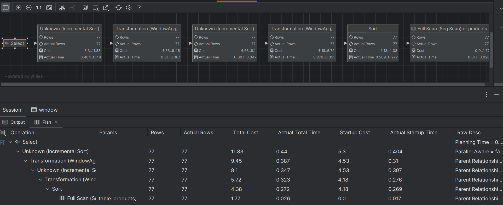
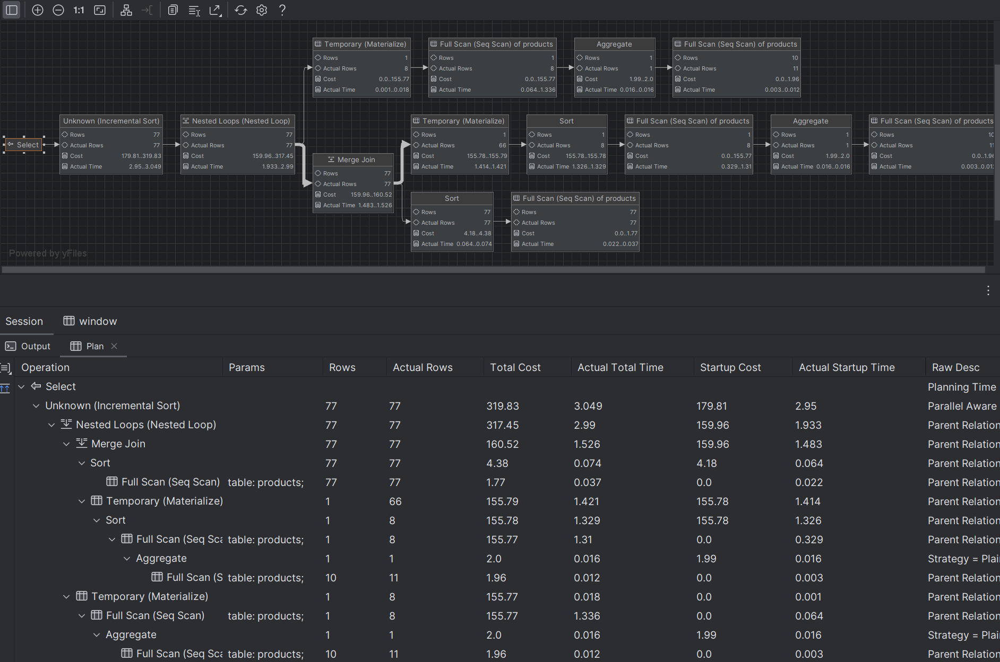

# SQL - Funkcje okna (Window functions) 

# Lab 1-2

---
**Imię i nazwisko:**
Przemysław Spyra, Piotr Urbańczyk
--- 


Celem ćwiczenia jest zapoznanie się z działaniem funkcji okna (window functions) w SQL, analiza wydajności zapytań i porównanie z rozwiązaniami przy wykorzystaniu "tradycyjnych" konstrukcji SQL

Swoje odpowiedzi wpisuj w miejsca oznaczone jako:

```sql
-- wyniki ...
```

Ważne/wymagane są komentarze.

Zamieść kod rozwiązania oraz zrzuty ekranu pokazujące wyniki, (dołącz kod rozwiązania w formie tekstowej/źródłowej)

Zwróć uwagę na formatowanie kodu

---

## Oprogramowanie - co jest potrzebne?

Do wykonania ćwiczenia potrzebne jest następujące oprogramowanie:
- MS SQL Server - wersja 2019, 2022
- PostgreSQL - wersja 15/16
- SQLite
- Narzędzia do komunikacji z bazą danych
	- SSMS - Microsoft SQL Managment Studio
	- DtataGrip lub DBeaver
-  Przykładowa baza Northwind
	- W wersji dla każdego z wymienionych serwerów

Oprogramowanie dostępne jest na przygotowanej maszynie wirtualnej

## Dokumentacja/Literatura

- Kathi Kellenberger,  Clayton Groom, Ed Pollack, Expert T-SQL Window Functions in SQL Server 2019, Apres 2019
- Itzik Ben-Gan, T-SQL Window Functions: For Data Analysis and Beyond, Microsoft 2020

- Kilka linków do materiałów które mogą być pomocne
	 - https://learn.microsoft.com/en-us/sql/t-sql/queries/select-over-clause-transact-sql?view=sql-server-ver16
	- https://www.sqlservertutorial.net/sql-server-window-functions/
	- https://www.sqlshack.com/use-window-functions-sql-server/
	- https://www.postgresql.org/docs/current/tutorial-window.html
	- https://www.postgresqltutorial.com/postgresql-window-function/
	-  https://www.sqlite.org/windowfunctions.html
	- https://www.sqlitetutorial.net/sqlite-window-functions/

- Ikonki używane w graficznej prezentacji planu zapytania w SSMS opisane są tutaj:
	- [https://docs.microsoft.com/en-us/sql/relational-databases/showplan-logical-and-physical-operators-reference](https://docs.microsoft.com/en-us/sql/relational-databases/showplan-logical-and-physical-operators-reference)

---
# Zadanie 1 - obserwacja

Wykonaj i porównaj wyniki następujących poleceń.

```sql
select avg(unitprice) avgprice
from products p;

select avg(unitprice) over () as avgprice
from products p;

select categoryid, avg(unitprice) avgprice
from products p
group by categoryid

select avg(unitprice) over (partition by categoryid) as avgprice
from products p;
```

Jaka jest są podobieństwa, jakie różnice pomiędzy grupowaniem danych a działaniem funkcji okna?

Wykonanie zapytania z funkcją agregującą avg zwraca jednorazowo jej wartość obliczoną dla wszystkich wierszy tabeli products (28.8663). Wynik jest zagregowany do pojedynczego wiersza.

Wykonanie tego zapytania w klauzuli GROUP BY categoryid zwraca jednorazowo osiem wartości tej funkcji (37.9791, 23.0625, 25.1600, 28.7300, 20.2500, 54.0066, 32.3700, 20.6825). Wynik jest zatem zagregowany dla wierszy zgrupowanych według ośmiu kategorii a wyników jest tyle, ile jest unikalnych CategoryID.

Wykonanie zapytania z funkcją okna zwraca zagregowaną wartość funkcji (tę samą: 28.8663) dla każdego przetwarzanego przez zapytanie wiersza (w tym wypadku 77-miokrotnie). Funkcja okna wykonuje operacje na podzbiorach danych przesuwających się po całym zbiorze. Wynik, czyli średnia cena liczona dla całej tabeli Products przydzielony jest do każdej instancji produktu - wyników jest tyle, ile jest wierszy w tabeli Products.

Wykonanie zapytania z funkcją okna partycjonowaną categoryid zwraca w 77-dmiu wierszach osiem wartości (ponownie tych samych: 37.9791, 23.0625, 25.1600, 28.7300, 20.2500, 54.0066, 32.3700, 20.6825): dla każdego przetwarzanego wiersza podaje wartość funkcji dla wszystkich elementów mających ten sam categoryid, co element znajdujący się w przetwarzanym wierszu. Funkcja okna jest wyliczana dla każdego wiersza. Zatem użycie partition by CategoryID sprawia, że średnia cena jest liczona dla poszczególnych CategoryID i przypisywana do wszystkich produktów należących do danej kategorii.

---
# Zadanie 2 - obserwacja

Wykonaj i porównaj wyniki następujących poleceń.

```sql
--1)

select p.productid, p.ProductName, p.unitprice,
       (select avg(unitprice) from products) as avgprice
from products p
where productid < 10;

--2)
select p.productid, p.ProductName, p.unitprice,
       avg(unitprice) over () as avgprice
from products p
where productid < 10;
```


Jaka jest różnica? Czego dotyczy warunek w każdym z przypadków? Napisz polecenie równoważne 
- 1) z wykorzystaniem funkcji okna. Napisz polecenie równoważne 
- 2) z wykorzystaniem podzapytania

Oba zapytania zwracają 9 wierszy zawierjących id, nazwy oraz ceny produktów, których id jest mniejsze od 10. Różnią się jednak kolumną zawierającą wartość funkcji avg. Agregacja wywołana w podzapytaniu zwróciła wartość średnią dla wszystkich produktów (wszystkich wierszy w tabeli). Agregacja użyta w funkcji okna zwróciła wartość średnią dla wierszy ograniczonych warunkiem where productid < 10.

W przypadku 1) warunek dotyczy wyłącznie zapytania głównego/zewnętrznego, w przypadku 2) warunek dotyczy także argumentów funkcji okna.

Różnica polega więc na tym, że select z podzapytaniem opiera swoją średnią na wszystkich wartościach unitprice z tabeli products, całkowicie ignorując polecenie where productid < 10, podczas, gdy drugi select używający funkcji okna uwzględnia ten warunek. Dostajemy w ten sposób różne wyniki (28.833 vs 31.372).


```sql
--1) (równoważne 1 powyżej)
with av as (select p.productid,
                   p.ProductName,
                   p.unitprice,
                   avg(p.unitprice) over () as avgprice
            from products p)
select * from av
where productid < 10;

--2) (równoważne 2 powyżej)
select p.productid, p.ProductName, p.unitprice,
    (select avg(unitprice) from products where productid < 10) as avgprice
from products p
where productid < 10;
```


# Zadanie 3

Baza: Northwind, tabela: products

Napisz polecenie, które zwraca: id produktu, nazwę produktu, cenę produktu, średnią cenę wszystkich produktów.

Napisz polecenie z wykorzystaniem z wykorzystaniem podzapytania, join'a oraz funkcji okna. Porównaj czasy oraz plany wykonania zapytań.

Przetestuj działanie w różnych SZBD (MS SQL Server, PostgreSql, SQLite)

W SSMS włącz dwie opcje: Include Actual Execution Plan oraz Include Live Query Statistics


W DataGrip użyj opcji Explain Plan/Explain Analyze


```sql
-- podzapytanie
select p.productid, p.productname, p.unitprice,
       (select avg(unitprice) from products) as avgprice
from products p;

-- join
SELECT p.productid, p.productname, p.unitprice, avgprice.avgUnitprice AS avgprice
FROM products p
CROSS JOIN (SELECT AVG(unitprice) AS avgUnitprice FROM products) AS avgprice;

-- funkcja okna
select p.productid, p.productname, p.unitprice,
       avg(unitprice) over() as avgprice
from products p;
```

**MS SQL Server**

podzapytanie:


join:


funkcja okna:


Koszty wykonania od najmniejszego: funkcja okna (2.73), podzapytanie (3.75), join(4.51) 
Plany wykonania od najmniejszego stopnia złożenia: funkcja okna, join, podzapytanie (bardzo wysoki stopień złożoności względem pozostałych)


**PostgreSQL**

podzapytanie:


join:


funkcja okna:


Koszty wykonania od najmniejszego: funkcja okna (2.73), podzapytanie (3.75), join(4.51) 
Plany wykonania od najmniejszego stopnia złożenia: funkcja okna, podzapytanie, join


**SQLite**

podzapytanie:

join:

funkcja okna:


Brak informacji o koszcie wykonania.
Plany wykonania od najmniejszego stopnia złożenia: funkcja okna / podzapytanie, join

**Podsumowanie**:

W MS SQL Server, mimo iż wykonywanie funkcji okna na grafie planu wykonania wygląda na nieco bardziej skomplikowane, w rzeczywistoście jest szybsze od zapytania wykorzystującego podzapytanie i joina (które mają zbliżone czasy wykonywania)

W PostgreSQL wersje wykorzystujące podzapytanie i funkcję okna zarówno prezentują się podobnie na grafie, jak i wykonują się w zbliżonych czasach. Na schemacie na bardziej skomplikowane wygląda zapytanie z joinem, które też wykonuje się nieco dłużej.

W SQLite analiza dała mniej informacji, niż w przypadku pozostałych dwóch SZBD. Na grafie planu wykonania wersje wykorzystujące podzapytanie i funkcję okna zarówno prezentują się podobnie. Wersja z joinem ma dodatkowy węzeł.


---

# Zadanie 4

Baza: Northwind, tabela products

Napisz polecenie, które zwraca: id produktu, nazwę produktu, cenę produktu, średnią cenę produktów w kategorii, do której należy dany produkt. Wyświetl tylko pozycje (produkty) których cena jest większa niż średnia cena.

Napisz polecenie z wykorzystaniem podzapytania, join'a oraz funkcji okna. Porównaj zapytania. Porównaj czasy oraz plany wykonania zapytań.

Przetestuj działanie w różnych SZBD (MS SQL Server, PostgreSql, SQLite)

```sql
-- podzapytanie
select p.productid, p.productname, p.unitprice,
       (SELECT AVG(unitprice) FROM products WHERE categoryid = p.categoryid) as avg_category_price
from products p
where p.unitprice > (select avg(unitprice) from products)
order by p.productid;

-- join
WITH av AS (SELECT categoryid,
        AVG(unitprice) AS avg_category_price
    FROM products
    GROUP BY categoryid)
SELECT p.productid, p.productname, p.unitprice, av.avg_category_price AS avgprice
FROM products p
JOIN av ON av.categoryid = p.categoryid
where p.unitprice > (select avg(unitprice) from products)
order by p.productid;

-- funkcja okna
SELECT productid, productname, unitprice, avg_category_price
FROM (
    SELECT p.productid, p.productname, p.unitprice,
           AVG(p.unitprice) OVER(PARTITION BY p.categoryid) AS avg_category_price, AVG(unitprice) OVER() AS avgprice
    FROM products p
) AS AverageUnitPrice
WHERE unitprice > avgprice
ORDER BY productid;
```

**MS SQL Server**

podzapytanie:

join:

funkcja okna:


Koszty wykonania od najmniejszego: funkcja okna (0.0056), join / podzapytanie(0.0127) - porównywalne
Plany wykonania od najmniejszego stopnia złożenia: join, podzapytanie, funkcja okna


**PostgreSQL**

podzapytanie:

join:

funkcja okna:


Koszty wykonania od najmniejszego: funkcja okna (3.69), podzapytanie(5.91), join(6.17).
Plany wykonania od najmniejszego stopnia złożenia: funkcja okna, podzapytanie, join.


**SQLite**

podzapytanie:

join:

funkcja okna:


Brak informacji o koszcie wykonania.
Plany wykonania od najmniejszego stopnia złożenia: podzapytanie, funkcja okna, join

**Podsumowanie**:

W MS SQL Server zapytanie z funkcją okna i joinem wykonują się w podobnym czasie. Dużo wolniej wykonuje się wersja z podzapytaniem, która też na schemacie planu wykonania ujawnia więckszą liczbę operacji.

Podobnie w PostgreSQL wersje wykorzystujące podzapytanie wykonuje się znacząco dłużej od zapytań wykorzystujących funkcję okna i joina. Najprostszy diagram ma zapytanie z funkcją okna, w którym od zapytania do wyników wiedzie jedna ścieżka grafu, bez rozgałęzień.

W SQLite analiza dała mniej informacji, niż w przypadku pozostałych dwóch SZBD. Na grafie najprostsze drzewa planowanych operacji prezentują zapytania z podzapytaniem i joinem, które mają porównywalny czas wykonania. Wersja z funkcją okna wykonuje się nieco dłużej.

Interesujący jest takze porządek wyników. Mimio braku klazuli `order by`, SQLite przy pozapytaniu a PostgreSQL przy podzapytaniu i joinie wyniki zostały posortowane wg `ProductId`. W MS SQL Server wyniki wszystkich zapytań (podzapytanie, funkcja okna, join) są w tej samej, lecz nieleksykalnej kolejności.


---
# Zadanie 5 - przygotowanie

Baza: Northwind

Tabela products zawiera tylko 77 wiersz. Warto zaobserwować działanie na większym zbiorze danych.

Wygeneruj tabelę zawierającą kilka milionów (kilkaset tys.) wierszy

Stwórz tabelę o następującej strukturze:

Skrypt dla SQL Srerver

```sql
create table product_history(
   id int identity(1,1) not null,
   productid int,
   productname varchar(40) not null,
   supplierid int null,
   categoryid int null,
   quantityperunit varchar(20) null,
   unitprice decimal(10,2) null,
   quantity int,
   value decimal(10,2),
   date date,
 constraint pk_product_history primary key clustered
    (id asc )
)
```

Wygeneruj przykładowe dane:

Dla 30000 iteracji, tabela będzie zawierała nieco ponad 2mln wierszy (dostostu ograniczenie do możliwości swojego komputera)

Skrypt dla SQL Srerver

```sql
declare @i int  
set @i = 1  
while @i <= 30000  
begin  
    insert product_history  
    select productid, ProductName, SupplierID, CategoryID,   
         QuantityPerUnit,round(RAND()*unitprice + 10,2),  
         cast(RAND() * productid + 10 as int), 0,  
         dateadd(day, @i, '1940-01-01')  
    from products  
    set @i = @i + 1;  
end;  
  
update product_history  
set value = unitprice * quantity  
where 1=1;
```


Skrypt dla Postgresql

```sql
create table product_history(
   id int generated always as identity not null  
       constraint pkproduct_history
            primary key,
   productid int,
   productname varchar(40) not null,
   supplierid int null,
   categoryid int null,
   quantityperunit varchar(20) null,
   unitprice decimal(10,2) null,
   quantity int,
   value decimal(10,2),
   date date
);
```

Wygeneruj przykładowe dane:

Skrypt dla Postgresql

```sql
do $$  
begin  
  for cnt in 1..30000 loop  
    insert into product_history(productid, productname, supplierid,   
           categoryid, quantityperunit,  
           unitprice, quantity, value, date)  
    select productid, productname, supplierid, categoryid,   
           quantityperunit,  
           round((random()*unitprice + 10)::numeric,2),  
           cast(random() * productid + 10 as int), 0,  
           cast('1940-01-01' as date) + cnt  
    from products;  
  end loop;  
end; $$;  
  
update product_history  
set value = unitprice * quantity  
where 1=1;
```


Wykonaj polecenia: `select count(*) from product_history`,  potwierdzające wykonanie zadania

**MS SQL Server**:


**PostgreSQL**:


**SQLite**:


---
# Zadanie 6

Baza: Northwind, tabela product_history

To samo co w zadaniu 3, ale dla większego zbioru danych

Napisz polecenie, które zwraca: id pozycji, id produktu, nazwę produktu, cenę produktu, średnią cenę produktów w kategorii do której należy dany produkt. Wyświetl tylko pozycje (produkty) których cena jest większa niż średnia cena.

Napisz polecenie z wykorzystaniem podzapytania, join'a oraz funkcji okna. Porównaj zapytania. Porównaj czasy oraz plany wykonania zapytań.

Przetestuj działanie w różnych SZBD (MS SQL Server, PostgreSql, SQLite)


```sql
-- podzapytanie
select p.id, productid, p.productname, p.unitprice,
       (SELECT AVG(unitprice) FROM product_history WHERE categoryid = p.categoryid) as avgprice
from product_history p
where p.unitprice > (select avg(unitprice) from product_history);

-- join
WITH av AS (SELECT categoryid,
        AVG(unitprice) AS avg_category_price,
        SUM(value) AS total_category_value
    FROM product_history
    GROUP BY categoryid)
SELECT p.id, p.productid, p.productname, p.unitprice, avg_category_price AS avgprice
FROM product_history p
JOIN av ON av.categoryid = p.categoryid
where p.unitprice > (select avg(unitprice) from product_history);

-- funkcja okna
select productid, productname, unitprice, averageUnitprice.avgprice as avgprive
FROM (
    SELECT p.productid, p.productname, p.unitprice,
           AVG(unitprice) OVER(PARTITION BY p.categoryid) AS avgprice
    FROM product_history p
) AS averageUnitprice
where unitprice > avgprice;
```
**MS SQL Server**

podzapytanie:

join:

funkcja okna:


Koszty wykonania od najmniejszego: funkcja okna(21.01), join (63.15), podzapytanie (63.22) 
Plany wykonania od najmniejszego stopnia złożenia: funkcja okna, join/podzapytanie

**PostgreSQL**

podzapytanie:

join:

funkcja okna:


Koszty wykonania od najmniejszego: funkcja okna(139692), podzapytanie (231450), join(239151)
Plany wykonania od najmniejszego stopnia złożenia: funkcja okna, podzapytanie, join


**SQLite**

podzapytanie:


join:


funkcja okna:


Brak informacji o koszcie wykonania. 
Plany wykonania od najmniejszego stopnia złożenia: podzapytanie, join, funkcja okna.

**Podsumowanie**:

Podczas gdy funkcja okna zdaje się mieć przewagę nad zapytanami wykorzystującymi podzapytanie i join w MS SQL Server i PosgreSQL, oferując zarówno niższy koszt, jak i mniej skomplikowany plan wykonania, w SQLite zarówno drzewo planu wykonania posiada dodatkowy poziom, jak i zapytanie z funkcją okna wykonuje się o rząd wielkości dłużej, niż pozostałe dwa (powyżej 2s w przypadku funkcji okna vs. ok. 800ms w przypadku podzapytania i joina).


---
# Zadanie 7

Baza: Northwind, tabela product_history

Lekka modyfikacja poprzedniego zadania

Napisz polecenie, które zwraca: id pozycji, id produktu, nazwę produktu, cenę produktu oraz
-  średnią cenę produktów w kategorii do której należy dany produkt.
-  łączną wartość sprzedaży produktów danej kategorii (suma dla pola value)
-  średnią cenę danego produktu w roku którego dotyczy dana pozycja
- łączną wartość sprzedaży produktów danej kategorii (suma dla pola value)

Napisz polecenie z wykorzystaniem podzapytania, join'a oraz funkcji okna. Porównaj zapytania. W przypadku funkcji okna spróbuj użyć klauzuli WINDOW.

Porównaj czasy oraz plany wykonania zapytań.

Przetestuj działanie w różnych SZBD (MS SQL Server, PostgreSql, SQLite)


```sql
-- podzapytania
SELECT ph.id,ph.productid,ph.productname,ph.unitprice,
    (SELECT AVG(unitprice) FROM product_history WHERE categoryid = ph.categoryid) AS avg_category_price,
    (SELECT SUM(value) FROM product_history WHERE categoryid = ph.categoryid) AS total_category_value,
    (SELECT AVG(unitprice) FROM product_history WHERE productid = ph.productid AND YEAR(date) = YEAR(ph.date))
    --PostgreSQL:
    --extract(year from date) = extract(year from ph.date)
    --SQLite:
    --strftime('%Y', date) = strftime('%Y', ph.date)
        AS avg_product_price_per_year
FROM product_history ph
WHERE id between 1000 AND 1200
ORDER BY ph.id;

-- join
WITH av AS (SELECT categoryid,
        AVG(unitprice) AS avg_category_price,
        SUM(value) AS total_category_value
    FROM product_history
    GROUP BY categoryid),
av_product AS (SELECT productid,
        YEAR(date) AS year,
        AVG(unitprice) AS avg_product_price_per_year
    FROM product_history
    GROUP BY productid, YEAR(date))
SELECT ph.id, ph.productid, ph.productname, ph.unitprice, av.avg_category_price, av.total_category_value, ap.avg_product_price_per_year
FROM product_history ph
JOIN av ON ph.categoryid = av.categoryid
JOIN av_product ap ON ph.productid = ap.productid AND YEAR(ph.date) = ap.year
WHERE ph.id BETWEEN 1000 AND 1200
ORDER BY ph.id;

-- funkcje okna
WITH av AS (SELECT ph.id, ph.productid, ph.productname, ph.unitprice,
                   AVG(ph.unitprice) OVER wcatid AS avg_category_price,
                   SUM(ph.value) OVER wcatid AS total_category_value,
                   AVG(ph.unitprice) OVER (PARTITION BY ph.productid, year(ph.date)) AS avg_product_price_per_year
            FROM product_history ph
            WINDOW wcatid AS (PARTITION BY ph.categoryid))
SELECT * FROM av
WHERE id between 1000 AND 1200
ORDER BY av.id;
```
Zrzut z wynikami:


**MS SQL Server**

podzapytanie:


join:


funkcja okna:


Koszty wykonania od najmniejszego: join (39), podzapytanie (59), funkcja okna (79). 
Plany wykonania od najmniejszego stopnia złożenia: funkcja okna, postgres, join. 


**PostgreSQL**

podzapytanie:


join:


funkcja okna:


Koszty wykonania od najmniejszego: join (359180), funkcja okna (1167121), podzapytanie (>5*10^7).
Plany wykonania od najmniejszego stopnia złożenia: funkcja okna, podzapytanie, join.


**SQLite**

podzapytanie:


join:


funkcja okna:


Brak informacji o koszcie wykonania.
Plany wykonania od najmniejszego stopnia złożenia: podzapytanie i join, funkcja okna.

**Podsumowanie**:

Podczas gdy w jednym MS SQL Server zapytanie wykorzystujące podzapytanie wykononywało się w szybciej od pozostałych dwóch wariantów, w przypadku PostgreSQL wykonanie query z podazpytaniem było znacząco dłuższe od pozostały (ok 7 min). Wygląda na to, że ograniecznie wprowadzone w zapytaniu nadrzędnym w klauzuli WHERE nie dotyczy tego, co dzieje się w podzapytaniach. Otrzymanie wymaganych informacji poleceniem wykorzystującym joina wymagało stosunkowo złożonego zapytania. 


---
# Zadanie 8 - obserwacja

Funkcje rankingu, `row_number()`, `rank()`, `dense_rank()`

Wykonaj polecenie, zaobserwuj wynik. Porównaj funkcje row_number(), rank(), dense_rank()

```sql 
select productid, productname, unitprice, categoryid,  
    row_number() over(partition by categoryid order by unitprice desc) as rowno,  
    rank() over(partition by categoryid order by unitprice desc) as rankprice,  
    dense_rank() over(partition by categoryid order by unitprice desc) as denserankprice  
from products;
```


Widać, że funkcje te służą do nadawania porządku wierszom w obrębie partycji.

ROW_NUMBER() nadaje unikalny numer porządkowy dla każdego wiersza w obrębie wydzielonego zbioru. Nie uwzględnia równych wartości. Numeracja jest ciągła i nie ma luk.

RANK() nadaje porządek wierszom w ramach zbioru uwzględniając powtórzenia.
Jeśli wartość sortująca jest taka sama, to funkcja przypisuje wierszom ten sam numer.
Może pozostawić luki w numeracji.

DENSE_RANK() działa podobnie jak RANK(), ale daje wartości ciągłe - nie pozostawia luk w numeracji.


Zadanie

Spróbuj uzyskać ten sam wynik bez użycia funkcji okna

```sql
SELECT
    p.productid, p.productname, p.unitprice, p.categoryid,
    (
        SELECT COUNT(*)
        FROM products p2
        WHERE p2.categoryid = p.categoryid AND p2.unitprice >= p.unitprice
    ) AS rowno,
    (
        SELECT COUNT(*)
        FROM products p2
        WHERE p2.categoryid = p.categoryid AND p2.unitprice > p.unitprice
    ) + 1 AS rankprice,
    (
        SELECT COUNT(DISTINCT p2.unitprice)
        FROM products p2
        WHERE p2.categoryid = p.categoryid AND p2.unitprice >= p.unitprice
    ) AS denserankprice
FROM products p
order by categoryid, unitprice desc;
```


---
# Zadanie 9

Baza: Northwind, tabela product_history

Dla każdego produktu, podaj 4 najwyższe ceny tego produktu w danym roku. Zbiór wynikowy powinien zawierać:
- rok
- id produktu
- nazwę produktu
- cenę
- datę (datę uzyskania przez produkt takiej ceny)
- pozycję w rankingu

Uporządkuj wynik wg roku, nr produktu, pozycji w rankingu

```sql
SELECT * FROM
             (SELECT YEAR(date) as year,productid,productname,unitprice,date,
                     rank() over(partition by productid, YEAR(date) order by unitprice desc) as rankprice
              FROM product_history) t
              where rankprice <= 4
ORDER BY year, productid, rankprice;
```


Spróbuj uzyskać ten sam wynik bez użycia funkcji okna, porównaj wyniki, czasy i plany zapytań. Przetestuj działanie w różnych SZBD (MS SQL Server, PostgreSql, SQLite)


```sql
SELECT YEAR(ph1.date) AS year, ph1.productid, ph1.productname, ph1.unitprice, ph1.date,
       COUNT(*) AS price_rank
FROM product_history ph1
JOIN product_history ph2 ON ph1.productid = ph2.productid
    AND YEAR(ph1.date) = YEAR(ph2.date)
    AND ph1.unitprice <= ph2.unitprice
GROUP BY YEAR(ph1.date), ph1.productid, ph1.productname, ph1.unitprice, ph1.date
HAVING COUNT(*) <= 4
ORDER BY YEAR(ph1.date), ph1.productid, price_rank;

    --PostgreSQL:
    --extract(year from date)
    --SQLite:
    --strftime('%Y', date)
```
**MS SQL Server**

plan i koszty polecenia z funkcją okna:


plan i koszty polecenia bez użycia funkcji okna:


**PostgreSQL**

pplan i koszty polecenia  z funkcją okna:


plan i koszty polecenia  bez użycia funkcji okna:


**SQLite**

polecenie z funkcją okna:


polecenie bez użycia funkcji okna:


**Komentarz**:

We wszystkich trzech SZBD polecenie wykorzystujące funkcję okna miały miażdżącą przewagę jeśli idzie czas wykonywania i koszty.
Ponadto, powyższe zapytania ostro rozgraniczyły SZBD pod względem czasu wykonania obu poleceń - MS SQL Server wykonywał zapytania szybciej od systemu PostgreSQL, który był szybszy od SQLlite.


---
# Zadanie 10 - obserwacja
Funkcje `lag()`, `lead()`

Wykonaj polecenia, zaobserwuj wynik. Jak działają funkcje `lag()`, `lead()`

```sql
select productid, productname, categoryid, date, unitprice,  
       lag(unitprice) over (partition by productid order by date)   
as previousprodprice,  
       lead(unitprice) over (partition by productid order by date)   
as nextprodprice  
from product_history  
where productid = 1 and year(date) = 2022  
order by date;  
  
with t as (select productid, productname, categoryid, date, unitprice,  
                  lag(unitprice) over (partition by productid   
order by date) as previousprodprice,  
                  lead(unitprice) over (partition by productid   
order by date) as nextprodprice  
           from product_history  
           )  
select * from t  
where productid = 1 and year(date) = 2022  
order by date;
```
pierwszy select:

drugi select:


Zarówno LEAD() jak i LAG() zwracają wartości, które liczone są na podstawie sąsiednich wierszy.
 LEAD() zwraca wartość z wiersza, który pojawia się po analizowanym wierszu (posiada indeks większy o 1). Nie musimy w ten sposób używać skomplikowanych podzapytań ani self-join, aby zwrócić następnik danego wiersza. 
 LAG() zwraca wartość z wiersza, który pojawia się przed analizowanym wierszem (posiada indeks mnniejszy o 1)

 Drugi select uzupełnia nam miejsce null w pierwszym wierszu, ponieważ ograniczenie w klauzuli where dotyczy tymczasowej tabeli utworzonej klauzulą with (a nie wierszy analizowanych w głównym zapytaniu z funkcją okna, jak w przypadku piwerszego selecta. Sytuacja jest dość podobna do obserwacji z zadania 2.

Zadanie

Spróbuj uzyskać ten sam wynik bez użycia funkcji okna, porównaj wyniki, czasy i plany zapytań. Przetestuj działanie w różnych SZBD (MS SQL Server, PostgreSql, SQLite)

```sql
SELECT ph.productid, ph.productname, ph.categoryid, ph.date, ph.unitprice,
    (SELECT TOP 1 p.unitprice
         FROM product_history p
         WHERE p.productid = ph.productid AND p.date < ph.date
         ORDER BY p.date DESC) AS previousprodprice,
    (SELECT TOP 1 p.unitprice
         FROM product_history p
         WHERE p.productid = ph.productid AND p.date > ph.date
         ORDER BY p.date ASC) AS nextprodprice
FROM product_history ph
WHERE ph.productid = 1 AND YEAR(ph.date) = 2022
ORDER BY ph.date;

    --PostgreSQL:
    --extract(year from date)
    --LIMIT 1
    --SQLite:
    --strftime('%Y', date)
    --'yearasstring'
    --LIMIT 1
```
**MS SQL Server**


**PostgreSQL**


**SQLite**


**Komentarz**:

Ponownie olbrzymią przewagę w czasie wykonywania zapytań (skonstruowanych bez użycia funkcji okna) spośród wszystkich SZBD miał MS SQL Server (6s), za nim plasował się SQLite (57s) a na samym końcu plasował się PostgreSQL (2m 48s).

Zapytania wykorzystujące funkcję okna wykonują się znacząco szybciej - w czasie zbliżonym do 1s (482ms, 691ms oraz 1s 493ms odpowiednio dla: MS SQL, PostgreSQL, SQLite). Zarówno koszty i czas wykonania, jak i złożoność i czytelność polecenia każą uznać tego rodzaju polecenia za bardziej korzystne i optymalne rozwiązanie.

---
# Zadanie 11

Baza: Northwind, tabele customers, orders, order details

Napisz polecenie które wyświetla inf. o zamówieniach

Zbiór wynikowy powinien zawierać:
- nazwę klienta, nr zamówienia,
- datę zamówienia,
- wartość zamówienia (wraz z opłatą za przesyłkę),
- nr poprzedniego zamówienia danego klienta,
- datę poprzedniego zamówienia danego klienta,
- wartość poprzedniego zamówienia danego klienta.

```sql
SELECT c.companyname, o.orderid, o.orderdate,
       SUM(od.unitprice * od.quantity * (1 - od.discount)) + o.freight AS order_value,
       LAG(o.orderid) OVER (PARTITION BY o.customerid ORDER BY o.orderdate) AS previous_order_id,
       LAG(o.orderdate) OVER (PARTITION BY o.customerid ORDER BY o.orderdate) AS previous_order_date,
       LAG(SUM(od.unitprice * od.quantity * (1 - od.discount)) + o.freight) OVER (PARTITION BY o.customerid ORDER BY o.orderdate) AS previous_order_value
FROM orders o
INNER JOIN customers c ON o.customerid = c.customerid
LEFT JOIN orderdetails od ON o.orderid = od.orderid
GROUP BY c.companyname, o.orderid, o.orderdate, o.freight, o.customerid
ORDER BY companyname, orderdate;
```


---
# Zadanie 12 - obserwacja

Funkcje `first_value()`, `last_value()`

Wykonaj polecenia, zaobserwuj wynik. Jak działają funkcje `first_value()`, `last_value()`. Skomentuj uzyskane wyniki. Czy funkcja `first_value` pokazuje w tym przypadku najdroższy produkt w danej kategorii, czy funkcja `last_value()` pokazuje najtańszy produkt? Co jest przyczyną takiego działania funkcji `last_value`. Co trzeba zmienić żeby funkcja last_value pokazywała najtańszy produkt w danej kategorii

```sql
select productid, productname, unitprice, categoryid,  
    first_value(productname) over (partition by categoryid   
order by unitprice desc) first,  
    last_value(productname) over (partition by categoryid   
order by unitprice desc) last  
from products  
order by categoryid, unitprice desc;
```


Funkcja first_value() zwraca wartość kolumny (określonej w argumencie) z pierwszego wiersza w uporządkowanym zbiorze danych, które jest określone przez funkcję okna. Innymi słowy, zwraca wartość kolumny z pierwszego wiersza w hierarchii, którą ustala funkcja okna (tu najdroższy w tej samej kategorii).

Funkcja last_value() zwraca wartość kolumny (określonej w argumencie) z ostatniego wiersza o takiej samej wartości porządkującej w partycjonowanym zbiorze danych. Oznacza to, że zwraca wartość kolumny z ostatniego wiersza w partycji, który ma tę samą wartość, jak wartość porządkująca, według której jest sortowany zbiór danych (to ostatni z kategorii o tej samej cenie, co w wierszu).

Żeby otrzymać najtańszy produkt danej kategorii, można ponownie skorzystać z first_value() i odwrócić kolejność porządku (usunąć desc):

```sql
first_value(productname) over (partition by categoryid   
order by unitprice) first, 

lub, jeśli koniecznie to ma być last_value(), to należy zmienić zakres ramki:

last_value(productname) over (partition by categoryid   
order by unitprice desc
range between unbounded preceding and unbounded following) last

Oba rozwiązanie demonstruje poniższe zapytanie:

select productid, productname, unitprice, categoryid,
    first_value(productname) over (partition by categoryid
order by unitprice desc) first,
    first_value(productname) over (partition by categoryid
order by unitprice) last_with_first_value,
    last_value(productname) over (partition by categoryid
order by unitprice desc
range between unbounded preceding and unbounded following) last_with_last_value
from products
order by categoryid, unitprice desc;

```

Zadanie

Spróbuj uzyskać ten sam wynik bez użycia funkcji okna, porównaj wyniki, czasy i plany zapytań. Przetestuj działanie w różnych SZBD (MS SQL Server, PostgreSql, SQLite)

```sql
SELECT p.productid, p.productname, p.unitprice, p.categoryid, first, last
FROM products p
LEFT JOIN (
    SELECT categoryid, productname as first
    FROM products p1
    WHERE unitprice = (
            SELECT MAX(unitprice)
            FROM products AS p2
            WHERE p1.categoryid = p2.categoryid)
    ) AS expensive_product ON p.categoryid = expensive_product.categoryid
LEFT JOIN (
    SELECT categoryid, productname as last
    FROM products AS p1
    WHERE unitprice = (
            SELECT MIN(unitprice)
            FROM products AS p2
            WHERE p1.categoryid = p2.categoryid)
) AS cheap_product ON p.categoryid = cheap_product.categoryid
ORDER BY p.categoryid, p.unitprice DESC;
```

**MS SQL Server**

plan i koszty polecenia z funkcją okna:

(czas wykonywania zapytania: 165ms)


plan i koszty polecenia bez użycia funkcji okna:

(czas wykonywania zapytania: 176ms)


**PostgreSQL**

pplan i koszty polecenia  z funkcją okna:

(czas wykonywania zapytania: 116ms):


plan i koszty polecenia  bez użycia funkcji okna:

(czas wykonywania zapytania: 186ms):


**SQLite**

polecenie z funkcją okna

(czas wykonywania zapytania: 103ms):


polecenie bez użycia funkcji okna

(czas wykonywania zapytania: 158ms):

**Komentarz**:

Polecenie niewykorzystujące funkcji okna, któe wymagało czterech podazpytań (dwa razy dwa zagnieźdżone podzapytania) wykonywało się zaskakująco niskim kosztem i w czasie zbliżonym do zapytania z funkcją okna we wszystkich SZBD.


---
# Zadanie 13

Baza: Northwind, tabele orders, order details

Napisz polecenie które wyświetla inf. o zamówieniach

Zbiór wynikowy powinien zawierać:
- Id klienta,
- nr zamówienia,
- datę zamówienia,
- wartość zamówienia (wraz z opłatą za przesyłkę),
- dane zamówienia klienta o najniższej wartości w danym miesiącu
	- nr zamówienia o najniższej wartości w danym miesiącu
	- datę tego zamówienia
	- wartość tego zamówienia
- dane zamówienia klienta o najwyższej wartości w danym miesiącu
	- nr zamówienia o najniższej wartości w danym miesiącu
	- datę tego zamówienia
	- wartość tego zamówienia

```sql
SELECT
    o.customerid,
    o.orderid,
    o.orderdate,
    ROUND(SUM(od.unitprice * od.quantity * (1 - od.discount)) + o.freight, 2) AS order_value,
    MIN(o.orderid) OVER (PARTITION BY YEAR(o.orderdate), MONTH(o.orderdate)) AS cheap_mon_id,
    MIN(o.orderdate) OVER (PARTITION BY YEAR(o.orderdate), MONTH(o.orderdate)) AS cheap_mon_date,
    MIN(ROUND(SUM(od.unitprice * od.quantity * (1 - od.discount)) + o.freight, 2)) OVER (PARTITION BY YEAR(o.orderdate), MONTH(o.orderdate)) AS cheap_mon_value,
    MAX(o.orderid) OVER (PARTITION BY YEAR(o.orderdate), MONTH(o.orderdate)) AS exp_mon_id,
    MAX(o.orderdate) OVER (PARTITION BY YEAR(o.orderdate), MONTH(o.orderdate)) AS exp_mon_date,
    MAX(ROUND(SUM(od.unitprice * od.quantity * (1 - od.discount)) + o.freight, 2)) OVER (PARTITION BY YEAR(o.orderdate), MONTH(o.orderdate)) AS exp_mon_value
FROM
    orders o
INNER JOIN
    orderdetails od ON o.orderid = od.orderid
group by o.customerid, o.orderid, o.orderdate, o.freight
ORDER BY
    o.customerid, o.orderdate;
```

---
# Zadanie 14

Baza: Northwind, tabela product_history

Napisz polecenie które pokaże wartość sprzedaży każdego produktu narastająco od początku każdego miesiąca. Użyj funkcji okna

Zbiór wynikowy powinien zawierać:
- id pozycji
- id produktu
- datę
- wartość sprzedaży produktu w danym dniu
- wartość sprzedaży produktu narastające od początku miesiąca

```sql
SELECT id, productid, date, value,
    SUM(value) OVER (PARTITION BY productid, YEAR(date), MONTH(date) ORDER BY date) AS cumulative_monthly
FROM product_history
-- WHERE id BETWEEN 2003 AND 2465 AND productid = 1
ORDER BY productid, date;
```


Spróbuj wykonać zadanie bez użycia funkcji okna. Spróbuj uzyskać ten sam wynik bez użycia funkcji okna, porównaj wyniki, czasy i plany zapytań. Przetestuj działanie w różnych SZBD (MS SQL Server, PostgreSql, SQLite)

```sql
SELECT ph.id, ph.productid, ph.date, ph.value,
(SELECT SUM(value)
     FROM product_history
     WHERE productid = ph.productid
     AND YEAR(date) = YEAR(ph.date)
     AND MONTH(date) = MONTH(ph.date)
     AND date <= ph.date) AS cumulative_monthly
FROM product_history ph
-- WHERE ph.id BETWEEN 2003 AND 2465 AND productid = 1
ORDER BY ph.productid, ph.date;
```
SQL SERVER


PostgreSQL


**MS SQL Server**

plan i koszty polecenia z funkcją okna: 128

czas wykonywania zapytania (z ograniczeniem): 84ms


plan i koszty polecenia bez użycia funkcji okna:

czas wykonywania zapytania (z ograniczeniem): 4s


**PostgreSQL**

plan i koszty polecenia z funkcją okna

(czas wykonywania zapytania (z ograniczeniem): 84ms


plan i koszty polecenia  bez użycia funkcji okna:

czas wykonywania zapytania (z ograniczeniem): 5s


**SQLite**

polecenie z funkcją okna

czas wykonywania zapytania  (z ograniczeniem): 322ms


polecenie bez użycia funkcji okna

czas wykonywania zapytania  (z ograniczeniem): 2s 802ms


**Komentarz**:

W tym zadaniu, ponownie polecenia z funkcją okna miały olbrzymią przewagę nad zapytanami bez wykorzystania funkcji okna a MS SQL Server miał znaczącą przewagę nad pozostalymi SZBD w zakresie kosztów i czasu wykonywania zapytań (zwłascza tych niewykorzystujących funkcji okna). Najlepiej widać to, gdy nieco zwiększmy sobie ograniczenie zadane w (powyżej okomentowanej) klauzuli where (np. usuwając ograniczenie na prductid lub oba).


---
# Zadanie 15

Wykonaj kilka "własnych" przykładowych analiz. Czy są jeszcze jakieś ciekawe/przydatne funkcje okna (z których nie korzystałeś w ćwiczeniu)? Spróbuj ich użyć w zaprezentowanych przykładach.

```sql
-- Ranking produktów ze względu na wartość sprzedaży miesięcznej
SELECT
    YEAR(date) AS year,
    MONTH(date) AS month,
    productid,
    SUM(value) AS total_sales,
    RANK() OVER (PARTITION BY YEAR(date), MONTH(date) ORDER BY SUM(value) DESC) AS sales_rank
FROM
    product_history
GROUP BY
    YEAR(date), MONTH(date), productid
ORDER BY
    YEAR(date), MONTH(date), sales_rank;

-- Znalezienie zmiany wartości sprzedaży w czasie
SELECT
    date,
    productid,
    value,
    LAG(value) OVER (PARTITION BY productid ORDER BY date) AS previous_value,
    value - LAG(value) OVER (PARTITION BY productid ORDER BY date) AS sales_change
FROM
    product_history
ORDER BY
    productid, date;

```

```sql
-- Analiza trendów sprzedaży produktów w czasie

SELECT
    date,
    productid,
    value,
    AVG(value) OVER (PARTITION BY productid ORDER BY date ROWS BETWEEN 3 PRECEDING AND 1 FOLLOWING) AS moving_avg_sales
FROM
    product_history
ORDER BY
    productid, date;
```

```sql
-- Porównanie sprzedaży danego produktu z innymi produktami w tym samym okresie czasu

SELECT
    date,
    productid,
    value,
    AVG(value) OVER (PARTITION BY productid) AS avg_sales,
    SUM(value) OVER (PARTITION BY YEAR(date), MONTH(date)) AS total_monthly_sales,
    (value / SUM(value) OVER (PARTITION BY YEAR(date), MONTH(date))) * 100 AS sales_percentage_of_total
FROM
    product_history
ORDER BY
    date, productid;

```


Punktacja

|         |     |
| ------- | --- |
| zadanie | pkt |
| 1       | 0,5 |
| 2       | 0,5 |
| 3       | 1   |
| 4       | 1   |
| 5       | 0,5 |
| 6       | 2   |
| 7       | 2   |
| 8       | 0,5 |
| 9       | 2   |
| 10      | 1   |
| 11      | 2   |
| 12      | 1   |
| 13      | 2   |
| 14      | 2   |
| 15      | 2   |
| razem   | 20  |
