# Raport

# Przetwarzanie i analiza danych przestrzennych 
# Oracle spatial


---

**Imiona i nazwiska:**
- Piotr Urbańczyk
- Przemysław Spyra
--- 

Celem ćwiczenia jest zapoznanie się ze sposobem przechowywania, przetwarzania i analizy danych przestrzennych w bazach danych
(na przykładzie systemu Oracle spatial)

Swoje odpowiedzi wpisuj w miejsca oznaczone jako:

---
> Wyniki, zrzut ekranu, komentarz

```sql
--  ...
```

---

Do wykonania ćwiczenia (zadania 1 – 7) i wizualizacji danych wykorzystaj Oracle SQL Develper. Alternatywnie możesz wykonać analizy w środowisku Python/Jupyter Notebook

Do wykonania zadania 8 wykorzystaj środowisko Python/Jupyter Notebook

Raport należy przesłać w formacie pdf.

Należy też dołączyć raport zawierający kod w formacie źródłowym.

Np.
- plik tekstowy .sql z kodem poleceń
- plik .md zawierający kod wersji tekstowej
- notebook programu jupyter – plik .ipynb

Zamieść kod rozwiązania oraz zrzuty ekranu pokazujące wyniki, (dołącz kod rozwiązania w formie tekstowej/źródłowej)

Zwróć uwagę na formatowanie kodu

<div style="page-break-after: always;"></div>

# Zadanie 1

Zwizualizuj przykładowe dane

US_STATES


```sql
SELECT * FROM us_states
```
Stany mają stałą liczbę stanów, tj. 50.

US_INTERSTATES


```sql
SELECT * FROM  us_interstates
```
Autostrady międzystanowe są bardziej zagęszczone w regionach o dużej gęstości zaludnienia i w regionach z dużym ruchem tranzytowym. Najwięcej autostrad znajdziemy w północno-wschodnich stanach oraz w Kalifornii, natomiast najmniej w mniej zaludnionych stanach, takich jak Montana czy Wyoming.

US_CITIES


```sql
SELECT * FROM  us_cities
```
Miasta są najliczniejsze w stanach z dużą populacją, takich jak Kalifornia, Teksas, Nowy Jork, Floryda. Najmniej miast znajdziemy w stanach o małej gęstości zaludnienia, takich jak Alaska, Wyoming, czy Vermont.

US_RIVERS


```sql
SELECT * FROM  us_rivers
```
Rzeki są najliczniejsze w regionach o dużej ilości opadów oraz w miejscach z licznymi zbiornikami wodnymi. Przykładowo, najwięcej rzek znajdziemy na wschodnim wybrzeżu, w stanach takich jak Pensylwania czy Nowy Jork, oraz w centralnej części USA. Najmniej rzek jest na suchych obszarach, takich jak pustynie Arizony czy Nevady.

US_COUNTIES


```sql
SELECT * FROM  us_counties
```
Hrabstwa są liczniejsze w stanach o dużej powierzchni i historycznie gęsto zaludnionych obszarach, takich jak Georgia czy Wirginia. Najmniej hrabstw znajdziemy w stanach o mniejszej powierzchni lub niskiej gęstości zaludnienia, takich jak Delaware, Rhode Island, czy Alaska.

US_PARKS


```sql
SELECT * FROM  us_parks
```
Parki narodowe są najliczniejsze w zachodnich stanach USA, takich jak Kalifornia, Alaska, Utah, Kolorado, i Arizona, gdzie znajduje się wiele terenów chronionych. Najmniej parków narodowych jest w stanach wschodniego wybrzeża oraz w stanach środkowo-zachodnich, poza kilkoma wyjątkami

# Zadanie 2

**Uwaga: Parzyste zadania zostały wykonane w jupyter notebook.**

Znajdź wszystkie stany (us_states) których obszary mają część wspólną ze wskazaną geometrią (prostokątem)

Pokaż wynik na mapie.

prostokąt

```sql
SELECT  sdo_geometry (2003, 8307, null,
sdo_elem_info_array (1,1003,3),
sdo_ordinate_array ( -117.0, 40.0, -90., 44.0)) g
FROM dual
```


> Wyniki, zrzut ekranu, komentarz

```python
rectangle = """SELECT sdo_util.to_wktgeometry(
    sdo_geometry (2003, 8307, null,
    sdo_elem_info_array (1,1003,3),
    sdo_ordinate_array ( -117.0, 40.0, -90., 44.0))
) g FROM dual"""

rectangle_result = cursor.execute(rectangle).fetchall()

# Tu zaczyna się definicja nowej mapy,
# poniżej dokładane są do niej nowe "warstwy".

m = folium.Map()

rectangle_result = loads(cursor.execute(rectangle).fetchall())

st = {'fillColor': 'blue', 'color': 'red'}

l = []
for row in rectangle_result:
    g = geojson.Feature(geometry=row[0], properties={})
    l.append(g)

feature_collection = geojson.FeatureCollection(l)
folium.GeoJson(feature_collection, style_function=lambda x:st).add_to(m)  

m
```

Zrzut ekranu:


Komentarz:
Prostkąt na mapie Stanów Zjednoczonych.


Użyj funkcji SDO_FILTER

```sql
SELECT state, geom FROM us_states
WHERE sdo_filter (geom,
sdo_geometry (2003, 8307, null,
sdo_elem_info_array (1,1003,3),
sdo_ordinate_array ( -117.0, 40.0, -90., 44.0))
) = 'TRUE';
```

Zwróć uwagę na liczbę zwróconych wierszy (16)


> Wyniki, zrzut ekranu, komentarz

```python
filter_query = """SELECT state, sdo_util.to_wktgeometry(geom) FROM us_states
WHERE sdo_filter (geom,
sdo_geometry (2003, 8307, null,
sdo_elem_info_array (1,1003,3),
sdo_ordinate_array ( -117.0, 40.0, -90., 44.0))
) = 'TRUE'"""

filter_result = cursor.execute(filter_query).fetchall()

filter_geom = [loads(res[1]) for res in filter_result]

st2 = {'fillColor': 'white', 'color': 'blue'}

l2 = []
for row in filter_geom:
    g = geojson.Feature(geometry=row, properties={})
    l2.append(g)

feature_collection2 = geojson.FeatureCollection(l2)

folium.GeoJson(feature_collection2, style_function=lambda x:st2).add_to(m)  

m 
```

Zrzut ekranu:


Komentarz: Stany (us_states), których obszary mają część wspólną ze wskazaną geometrią (prostokątem) uzyskane zapytaniem wykorzystującym
`SDO_FILTER`.

Wydaje się, jakby zapytanie wykorzystujące funkcję `SDO_FILTER` błędnie zwracało dwa stany nieprzecinające się z prostkątem. Takie działanie `SDO_FILTER` wyjaśnia dokumentacja Oracla, wg któej funkcja `SDO_FILTER` wykonuje tylko operację filtracji pierwotnej. Jest to szybka operacja, która może zwrócić niektóre fałszywe pozytywy (obiekty, które są identyfikowane jako interakcje, ale które faktycznie nie oddziałują). Aby uzyskać dokładne wyniki, można użyć operacji filtracji wtórnej, takiej jak SDO_RELATE.

Użyj funkcji  SDO_ANYINTERACT

```sql
SELECT state, geom FROM us_states
WHERE sdo_anyinteract (geom,
sdo_geometry (2003, 8307, null,
sdo_elem_info_array (1,1003,3),
sdo_ordinate_array ( -117.0, 40.0, -90., 44.0))
) = 'TRUE';
```

Porównaj wyniki sdo_filter i sdo_anyinteract

Pokaż wynik na mapie


> Wyniki, zrzut ekranu, komentarz

```python
anyinteract_query = """SELECT state, sdo_util.to_wktgeometry(geom) FROM us_states
WHERE sdo_anyinteract (geom,
sdo_geometry (2003, 8307, null,
sdo_elem_info_array (1,1003,3),
sdo_ordinate_array ( -117.0, 40.0, -90., 44.0))
) = 'TRUE'"""

anyinteract_result = cursor.execute(anyinteract_query).fetchall()

anyinteract_geom = [loads(res[1]) for res in anyinteract_result]

st3 = {'fillColor': 'green', 'color': 'green'}

l3 = []
for row in anyinteract_geom:
    g = geojson.Feature(geometry=row, properties={})
    l3.append(g)

feature_collection3 = geojson.FeatureCollection(l3)

folium.GeoJson(feature_collection3, style_function=lambda x:st3).add_to(m)  

m 
```

Zrzut ekranu:


```python
print(f"Liczba stanów zwróconych przez SDO_FILTER: {len(filter_result)}")
print(f"Liczba stanów zwróconych przez SDO_ANYINTERACT: {len(anyinteract_result)}")
```
Liczba stanów zwróconych przez SDO_FILTER: 16\
Liczba stanów zwróconych przez SDO_ANYINTERACT: 14

Komentarz: Stany (us_states), których obszary mają część wspólną ze wskazaną geometrią (prostokątem) uzyskane zapytaniem wykorzystującym
`SDO_ANYINTERACT` nałożone na mapę stanów, których obszary mają część wspólną ze wskazaną geometrią (prostokątem) uzyskane zapytaniem wykorzystującym `SDO_FILTER`.

Wygląda na to, że zapytanie wykorzystujące funkcję `SDO_ANYINTERACT` poprawnie zwraca stany mające część wspólną z prostokątem.


# Zadanie 3

Znajdź wszystkie parki (us_parks) których obszary znajdują się wewnątrz stanu Wyoming

Użyj funkcji SDO_INSIDE

```sql
SELECT p.name, p.geom
FROM us_parks p, us_states s
WHERE s.state = 'Wyoming'
AND SDO_INSIDE (p.geom, s.geom ) = 'TRUE';
```

W przypadku wykorzystywania narzędzia SQL Developer, w celu wizualizacji na mapie użyj podzapytania

```sql
SELECT pp.name, pp.geom  FROM us_parks pp
WHERE id IN
(
    SELECT p.id
    FROM us_parks p, us_states s
    WHERE s.state = 'Wyoming'
    and SDO_INSIDE (p.geom, s.geom ) = 'TRUE'
)
```


```sql
SELECT p.name, p.geom
FROM us_parks p
WHERE SDO_INSIDE (p.geom, (SELECT geom FROM us_states WHERE state = 'Wyoming')) = 'TRUE';
```

```sql
SELECT state, geom FROM us_states
WHERE state = 'Wyoming'
```

```sql
SELECT p.name, p.geom
FROM us_parks p, us_states s
WHERE s.state = 'Wyoming'
AND SDO_ANYINTERACT (p.geom, s.geom ) = 'TRUE';
```

W celu wizualizacji użyj podzapytania


```sql
SELECT p.name, p.geom
FROM us_parks p
WHERE SDO_ANYINTERACT (p.geom, (SELECT geom FROM us_states WHERE state = 'Wyoming')) = 'TRUE';

```


Stan Wyoming jest domem dla kilku znanych i dużych parków narodowych. Jednym z największych i najbardziej znanych parków narodowych w Wyoming jest ```Yellowstone National Park```, który jest również jednym z najstarszych parków narodowych na świecie. Innymi znanymi parkami narodowymi w Wyoming są ``Grand Teton National Park`` oraz ``Devils Tower National Monument``.

# Zadanie 4

**Uwaga: Parzyste zadania zostały wykonane w jupyter notebook.**

Znajdź wszystkie jednostki administracyjne (us_counties) wewnątrz stanu New Hampshire

```sql
SELECT c.county, c.state_abrv, c.geom
FROM us_counties c, us_states s
WHERE s.state = 'New Hampshire'
AND SDO_RELATE ( c.geom,s.geom, 'mask=INSIDE+COVEREDBY') = 'TRUE';

SELECT c.county, c.state_abrv, c.geom
FROM us_counties c, us_states s
WHERE s.state = 'New Hampshire'
AND SDO_RELATE ( c.geom,s.geom, 'mask=INSIDE') = 'TRUE';

SELECT c.county, c.state_abrv, c.geom
FROM us_counties c, us_states s
WHERE s.state = 'New Hampshire'
AND SDO_RELATE ( c.geom,s.geom, 'mask=COVEREDBY') = 'TRUE';
```

W przypadku wykorzystywania narzędzia SQL Developer, w celu wizualizacji danych na mapie należy użyć podzapytania (podobnie jak w poprzednim zadaniu)


> Wyniki, zrzut ekranu, komentarz

```python
query_borders = """SELECT c.county, sdo_util.to_wktgeometry(c.geom)
FROM us_counties c, us_states s
WHERE s.state = 'New Hampshire'
AND SDO_RELATE ( c.geom,s.geom, 'mask=INSIDE+COVEREDBY') = 'TRUE'"""

query_inside = """SELECT c.county, sdo_util.to_wktgeometry(c.geom)
FROM us_counties c, us_states s
WHERE s.state = 'New Hampshire'
AND SDO_RELATE ( c.geom,s.geom, 'mask=INSIDE') = 'TRUE'"""

query_coveredby = """SELECT c.county, sdo_util.to_wktgeometry(c.geom)
FROM us_counties c, us_states s
WHERE s.state = 'New Hampshire'
AND SDO_RELATE ( c.geom,s.geom, 'mask=COVEREDBY') = 'TRUE'"""


borders_result = cursor.execute(query_borders).fetchall()
inside_result = cursor.execute(query_inside).fetchall()
coveredby_result = cursor.execute(query_coveredby).fetchall()

m = folium.Map()

st_border = {'color': 'white', 'fillColor': 'transparent'}
st_inside = {'color': 'transparent', 'fillColor': 'red'}
st_coveredby = {'color': 'transparent', 'fillColor': 'blue'}

inside_geom = [loads(res[1]) for res in inside_result]
inside_features = [geojson.Feature(geometry=res, properties={}) for res in inside_geom]
inside_feature_collection = geojson.FeatureCollection(inside_features)
folium.GeoJson(inside_feature_collection, style_function=lambda x:st_inside).add_to(m)

coveredby_geom = [loads(res[1]) for res in coveredby_result]
coveredby_features = [geojson.Feature(geometry=res, properties={}) for res in coveredby_geom]
coveredby_feature_collection = geojson.FeatureCollection(coveredby_features)
folium.GeoJson(coveredby_feature_collection, style_function=lambda x:st_coveredby).add_to(m)

borders_geom = [loads(res[1]) for res in borders_result]
borders_features = [geojson.Feature(geometry=res, properties={}) for res in borders_geom]
borders_feature_collection = geojson.FeatureCollection(borders_features)
folium.GeoJson(borders_feature_collection, style_function=lambda x:st_border).add_to(m)

m
```

Zrzut ekranu:

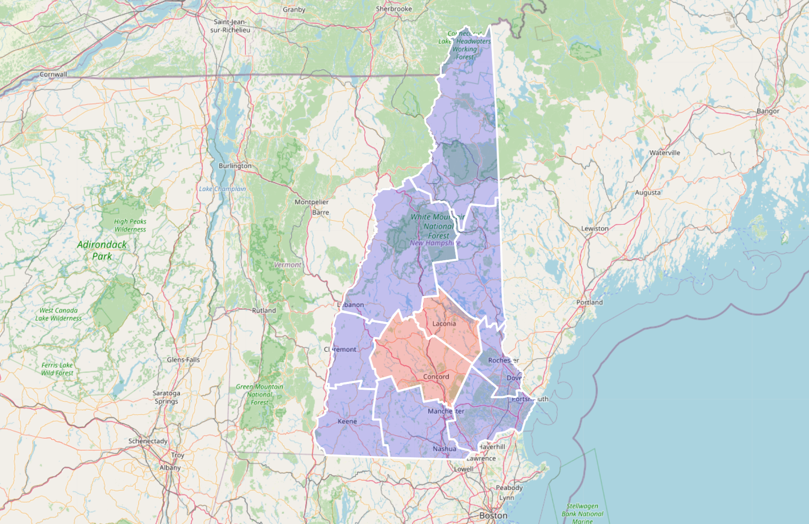

Komentarz:
Wszystkie jednostki administracyjne (us_counties) wewnątrz stanu New Hampshire.

Na powższej mapie zobrazowano wszystkie trzy rodzaje zapyatń podanych w zadaniu, nadając biały kolor obramowania (granic) wszystkim jednostkom administracyjnym (`mask=INSIDE+COVEREDBY`), czerwonym kolor jednoskom wewnątz stanu (`mask=INSIDE`) i niebieski kolor jednoskom pokrytym przez obszar stanu (`mask=COVEREDBY`).


# Zadanie 5

Znajdź wszystkie miasta w odległości 50 mili od drogi (us_interstates) I4

Pokaż wyniki na mapie

```sql
SELECT * FROM us_interstates 
WHERE interstate = 'I4' 
 
SELECT * FROM us_states 
WHERE state_abrv = 'FL' 
 
SELECT c.city, c.state_abrv, c.location  
FROM us_cities c 
WHERE ROWID IN  
(  
SELECT c.rowid 
FROM us_interstates i, us_cities c  
WHERE i.interstate = 'I4' 
AND sdo_within_distance (c.location, i.geom,'distance=50 unit=mile') 
= 'TRUE'  
);
```


Ta autostrada biegnie przez stan Floryda, przechodząc przez miasta takie jak Tampa, Orlando i St. Petersburg.

Dodatkowo:

a)     Znajdz wszystkie jednostki administracyjne przez które przechodzi droga I4

b)    Znajdz wszystkie jednostki administracyjne w pewnej odległości od I4

c)     Znajdz rzeki które przecina droga I4

d)    Znajdz wszystkie drogi które przecinają rzekę Mississippi

e)    Znajdz wszystkie miasta w odlegości od 15 do 30 mil od drogi 'I275'

f)      Itp. (własne przykłady)


```sql
--- Znajdź wszystkie jednostki administracyjne przez które przechodzi droga I4
SELECT c.county, c.geom 
FROM us_counties c 
WHERE EXISTS ( 
    SELECT 1 
    FROM us_interstates i 
    WHERE i.interstate = 'I4' 
    AND sdo_relate(c.geom, i.geom, 'mask=ANYINTERACT') = 'TRUE' 
) 
```
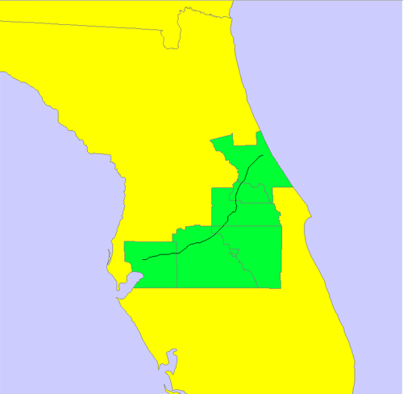

Droga ta znajduje sie na Florydzie. Znajduje sie na terytorium 6 hrabstw.

```sql

--- Znajdź wszystkie jednostki administracyjne w pewnej odległości od I4
 SELECT c.county, c.state_abrv, c.geom 
FROM us_counties c 
WHERE EXISTS ( 
    SELECT 1 
    FROM us_interstates i 
    WHERE i.interstate = 'I4' 
    AND SDO_WITHIN_DISTANCE(c.geom, i.geom, 'distance=100 unit=mile') = 'TRUE' 
);
```
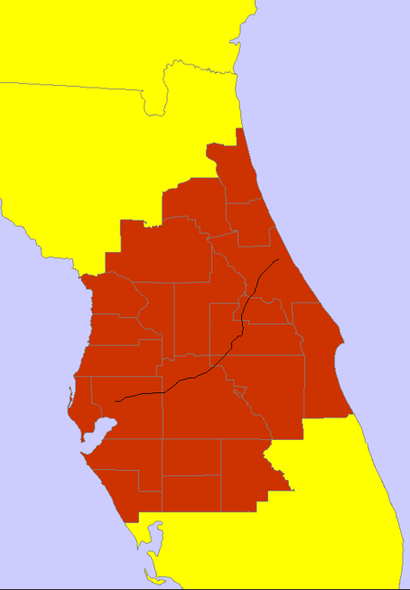
```sql
--- Znajdź rzeki które przecina droga I4
WITH intersecting_rivers AS ( 
    SELECT r.name, r.geom 
    FROM us_rivers r 
    WHERE EXISTS ( 
        SELECT 1 
        FROM us_interstates i 
        WHERE i.interstate = 'I4' 
        AND SDO_RELATE(r.geom, i.geom, 'mask=ANYINTERACT') = 'TRUE' 
    ) 
) 
SELECT name, geom 
FROM intersecting_rivers
```
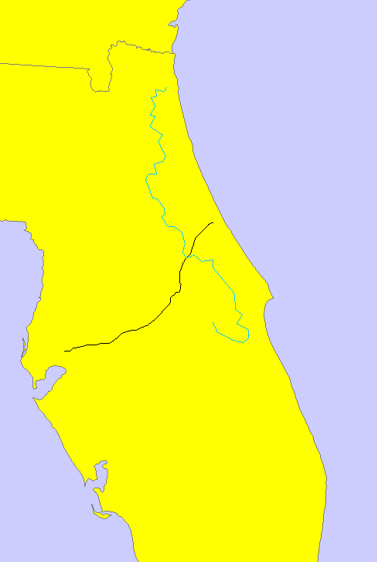

Droga I4 przecina rzekę St.Johnsa.
```sql
--- Znajdź wszystkie drogi które przecinają rzekę Mississippi
WITH intersecting_highways AS ( 
    SELECT i.interstate, i.geom 
    FROM us_interstates i 
    WHERE EXISTS ( 
        SELECT 1 
        FROM us_rivers r 
        WHERE r.name = 'Mississippi' 
        AND SDO_RELATE(i.geom, r.geom, 'mask=ANYINTERACT') = 'TRUE' 
    ) 
) 
SELECT interstate, geom 
FROM intersecting_highways;
```
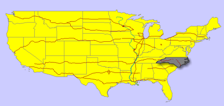

Znalazeiono 15 dróg, które przecinają rzekę Mississippi.
```sql
--- Znajdź wszystkie miasta w odległości od 15 do 30 mil od drogi 'I275'

SELECT c.*
FROM us_cities c, us_interstates i
WHERE SDO_WITHIN_DISTANCE(c.location, i.geom, 'distance=15 unit=mile') = 'TRUE' 
AND SDO_WITHIN_DISTANCE(c.location, i.geom, 'distance=30 unit=mile') = 'TRUE'
AND i.interstate = 'I275';
```
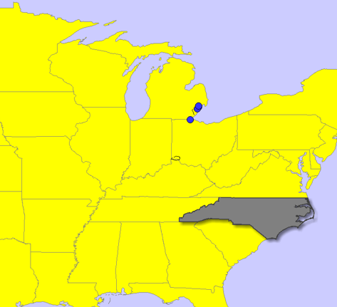

W bazie znajduj się miasta Sterling Heights, Detroit, Toledo, Warren. Wszystkie z nich dotycz części drogi znajdującej się w stanie "Michigan"
```sql
--- Wlasne przykłady
--- Znajdź wszystkie wszystkie stany, przez które przebiegają maksymalnie 2 autostrady.
SELECT s.state, s.state_abrv 
FROM us_states s 
WHERE ( 
    SELECT COUNT(DISTINCT i.interstate) 
    FROM us_interstates i 
    WHERE SDO_RELATE(s.geom, i.geom, 'mask=ANYINTERACT') = 'TRUE' 
) < 3; 
```
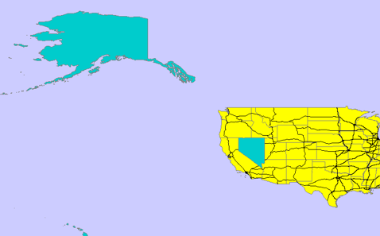

Są to Nevada, Hawaii, Alaka, American Samoa, Guam, Northern Mariana Talands, Puero Rico, Virgin Islands.
```sql
--- Znajdź wszystkie parki, które znajują się w odległości nie większej niż 120 mil od miasta Las Vegas: 
SELECT name, geom FROM us_parks
WHERE EXISTS ( 
SELECT 1 FROM us_ciies WHERE city = 'Las Vegas'
AND SDO_WITHIN_DISTANCE(geom, (SELECT location FROM us_cities))
FROM us_airports a, us_states s
WHERE SDO_CONTAINS(s.geom, a.location) = 'TRUE' AND s.state_name = 'California';
```
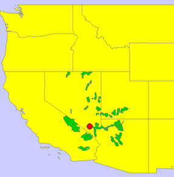

# Zadanie 6

**Uwaga: Parzyste zadania zostały wykonane w jupyter notebook.**

Znajdz 5 miast najbliższych drogi I4

```sql
SELECT c.city, c.state_abrv, c.location
FROM us_interstates i, us_cities c 
WHERE i.interstate = 'I4'
AND sdo_nn(c.location, i.geom, 'sdo_num_res=5') = 'TRUE';
```

>Wyniki, zrzut ekranu, komentarz

```python
query_i4_cities = """SELECT c.city, c.state_abrv, sdo_util.to_wktgeometry(c.location)
FROM us_interstates i, us_cities c 
WHERE i.interstate = 'I4'
AND sdo_nn(c.location, i.geom, 'sdo_num_res=5') = 'TRUE'"""

query = cursor.execute(query_i4_cities).fetchall()

m = folium.Map()

st = {'color': 'blue', 'fillColor': 'blue'}

for result in [query]:
    geom = [loads(res[2]) for res in result]
    features = [geojson.Feature(geometry=res, properties={}) for res in geom]
    feature_collection = geojson.FeatureCollection(features)
    folium.GeoJson(feature_collection, style_function=lambda x:st).add_to(m)

m
```

Zrzut ekranu:

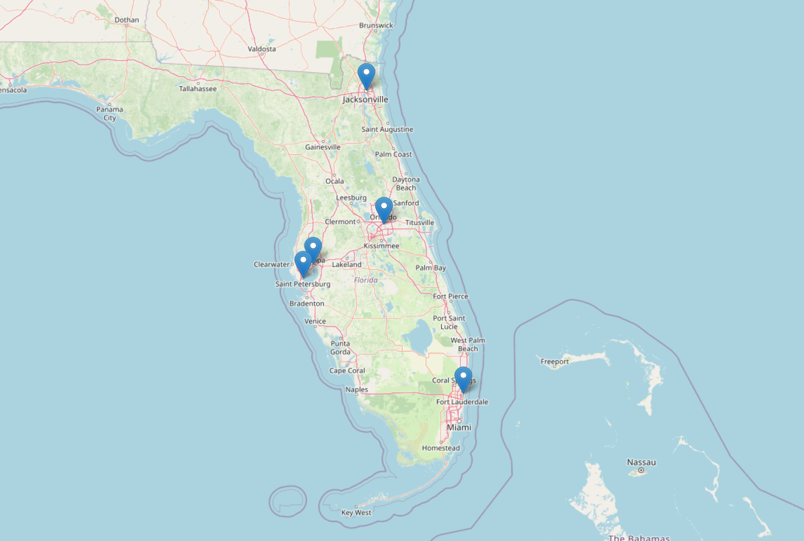

Komentarz: Zrzut ekranu przedstawia 5 miast nabliższych drogi I4 (Tampa,
Jacksonville,
St Petersburg,
Orlando, oraz
Fort Lauderdale). W zapytaniu użyto funkcji `SDO_NN`, zwracającej najbliższych sąsiadów danego kształtu.


Dodatkowo:

a)     Znajdz kilka miast najbliższych rzece Mississippi

b)    Znajdz 3 miasta najbliżej Nowego Jorku

c)     Znajdz kilka jednostek administracyjnych (us_counties) z których jest najbliżej do Nowego Jorku

d)    Znajdz 5 najbliższych miast od drogi  'I170', podaj odległość do tych miast

e)    Znajdz 5 najbliższych dużych miast (o populacji powyżej 300 tys) od drogi 'I170'

f)      Itp. (własne przykłady)


> Wyniki, zrzut ekranu, komentarz
> (dla każdego z podpunktów)

a)
```python
query_mississippi_cities = """SELECT c.city, c.state_abrv, sdo_util.to_wktgeometry(c.location)
FROM us_rivers r, us_cities c 
WHERE r.name = 'Mississippi'
AND sdo_nn(c.location, r.geom, 'sdo_num_res=7') = 'TRUE'"""

# Wyświetlanie na mapie analogicznie, jak we wzorcowym przykładzie powyżej
```
Zrzut ekranu:

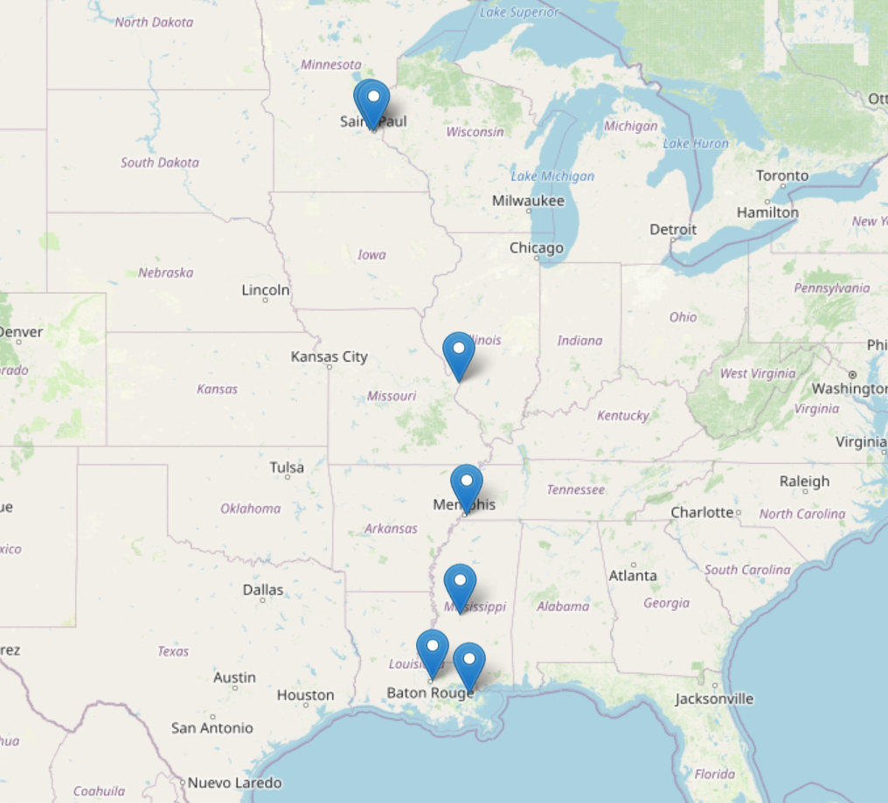

Komentarz: Zrzut ekranu przedstawia 7 miast najbliższych rzece Mississippi.
(St Paul,
Memphis,
New Orleans,
St Louis,
Minneapolis,
Baton Rouge,
Jackson).
W zapytaniu użyto funkcji `SDO_NN`, zwracającej najbliższych sąsiadów danego kształtu.


b)
```python
query_new_york_cities = """SELECT c.city, c.state_abrv, sdo_util.to_wktgeometry(c.location)
FROM us_cities c 
WHERE c.city != 'New York'
AND sdo_nn(c.location, (SELECT location FROM us_cities WHERE city = 'New York'), 'sdo_num_res=4') = 'TRUE'"""

# Wyświetlanie na mapie analogicznie, jak we wzorcowym przykładzie powyżej
```
Zrzut ekranu:

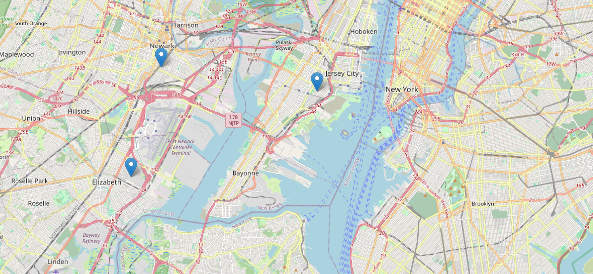

Komentarz:
Zrzut ekranu przedstawia 3 miasta najbliżej Nowego Jorku.
(Elizabeth,
Newark,
Jersey City).
W zapytaniu użyto funkcji `SDO_NN`, zwracającej najbliższych sąsiadów danego kształtu. Ponieważ wygląda na to, że `SDO_NN` jest zwrotna, żeby uzyskać trzy miasta najbliżej Nowego Jorku, należało zwiększyć `sdo_num_res` do 4 i wykluczyć `New York` z poszukiwań (Nowy Jork sam jest miastem najbliżej Nowego Jorku). Lokacja Nowego Jorku brana jest podzapytaniem.

c)
```python
query_new_york_counties = """
SELECT co.county, co.state_abrv, sdo_util.to_wktgeometry(co.geom)
FROM us_counties co 
WHERE sdo_nn(co.geom, (SELECT location FROM us_cities WHERE city = 'New York'), 'sdo_num_res=5') = 'TRUE'
"""

# Wyświetlanie na mapie analogicznie, jak we wzorcowym przykładzie powyżej
```
Zrzut ekranu:

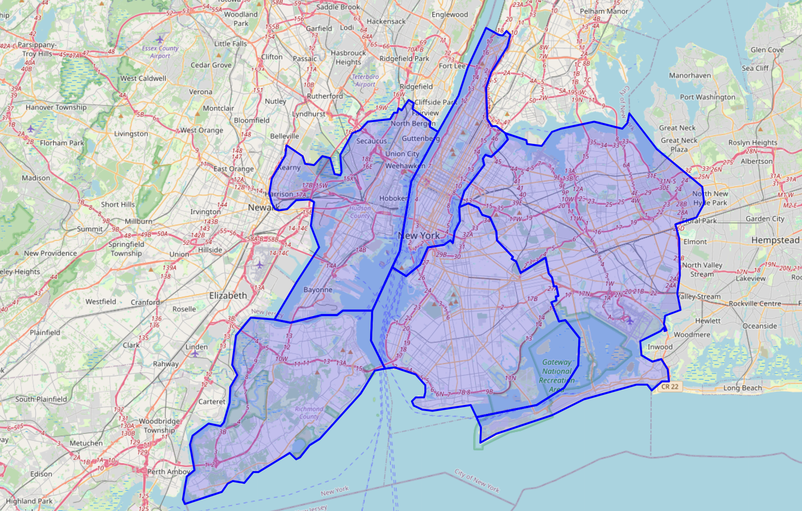


Komentarz:
Zrzut ekranu przedstawia kilka jednostek administracyjnych (us_counties) z których jest najbliżej do Nowego Jorku.
(Hudson,
Queens,
Richmond,
Kings,
New York).
W zapytaniu użyto funkcji `SDO_NN`, zwracającej najbliższych sąsiadów danego kształtu. Siłą rzeczy zapytania zwraca jedn. admin, które leżą na terenie miasta Nowy Jork (Queens,
New York). Usunięcie ich dodaniem funkcji `SDO_INSIDE` czy `SDO_RELATE` (chyba) jest niemożliwe, ponieważ baza zdaje się nie przechowywać danych o kształcie powierzchni miast (prznajmniej nie w tabeli `us_cities`). Zawsze można wyliczyć te jednostki i dodać coś w stylu: `AND co.county NOT IN ('Queens', 'New York')`.


d)
```python
query_i170_cities = """
SELECT c.city, c.state_abrv, sdo_util.to_wktgeometry(c.location), 
       sdo_geom.sdo_distance(c.location, i.geom, 0.005, 'unit=KM') as distance
FROM us_interstates i, us_cities c 
WHERE i.interstate = 'I170'
AND sdo_nn(c.location, i.geom, 'sdo_num_res=5') = 'TRUE'
ORDER BY distance
"""


# Wyświetlanie na mapie analogicznie, jak we wzorcowym przykładzie powyżej
```
Zrzut ekranu:

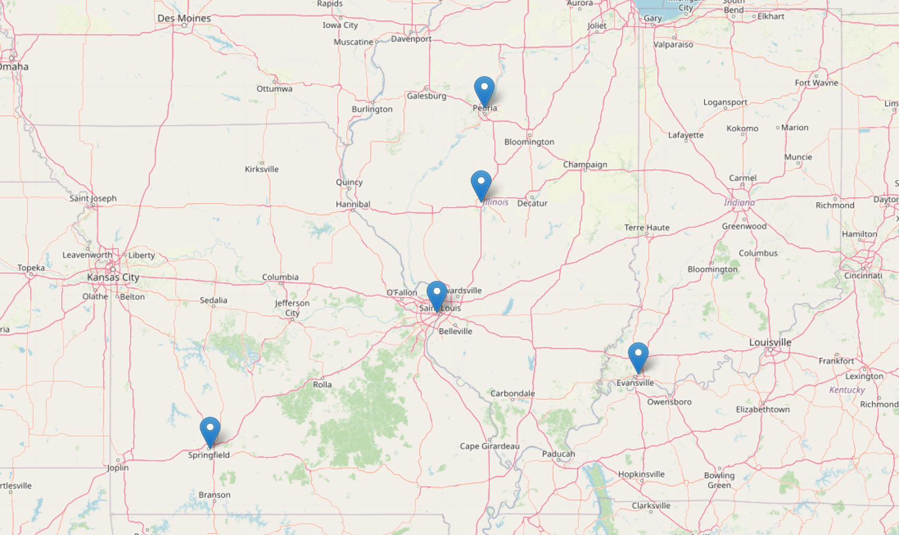


Komentarz:
Zrzut ekranu przedstawia 5 najbliższych miast od drogi  'I170'. Poniżej wymieniem je razem z odległością w kilometrach.\
St Louis 8.63086834124045\
Springfield 126.815899024404\
Peoria 227.686805598134\
Evansville 254.637198689794\
Springfield 303.375234373403


e)
```python
query_i170_large_cities = """
SELECT * FROM (
  SELECT c.city, c.state_abrv, sdo_util.to_wktgeometry(c.location), 
         sdo_geom.sdo_distance(c.location, i.geom, 0.005, 'unit=KM') as distance
  FROM us_interstates i, us_cities c 
  WHERE i.interstate = 'I170' AND c.pop90 > 300000
  ORDER BY distance
)
WHERE ROWNUM <= 5
"""

# Wyświetlanie na mapie analogicznie, jak we wzorcowym przykładzie powyżej
```
Zrzut ekranu:

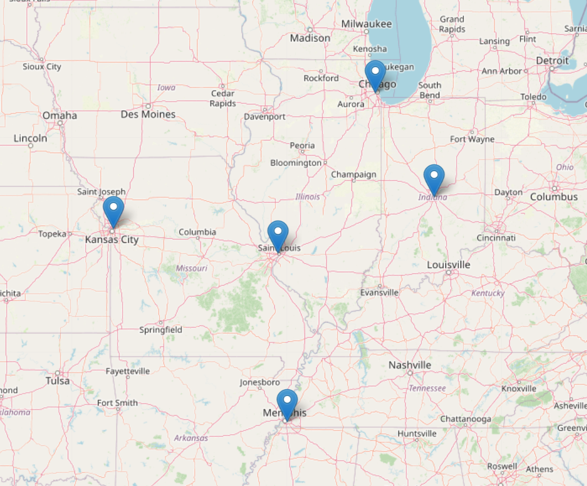

Komentarz:
Zrzut ekranu przedstawia 5 najbliższych dużych miast (o populacji powyżej 300 tys) od drogi 'I170'
(St Louis,
Kansas City,
Indianapolis,
Memphis,
Chicago).
W tym zapytaniu zapytaniu po raz pierwszy nie użyto funkcji `SDO_NN`. Takie podejście zwracało najbliższych sąsiadó i dopiero potem nakładało warunek, w efekcie czego trudno było dobierać `sdo_num_res` tak, by uzyskąc ostatecznie pięć miast. Zamiast tego zaproponowano zapytanie zwracahające 5 pierwszych wyników zapytania zwracającego miasta > 300000 mieszkańców uszeregowane wg odległości względem drogi 'I170'.


f) Własny przykład 1
```python
query_i95 = """SELECT c.city, c.state_abrv, sdo_util.to_wktgeometry(c.location)
FROM us_interstates i, us_cities c 
WHERE i.interstate = 'I95'
AND sdo_nn(c.location, i.geom, 'sdo_num_res=5') = 'TRUE'"""

# Wyświetlanie na mapie analogicznie, jak we wzorcowym przykładzie powyżej
```
Zrzut ekranu:

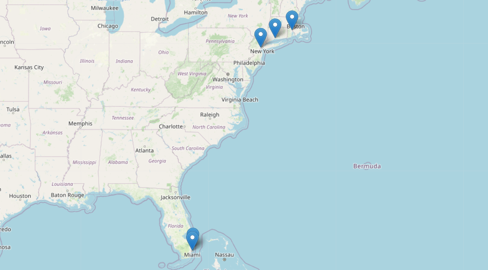

Komentarz:
Zrzut ekranu przedstawia 5 miast najbliższych drodze I95.


g) Własny przykład 2
```python
query_colorado = """SELECT c.city, c.state_abrv, sdo_util.to_wktgeometry(c.location)
FROM us_rivers r, us_cities c 
WHERE r.name = 'Colorado'
AND sdo_nn(c.location, r.geom, 'sdo_num_res=5') = 'TRUE'"""

# Wyświetlanie na mapie analogicznie, jak we wzorcowym przykładzie powyżej
```
Zrzut ekranu:

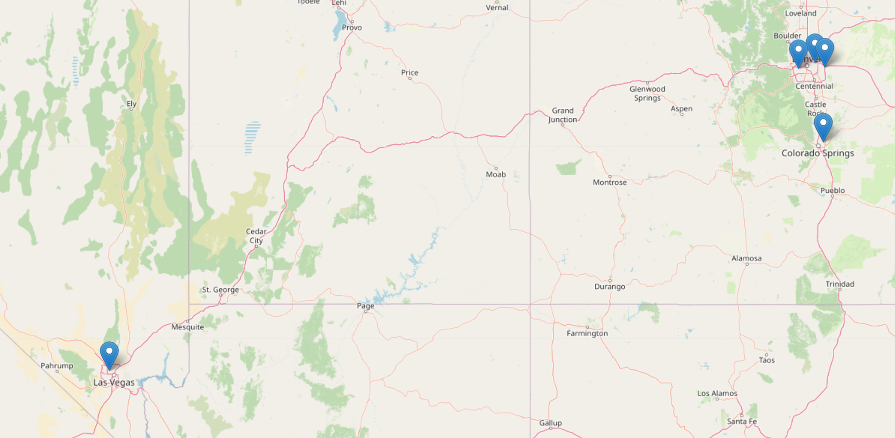

Komentarz:
Zrzut ekranu przedstawia 5 miast najbliższych rzece Colorado.


h) Własny przykład 3
```python
query_los_angeles = """SELECT c.city, c.state_abrv, sdo_util.to_wktgeometry(c.location)
FROM us_cities c 
WHERE c.city != 'Los Angeles'
AND sdo_nn(c.location, (SELECT location FROM us_cities WHERE city = 'Los Angeles'), 'sdo_num_res=4') = 'TRUE'"""

# Wyświetlanie na mapie analogicznie, jak we wzorcowym przykładzie powyżej
```
Zrzut ekranu:

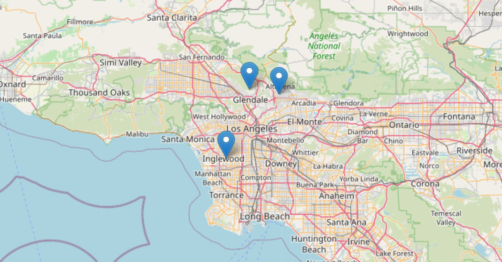

Komentarz:
Zrzut ekranu przedstawia 3 miasta najbliżej Los Angeles


i) Własny przykład 4
```python
query_los_angeles_counties = """SELECT co.county, co.state_abrv, sdo_util.to_wktgeometry(co.geom)
FROM us_counties co 
WHERE sdo_nn(co.geom, (SELECT location FROM us_cities WHERE city = 'Los Angeles'), 'sdo_num_res=6') = 'TRUE'
AND co.county != 'Los Angeles'"""

# Wyświetlanie na mapie analogicznie, jak we wzorcowym przykładzie powyżej
```
Zrzut ekranu:

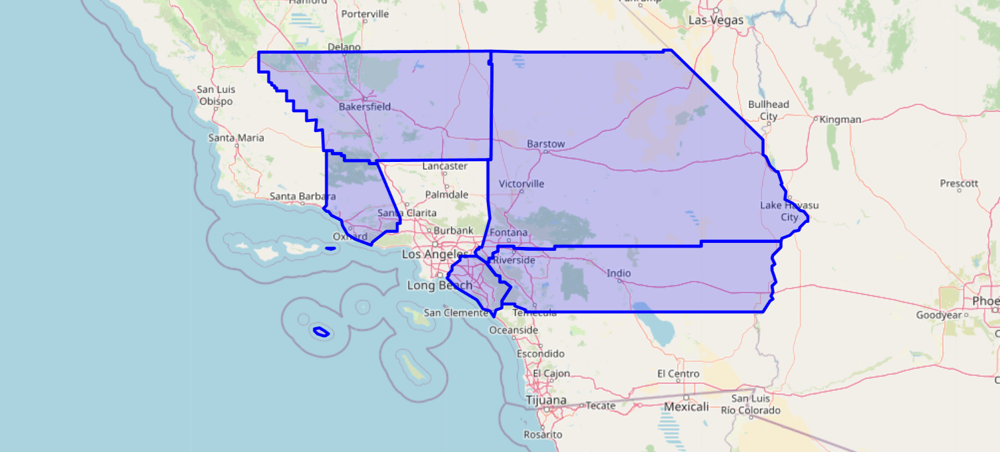

Komentarz:
Zrzut ekranu przedstawia 5 jedn. adm. najbliżej Los Angeles. Z zapytania wyłączono jednostkę administracyjną znajdującą się na terenie miasta.


# Zadanie 7

Oblicz długość drogi I4

```sql
SELECT SDO_GEOM.SDO_LENGTH (geom, 0.5,'unit=kilometer') length
FROM us_interstates
WHERE interstate = 'I4';
```


Długość drogi to 212.26 kilometrów.

Dodatkowo:

a)     Oblicz długość rzeki Mississippi

b)    Która droga jest najdłuższa/najkrótsza

c)     Która rzeka jest najdłuższa/najkrótsza

d)    Które stany mają najdłuższą granicę

e)    Itp. (własne przykłady)

```sql
--- Oblicz długość rzeki Mississippi
SELECT r.name, SDO_GEOM.SDO_LENGTH(r.geom, 0.005, 'unit=kilometer') AS length 
FROM us_rivers r 
WHERE r.name = 'Mississippi'; 

```

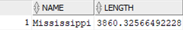

Długość rzeki Mississippi wynosi 3860 kilometrów.

```sql
-- Która droga jest najdłuższa/najkrótsza

-- Najdłuższa droga
SELECT interstate, SDO_GEOM.SDO_LENGTH(geom, 0.5, 'unit=kilometer') AS length
FROM us_interstates
ORDER BY length DESC
FETCH FIRST 1 ROW ONLY;

-- Najkrótsza droga
SELECT interstate, SDO_GEOM.SDO_LENGTH(geom, 0.5, 'unit=kilometer') AS length
FROM us_interstates
ORDER BY length
FETCH FIRST 1 ROW ONLY;

```
- Najdłuższa droga:


to I90, jej długość to 4290.64 km.

- Najkrótsza droga:


to I564, jej długość to 0.462km


```sql
-- Najdłuższa rzeka
SELECT river_name, SDO_GEOM.SDO_LENGTH(geom, 0.5, 'unit=kilometer') AS length
FROM us_rivers
ORDER BY length DESC
FETCH FIRST 1 ROW ONLY;

-- Najkrótsza rzeka
SELECT river_name, SDO_GEOM.SDO_LENGTH(geom, 0.5, 'unit=kilometer') AS length
FROM us_rivers
ORDER BY length
FETCH FIRST 1 ROW ONLY;
```

- Najdłuższa rzeka:


to St. Lawrence, jej długość to 6950.91 km.

- Najkrótsza rzeka:


to również St. Lawrence, jej długość to 1,16 km.

```sql
--- Które stany mają najdłuższą granicę
SELECT state, SDO_GEOM.SDO_LENGTH(geom, 0.5, 'unit=kilometer') AS length
FROM us_states
ORDER BY length DESC
FETCH FIRST 1 ROW ONLY;
```


Stan Alaska ma najdłuższą granicę, któa wynosi 26138.37 km.


Oblicz odległość między miastami Buffalo i Syracuse

```sql
SELECT SDO_GEOM.SDO_DISTANCE ( c1.location, c2.location, 0.5) distance
FROM us_cities c1, us_cities c2
WHERE c1.city = 'Buffalo' and c2.city = 'Syracuse';
```


Odległość między miastami Buffalo i Syracuse to 222184,61 km


Dodatkowo:

a)     Oblicz odległość między miastem Tampa a drogą I4

b)    Jaka jest odległość z między stanem Nowy Jork a  Florydą

c)     Jaka jest odległość z między miastem Nowy Jork a  Florydą

d)    Podaj 3 parki narodowe do których jest najbliżej z Nowego Jorku, oblicz odległości do tych parków

e)    Przetestuj działanie funkcji

a.     sdo_intersection, sdo_union, sdo_difference

b.     sdo_buffer

c.     sdo_centroid, sdo_mbr, sdo_convexhull, sdo_simplify

f)      Itp. (własne przykłady)


```sql
--- Oblicz odległość między miastem Tampa a drogą I4
SELECT SDO_GEOM.SDO_DISTANCE(c.location, i.geom, 0.5) AS distance_km
FROM us_cities c, us_interstates i
WHERE c.city = 'Tampa' AND i.interstate = 'I4';

```


Odległość między miastem Tampa a drogą I4 to 3103.91 km
```sql
--- Jaka jest odległość z między stanem Nowy Jork a  Florydą
SELECT SDO_GEOM.SDO_DISTANCE(s1.geom, s2.geom, 0.5) AS distance_km
FROM us_states s1, us_states s2
WHERE s1.state_name = 'New York' AND s2.state_name = 'Florida';

```

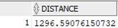

Odległość między stanem Nowy Jork a Florydą to 1296.59 km

```sql
--- Jaka jest odległość z między miastem Nowy Jork a  Florydą
SELECT SDO_GEOM.SDO_DISTANCE(c1.location, c2.location, 0.5) AS distance_km
FROM us_cities c1, us_cities c2
WHERE c1.city = 'New York' AND c2.city = 'Florida';

```
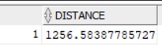

Odległość między Nowym Jorkiem a Florydą zależy od konkretnych miast w tych stanach. Na przykład, odległość między Nowym Jorkiem a Miami wynosi około 1256 kilometrów w linii prostej. Jednak jeśli chodzi o odległość drogową, zazwyczaj jest to około około 2,060-2,090 kilometrów.

```sql
--- Podaj 3 parki narodowe do których jest najbliżej z Nowego Jorku, oblicz odległości do tych parków
SELECT p.name, SDO_GEOM.SDO_DISTANCE ( c.location, p.geom, 0.5, 'unit=kilometer') distance 
FROM us_parks p, us_cities c  
WHERE c.city = 'New York' 
AND sdo_nn(c.location, p.geom, 'sdo_num_res=3') = 'TRUE' 
ORDER BY distance  
FETCH FIRST 3 ROW ONLY 

```

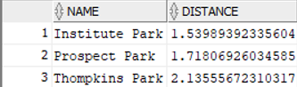

3 parki narodowe do których jest najbliżej z Nowego Jorku to ```Institute Park```, ```Prospect Park``` oraz ```Thompkins Park```.


---
`sdo_intersection`: Oblicza przecięcie dwóch geometrii, zwracając wspólny obszar.

`sdo_union`: Oblicza sumę dwóch geometrii, zwracając obszar obejmujący oba obiekty.

`sdo_difference`: Oblicza różnicę między dwiema geometriami, zwracając obszar pierwszej geometrii bez części wspólnej z drugą.

`sdo_buffer`: Tworzy bufor wokół danej geometrii, będący obszarem w określonej odległości od jej krawędzi.

`sdo_centroid`: Oblicza centroid geometrii, czyli jej środek ciężkości.

`sdo_mbr`: Oblicza najmniejszy prostokąt otaczający (MBR) daną geometrię.

`sdo_convexhull`: Oblicza otoczkę wypukłą geometrii, czyli najmniejszy wypukły obszar zawierający całą geometrię.

`sdo_simplify`: Upraszcza geometrię, usuwając zbędne detale zgodnie z określoną tolerancją.

```sql
-- SDO_INTERSECTION: Zwraca część wspólną dwóch geometrii
SELECT SDO_GEOM.SDO_INTERSECTION(a.geom, b.geom, 0.005) AS intersection_geom
FROM geometry_table a, geometry_table b
WHERE a.id = 1 AND b.id = 2;

-- SDO_UNION: Zwraca sumę dwóch geometrii
SELECT SDO_GEOM.SDO_UNION(a.geom, b.geom, 0.005) AS union_geom
FROM geometry_table a, geometry_table b
WHERE a.id = 1 AND b.id = 2;

-- SDO_DIFFERENCE: Zwraca różnicę między dwoma geometriami
SELECT SDO_GEOM.SDO_DIFFERENCE(a.geom, b.geom, 0.005) AS difference_geom
FROM geometry_table a, geometry_table b
WHERE a.id = 1 AND b.id = 2;

```


```sql
-- SDO_BUFFER: Tworzy bufor wokół geometrii
SELECT SDO_GEOM.SDO_BUFFER(geom, 0.1, 0.005) AS buffer_geom
FROM geometry_table
WHERE id = 1;
```

```sql
-- SDO_CENTROID: Oblicza centroid dla geometrii
SELECT SDO_GEOM.SDO_CENTROID(geom, 0.005) AS centroid_geom
FROM geometry_table
WHERE id = 1;

-- SDO_MBR: Zwraca minimalny zewnętrzny prostokąt dla geometrii
SELECT SDO_GEOM.SDO_MBR(geom) AS mbr_geom
FROM geometry_table
WHERE id = 1;

-- SDO_CONVEXHULL: Tworzy otoczkę wypukłą wokół geometrii
SELECT SDO_GEOM.SDO_CONVEXHULL(geom, 0.005) AS convexhull_geom
FROM geometry_table
WHERE id = 1;

-- SDO_SIMPLIFY: Uproszcza geometrię
SELECT SDO_GEOM.SDO_SIMPLIFY(geom, 0.005) AS simplified_geom
FROM geometry_table
WHERE id = 1;

```


# Zadanie 8

**Uwaga: Parzyste zadania zostały wykonane w jupyter notebook.**


Wykonaj kilka własnych przykładów/analiz


Przykład 1

>Wyniki, zrzut ekranu, komentarz

```python
query_largest_parks = """
SELECT p.name, SDO_GEOM.SDO_AREA(p.geom, 0.005, 'unit=SQ_KM') as area, sdo_util.to_wktgeometry(p.geom)
FROM us_parks p
ORDER BY area DESC
FETCH FIRST 5 ROWS ONLY
"""

# Wyświetlanie na mapie analogicznie, jak przykładach w parzystych zadaniach powyżej
```

Zrut ekranu:

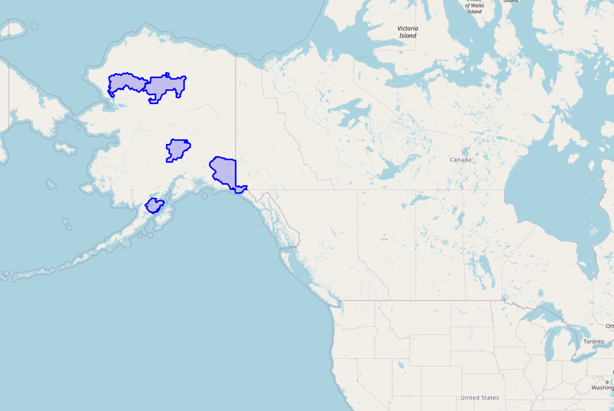


Komentarz:
W przykładzie podajemy zapytanie, które zwraca i umożliwia wyświetlenie na mapie 5 największych parków narodowych (z tabeli `us_parks`) w Stanach Zjednoczonych. Poniżej lista ich nazw wraz polem powierzni w km^2:\
Wrangell-St. Elias NP and NPRE 53370.0142890794\
Gates of the Arctic NP & NPRES 34280.9722577574\
Noatak NPRES 26582.3201923589\
Denali NP and NPRES 24398.5944663352\
Katmai NP and NPRES 16561.6337361726

Przykład 2

>Wyniki, zrzut ekranu, komentarz

```python
query_longest_river_in_texas = """
SELECT r.name, SDO_GEOM.SDO_LENGTH(r.geom, 0.005, 'unit=KM') as length, sdo_util.to_wktgeometry(r.geom)
FROM us_rivers r, us_states s
WHERE s.state = 'Texas' AND SDO_ANYINTERACT(r.geom, s.geom) = 'TRUE'
ORDER BY length DESC
FETCH FIRST ROW ONLY
"""

# Wyświetlanie na mapie analogicznie, jak przykładach w parzystych zadaniach powyżej
```

Zrut ekranu:

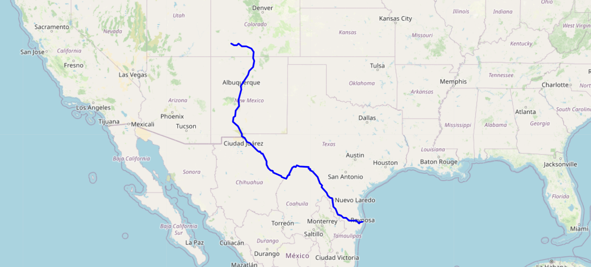

Komentarz:
W przykładzie podajemy zapytanie, które zwraca i umożliwia wyświetlenie na najdłuższą rzekę przepływającą przez stan Texas (Rio Grande, 2397.13 km).


Przykład 3

>Wyniki, zrzut ekranu, komentarz

```python
query_nearest_parks_to_la = """
SELECT p.name, SDO_GEOM.SDO_DISTANCE(p.geom, c.location, 0.005, 'unit=KM') as distance, sdo_util.to_wktgeometry(p.geom)
FROM us_parks p, us_cities c
WHERE c.city = 'Los Angeles'
ORDER BY distance
FETCH FIRST 5 ROWS ONLY
"""

# Wyświetlanie na mapie analogicznie, jak przykładach w parzystych zadaniach powyżej
```

Zrut ekranu:

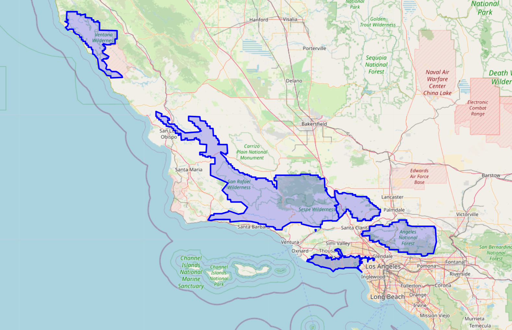

Komentarz:
W przykładzie podajemy zapytanie, które zwraca i umożliwia wyświetlenie na mapie 5 parków narodowych najbliższych Los Angeles (Santa Monica, Mountains NRA,
Angeles NF,
Los Padres NF,
Kenney Grove Park,
Toland Park), niewykorzystujące funkcji `SDO_NN`.


Punktacja

|   |   |
|---|---|
|zad|pkt|
|1|0,5|
|2|1|
|3|1|
|4|1|
|5|3|
|6|3|
|7|6|
|8|4|
|razem|20|
