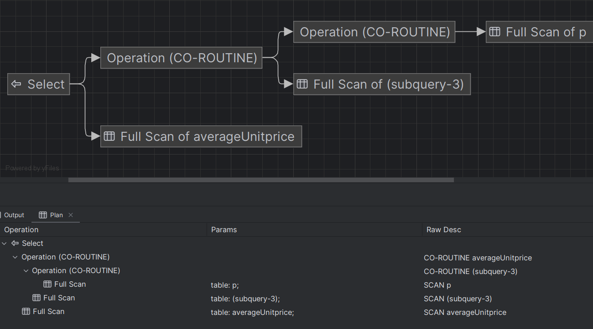

# SQL - Funkcje okna (Window functions) 

# Lab 1-2

---
**Imię i nazwisko:**
Przemysław Spyra
--- 


Celem ćwiczenia jest zapoznanie się z działaniem funkcji okna (window functions) w SQL, analiza wydajności zapytań i porównanie z rozwiązaniami przy wykorzystaniu "tradycyjnych" konstrukcji SQL

Swoje odpowiedzi wpisuj w miejsca oznaczone jako:

```sql
-- wyniki ...
```

Ważne/wymagane są komentarze.

Zamieść kod rozwiązania oraz zrzuty ekranu pokazujące wyniki, (dołącz kod rozwiązania w formie tekstowej/źródłowej)

Zwróć uwagę na formatowanie kodu

---

## Oprogramowanie - co jest potrzebne?

Do wykonania ćwiczenia potrzebne jest następujące oprogramowanie:
- MS SQL Server - wersja 2019, 2022
- PostgreSQL - wersja 15/16
- SQLite
- Narzędzia do komunikacji z bazą danych
	- SSMS - Microsoft SQL Managment Studio
	- DtataGrip lub DBeaver
-  Przykładowa baza Northwind
	- W wersji dla każdego z wymienionych serwerów

Oprogramowanie dostępne jest na przygotowanej maszynie wirtualnej

## Dokumentacja/Literatura

- Kathi Kellenberger,  Clayton Groom, Ed Pollack, Expert T-SQL Window Functions in SQL Server 2019, Apres 2019
- Itzik Ben-Gan, T-SQL Window Functions: For Data Analysis and Beyond, Microsoft 2020

- Kilka linków do materiałów które mogą być pomocne
	 - https://learn.microsoft.com/en-us/sql/t-sql/queries/select-over-clause-transact-sql?view=sql-server-ver16
	- https://www.sqlservertutorial.net/sql-server-window-functions/
	- https://www.sqlshack.com/use-window-functions-sql-server/
	- https://www.postgresql.org/docs/current/tutorial-window.html
	- https://www.postgresqltutorial.com/postgresql-window-function/
	-  https://www.sqlite.org/windowfunctions.html
	- https://www.sqlitetutorial.net/sqlite-window-functions/

- Ikonki używane w graficznej prezentacji planu zapytania w SSMS opisane są tutaj:
	- [https://docs.microsoft.com/en-us/sql/relational-databases/showplan-logical-and-physical-operators-reference](https://docs.microsoft.com/en-us/sql/relational-databases/showplan-logical-and-physical-operators-reference)

---
# Zadanie 1 - obserwacja

Wykonaj i porównaj wyniki następujących poleceń.

```sql
select avg(unitprice) avgprice
from products p;

select avg(unitprice) over () as avgprice
from products p;

select categoryid, avg(unitprice) avgprice
from products p
group by categoryid

select avg(unitprice) over (partition by categoryid) as avgprice
from products p;
```

Jaka jest są podobieństwa, jakie różnice pomiędzy grupowaniem danych a działaniem funkcji okna?

```sql
Grupowanie danych dzieli zbiór na kategorie. Pierwsza kolejka zwraca średnią cenę bazującą na całej tabeli Products, natomiast wariant z group by zwraca średnią cenę dla pogrupowanych CategoryID - wyników będzie tyle, ile jest unikalnych CategoryID.

Funkcja okna wykonuje operacje na podzbiorach danych przesuwających się po całym zbiorze. Wynikiem pierwszej kolejki z funkcją okna będzie średnia cena liczona dla całej tabeli Products, przydzielona dla każdej instancji produktu - wyników będzie tyle, ile jest wierszy w tabeli Products. Użycie partition by CategoryID sprawia, że średnia cena jest liczona dla poszczególnych CategoryID i przypisywana do wszystkich produktów należących do danej kategorii - wyników nadal będzie tyle, ile jest wierszy w tabeli Products.   
```

---
# Zadanie 2 - obserwacja

Wykonaj i porównaj wyniki następujących poleceń.

```sql
--1)

select p.productid, p.ProductName, p.unitprice,
       (select avg(unitprice) from products) as avgprice
from products p
where productid < 10;

--2)
select p.productid, p.ProductName, p.unitprice,
       avg(unitprice) over () as avgprice
from products p
where productid < 10;
```


Jaka jest różnica? Czego dotyczy warunek w każdym z przypadków? Napisz polecenie równoważne 
- 1) z wykorzystaniem funkcji okna. Napisz polecenie równoważne 
- 2) z wykorzystaniem podzapytania

```sql
Różnica polega na tym, że select z podzapytaniem opiera swoją średnią na wszystkich wartościach unitprice z tabeli products, całkowicie ignorując polecenie where productid < 10, podczas, gdy drugi select używający funkcji okna uwzględnia ten warunek. Dostajemy w ten sposób różne wyniki (28.833 vs 31.372).

--1 można sprowdzić do 2 wrzucając warunek where do podzapytania
select p.productid, p.ProductName, p.unitprice,
       (select avg(unitprice) from products where productid < 10) as avgprice
from products p;

-- 2 można sprowadzić do 1 ignorując warunek where
select p.productid, p.ProductName, p.unitprice,
       avg(unitprice) over () as avgprice
from products p;
```


# Zadanie 3

Baza: Northwind, tabela: products

Napisz polecenie, które zwraca: id produktu, nazwę produktu, cenę produktu, średnią cenę wszystkich produktów.

Napisz polecenie z wykorzystaniem z wykorzystaniem podzapytania, join'a oraz funkcji okna. Porównaj czasy oraz plany wykonania zapytań.

Przetestuj działanie w różnych SZBD (MS SQL Server, PostgreSql, SQLite)

W SSMS włącz dwie opcje: Include Actual Execution Plan oraz Include Live Query Statistics


W DataGrip użyj opcji Explain Plan/Explain Analyze


```sql
-- podzapytanie
select p.productid, p.productname, p.unitprice,
       (select avg(unitprice) from products) as avgprice
from products p;

-- join
SELECT p.productid, p.productname, p.unitprice, avgprice.avgUnitprice AS avgprice
FROM products p
CROSS JOIN (SELECT AVG(unitprice) AS avgUnitprice FROM products) AS avgprice;

-- funkcja okna
select p.productid, p.productname, p.unitprice,
       avg(unitprice) over() as avgprice
from products p;
```

PostgreSQL

podzapytanie:


join:


funkcja okna:


Koszty wykonania od najmniejszego: funkcja okna (2.73), podzapytanie (3.75), join(4.51) 
Plany wykonania od najmniejszego stopnia złożenia: funkcja okna, podzapytanie, join

MS SQL Server

podzapytanie:


join:


funkcja okna:


Koszty wykonania od najmniejszego: funkcja okna (2.73), podzapytanie (3.75), join(4.51) 
Plany wykonania od najmniejszego stopnia złożenia: funkcja okna, join, podzapytanie (bardzo wysoki stopień złożoności względem pozostałych)

SQLite

podzapytanie:

join:

funkcja okna:


Brak informacji o koszcie wykonania.
Plany wykonania od najmniejszego stopnia złożenia: funkcja okna / podzapytanie, join
---

# Zadanie 4

Baza: Northwind, tabela products

Napisz polecenie, które zwraca: id produktu, nazwę produktu, cenę produktu, średnią cenę produktów w kategorii, do której należy dany produkt. Wyświetl tylko pozycje (produkty) których cena jest większa niż średnia cena.

Napisz polecenie z wykorzystaniem podzapytania, join'a oraz funkcji okna. Porównaj zapytania. Porównaj czasy oraz plany wykonania zapytań.

Przetestuj działanie w różnych SZBD (MS SQL Server, PostgreSql, SQLite)

```sql
-- podzapytanie
select p.productid, p.productname, p.unitprice,
       (select avg(unitprice) from products) as avgprice
from products p
where p.unitprice > (select avg(unitprice) from products);

-- join
SELECT p.productid, p.productname, p.unitprice, avgprice.avgUnitprice AS avgprice
FROM products p
CROSS JOIN (SELECT AVG(unitprice) AS avgUnitprice FROM products) AS avgprice
where p.unitprice > (select avg(unitprice) from products);

-- funkcja okna
select productid, productname, unitprice, averageUnitprice.avgprice as avgprive
FROM (
    SELECT p.productid, p.productname, p.unitprice,
           AVG(unitprice) OVER() AS avgprice
    FROM products p
) AS averageUnitprice
where unitprice > avgprice;
```
PostgreSQL

podzapytanie:

join:

funkcja okna:


Koszty wykonania od najmniejszego: funkcja okna (3.69), podzapytanie(5.91), join(6.17).
Plany wykonania od najmniejszego stopnia złożenia: funkcja okna, podzapytanie, join.

MS SQL Server

podzapytanie:

join:

funkcja okna:


Koszty wykonania od najmniejszego: funkcja okna (0.0056), join / podzapytanie(0.0127) - porównywalne
Plany wykonania od najmniejszego stopnia złożenia: join, podzapytanie, funkcja okna

SQLite

podzapytanie:

join:

funkcja okna:


Brak informacji o koszcie wykonania.
Plany wykonania od najmniejszego stopnia złożenia: podzapytanie, funkcja okna, join

---
# Zadanie 5 - przygotowanie

Baza: Northwind

Tabela products zawiera tylko 77 wiersz. Warto zaobserwować działanie na większym zbiorze danych.

Wygeneruj tabelę zawierającą kilka milionów (kilkaset tys.) wierszy

Stwórz tabelę o następującej strukturze:

Skrypt dla SQL Srerver

```sql
create table product_history(
   id int identity(1,1) not null,
   productid int,
   productname varchar(40) not null,
   supplierid int null,
   categoryid int null,
   quantityperunit varchar(20) null,
   unitprice decimal(10,2) null,
   quantity int,
   value decimal(10,2),
   date date,
 constraint pk_product_history primary key clustered
    (id asc )
)
```

Wygeneruj przykładowe dane:

Dla 30000 iteracji, tabela będzie zawierała nieco ponad 2mln wierszy (dostostu ograniczenie do możliwości swojego komputera)

Skrypt dla SQL Srerver

```sql
declare @i int  
set @i = 1  
while @i <= 30000  
begin  
    insert product_history  
    select productid, ProductName, SupplierID, CategoryID,   
         QuantityPerUnit,round(RAND()*unitprice + 10,2),  
         cast(RAND() * productid + 10 as int), 0,  
         dateadd(day, @i, '1940-01-01')  
    from products  
    set @i = @i + 1;  
end;  
  
update product_history  
set value = unitprice * quantity  
where 1=1;
```


Skrypt dla Postgresql

```sql
create table product_history(
   id int generated always as identity not null  
       constraint pkproduct_history
            primary key,
   productid int,
   productname varchar(40) not null,
   supplierid int null,
   categoryid int null,
   quantityperunit varchar(20) null,
   unitprice decimal(10,2) null,
   quantity int,
   value decimal(10,2),
   date date
);
```

Wygeneruj przykładowe dane:

Skrypt dla Postgresql

```sql
do $$  
begin  
  for cnt in 1..30000 loop  
    insert into product_history(productid, productname, supplierid,   
           categoryid, quantityperunit,  
           unitprice, quantity, value, date)  
    select productid, productname, supplierid, categoryid,   
           quantityperunit,  
           round((random()*unitprice + 10)::numeric,2),  
           cast(random() * productid + 10 as int), 0,  
           cast('1940-01-01' as date) + cnt  
    from products;  
  end loop;  
end; $$;  
  
update product_history  
set value = unitprice * quantity  
where 1=1;
```


Wykonaj polecenia: `select count(*) from product_history`,  potwierdzające wykonanie zadania

Postgresql:


SQL Server:


---
# Zadanie 6

Baza: Northwind, tabela product_history

To samo co w zadaniu 3, ale dla większego zbioru danych

Napisz polecenie, które zwraca: id pozycji, id produktu, nazwę produktu, cenę produktu, średnią cenę produktów w kategorii do której należy dany produkt. Wyświetl tylko pozycje (produkty) których cena jest większa niż średnia cena.

Napisz polecenie z wykorzystaniem podzapytania, join'a oraz funkcji okna. Porównaj zapytania. Porównaj czasy oraz plany wykonania zapytań.

Przetestuj działanie w różnych SZBD (MS SQL Server, PostgreSql, SQLite)


```sql
-- podzapytanie
select p.productid, p.productname, p.unitprice,
       (select avg(unitprice) from product_history) as avgprice
from product_history p
where p.unitprice > (select avg(unitprice) from product_history);

-- join
SELECT p.productid, p.productname, p.unitprice, avgprice.avgUnitprice AS avgprice
FROM product_history p
CROSS JOIN (SELECT AVG(unitprice) AS avgUnitprice FROM product_history) AS avgprice
where p.unitprice > (select avg(unitprice) from product_history);

-- funkcja okna
select productid, productname, unitprice, averageUnitprice.avgprice as avgprive
FROM (
    SELECT p.productid, p.productname, p.unitprice,
           AVG(unitprice) OVER() AS avgprice
    FROM product_history p
) AS averageUnitprice
where unitprice > avgprice;
```
PostgreSQL

podzapytanie:

join:

funkcja okna:


Koszty wykonania od najmniejszego: funkcja okna(139692), podzapytanie (231450), join(239151)
Plany wykonania od najmniejszego stopnia złożenia: funkcja okna, podzapytanie, join

MS SQL Server

podzapytanie:

join:

funkcja okna:


Koszty wykonania od najmniejszego: funkcja okna(21.01), join (63.15), podzapytanie (63.22) 
Plany wykonania od najmniejszego stopnia złożenia: funkcja okna, join/podzapytanie

SQLite

podzapytanie:

join:

funkcja okna:


Brak informacji o koszcie wykonania. 
Plany wykonania od najmniejszego stopnia złożenia:


---
# Zadanie 7

Baza: Northwind, tabela product_history

Lekka modyfikacja poprzedniego zadania

Napisz polecenie, które zwraca: id pozycji, id produktu, nazwę produktu, cenę produktu oraz
-  średnią cenę produktów w kategorii do której należy dany produkt.
-  łączną wartość sprzedaży produktów danej kategorii (suma dla pola value)
-  średnią cenę danego produktu w roku którego dotyczy dana pozycja
- łączną wartość sprzedaży produktów danej kategorii (suma dla pola value)

Napisz polecenie z wykorzystaniem podzapytania, join'a oraz funkcji okna. Porównaj zapytania. W przypadku funkcji okna spróbuj użyć klauzuli WINDOW.

Porównaj czasy oraz plany wykonania zapytań.

Przetestuj działanie w różnych SZBD (MS SQL Server, PostgreSql, SQLite)


```sql
-- podzapytania
SELECT
    ph.id,ph.productid,ph.productname,ph.unitprice,
    (SELECT AVG(unitprice) FROM product_history WHERE categoryid = ph.categoryid) AS avg_category_price,
    (SELECT SUM(value) FROM product_history WHERE categoryid = ph.categoryid) AS total_category_value,
    (SELECT AVG(unitprice) FROM product_history WHERE productid = ph.productid AND extract(year from date) = extract(year from ph.date)) AS avg_product_price_per_year,
    (SELECT SUM(value) FROM product_history WHERE categoryid = ph.categoryid) AS total_category_value_window
FROM
    product_history ph;

-- join
SELECT
    ph.id,ph.productid,ph.productname, ph.unitprice,
    AVG(pc.unitprice) AS avg_category_price,
    SUM(pc.value) AS total_category_value,
    AVG(ph.unitprice) AS avg_product_price_per_year,
    SUM(ph.value) AS total_category_value_window
FROM
    product_history ph
JOIN
    product_history pc ON ph.categoryid = pc.categoryid
GROUP BY
    ph.id,ph.productid,ph.productname,ph.unitprice;

-- funkcje okna
SELECT
    ph.id,ph.productid,ph.productname,ph.unitprice,
    AVG(ph.unitprice) OVER (PARTITION BY ph.categoryid) AS avg_category_price,
    SUM(ph.value) OVER (PARTITION BY ph.categoryid) AS total_category_value,
    AVG(ph.unitprice) OVER (PARTITION BY ph.productid, extract(year from ph.date)) AS avg_product_price_per_year,
    SUM(ph.value) OVER (PARTITION BY ph.categoryid) AS total_category_value_window
FROM
    product_history ph;
```

PostgreSQL

podzapytanie:

join:

funkcja okna:


Koszty wykonania od najmniejszego:
Plany wykonania od najmniejszego stopnia złożenia:

MS SQL Server

podzapytanie:

join:

funkcja okna:


Koszty wykonania od najmniejszego: 
Plany wykonania od najmniejszego stopnia złożenia: 

SQLite

podzapytanie:

join:

funkcja okna:


Brak informacji o koszcie wykonania.
Plany wykonania od najmniejszego stopnia złożenia:


---
# Zadanie 8 - obserwacja

Funkcje rankingu, `row_number()`, `rank()`, `dense_rank()`

Wykonaj polecenie, zaobserwuj wynik. Porównaj funkcje row_number(), rank(), dense_rank()

```sql 
select productid, productname, unitprice, categoryid,  
    row_number() over(partition by categoryid order by unitprice desc) as rowno,  
    rank() over(partition by categoryid order by unitprice desc) as rankprice,  
    dense_rank() over(partition by categoryid order by unitprice desc) as denserankprice  
from products;
```

```
 Widać, że funkcje te..
```


Zadanie

Spróbuj uzyskać ten sam wynik bez użycia funkcji okna

```sql
SELECT
    p.productid,
    p.productname,
    p.unitprice,
    p.categoryid,
    (
        SELECT COUNT(*)
        FROM products p2
        WHERE p2.categoryid = p.categoryid AND p2.unitprice >= p.unitprice
    ) AS rowno,
    (
        SELECT COUNT(DISTINCT p2.unitprice) + 1
        FROM products p2
        WHERE p2.categoryid = p.categoryid AND p2.unitprice > p.unitprice
    ) AS rankprice,
    (
        SELECT COUNT(DISTINCT p2.unitprice)
        FROM products p2
        WHERE p2.categoryid = p.categoryid AND p2.unitprice >= p.unitprice
    ) AS denserankprice
FROM products p;

```


---
# Zadanie 9

Baza: Northwind, tabela product_history

Dla każdego produktu, podaj 4 najwyższe ceny tego produktu w danym roku. Zbiór wynikowy powinien zawierać:
- rok
- id produktu
- nazwę produktu
- cenę
- datę (datę uzyskania przez produkt takiej ceny)
- pozycję w rankingu

Uporządkuj wynik wg roku, nr produktu, pozycji w rankingu

```sql
WITH RankedPrices AS (
    SELECT 
        YEAR(date) AS year,
        productid,
        productname,
        unitprice,
        date,
        ROW_NUMBER() OVER (PARTITION BY productid, YEAR(date) ORDER BY unitprice DESC) AS price_rank
    FROM 
        product_history
)

SELECT 
    year,
    productid,
    productname,
    unitprice,
    date,
    price_rank
FROM 
    RankedPrices
WHERE 
    price_rank <= 4
ORDER BY 
    year,
    productid,
    price_rank;
```


Spróbuj uzyskać ten sam wynik bez użycia funkcji okna, porównaj wyniki, czasy i plany zapytań. Przetestuj działanie w różnych SZBD (MS SQL Server, PostgreSql, SQLite)


```sql
SELECT 
    YEAR(ph1.date) AS year,
    ph1.productid,
    ph1.productname,
    ph1.unitprice,
    ph1.date,
    COUNT(*) AS price_rank
FROM 
    product_history ph1
JOIN 
    product_history ph2 ON ph1.productid = ph2.productid
    AND YEAR(ph1.date) = YEAR(ph2.date)
    AND ph1.unitprice <= ph2.unitprice
GROUP BY 
    YEAR(ph1.date),
    ph1.productid,
    ph1.productname,
    ph1.unitprice,
    ph1.date
HAVING 
    COUNT(*) <= 4
ORDER BY 
    YEAR(ph1.date),
    ph1.productid,
    price_rank;
```

---
# Zadanie 10 - obserwacja
Funkcje `lag()`, `lead()`

Wykonaj polecenia, zaobserwuj wynik. Jak działają funkcje `lag()`, `lead()`

```sql
select productid, productname, categoryid, date, unitprice,  
       lag(unitprice) over (partition by productid order by date)   
as previousprodprice,  
       lead(unitprice) over (partition by productid order by date)   
as nextprodprice  
from product_history  
where productid = 1 and year(date) = 2022  
order by date;  
  
with t as (select productid, productname, categoryid, date, unitprice,  
                  lag(unitprice) over (partition by productid   
order by date) as previousprodprice,  
                  lead(unitprice) over (partition by productid   
order by date) as nextprodprice  
           from product_history  
           )  
select * from t  
where productid = 1 and year(date) = 2022  
order by date;
```
pierwszy select:

drugi select:


```sql
Zarówno LEAD() jak i LAG() zwracają wartości, które liczone są na podstawie sąsiednich wierszy.
 LEAD() zwraca wiersz, który pojawia się za nim (posiada indeks większy o 1). Nie musimy w ten sposób używać skomplikowanych podzapytań ani self-join, aby zwrócić następnika danego wiersza. 
 LAG() zwraca wiersz, który pojawia się przed nim (posiada indeks mnniejszy o 1)

 Drugi select uzupełnia nam miejsce null w pierwszym wierszu, ponieważ ...
```
Zadanie

Spróbuj uzyskać ten sam wynik bez użycia funkcji okna, porównaj wyniki, czasy i plany zapytań. Przetestuj działanie w różnych SZBD (MS SQL Server, PostgreSql, SQLite)

```sql
SELECT 
    ph.productid,
    ph.productname,
    ph.categoryid,
    ph.date,
    ph.unitprice,
    prev.unitprice AS previousprodprice,
    next.unitprice AS nextprodprice
FROM 
    product_history ph
LEFT JOIN 
    product_history prev ON ph.productid = prev.productid
    AND ph.date > prev.date
LEFT JOIN 
    product_history next ON ph.productid = next.productid
    AND ph.date < next.date
WHERE 
    ph.productid = 1
    AND YEAR(ph.date) = 2022
ORDER BY 
    ph.date;

```
MS SQL Server


PostgreSQL

\> 20min

---
# Zadanie 11

Baza: Northwind, tabele customers, orders, order details

Napisz polecenie które wyświetla inf. o zamówieniach

Zbiór wynikowy powinien zawierać:
- nazwę klienta, nr zamówienia,
- datę zamówienia,
- wartość zamówienia (wraz z opłatą za przesyłkę),
- nr poprzedniego zamówienia danego klienta,
- datę poprzedniego zamówienia danego klienta,
- wartość poprzedniego zamówienia danego klienta.

```sql
WITH PreviousOrder AS (
    SELECT
        c.CompanyName,
        o.orderid,
        o.orderdate,
        SUM(od.unitprice * od.quantity * (1 - od.discount)) + o.freight AS order_value,
        LAG(o.orderid) OVER (PARTITION BY o.customerid ORDER BY o.orderdate) AS previous_order_id,
        LAG(o.orderdate) OVER (PARTITION BY o.customerid ORDER BY o.orderdate) AS previous_order_date,
        LAG(SUM(od.unitprice * od.quantity * (1 - od.discount)) + o.freight) OVER (PARTITION BY o.customerid ORDER BY o.orderdate) AS previous_order_value
    FROM
        orders o
    INNER JOIN
        customers c ON o.customerid = c.customerid
    LEFT JOIN
        "Order Details" od ON o.orderid = od.orderid
    GROUP BY
        c.CompanyName, o.orderid, o.orderdate, o.freight, o.customerid
)

SELECT
    CompanyName,
    orderid,
    orderdate,
    order_value,
    previous_order_id,
    previous_order_date,
    previous_order_value
FROM
    PreviousOrder
ORDER BY
    orderdate;
```


---
# Zadanie 12 - obserwacja

Funkcje `first_value()`, `last_value()`

Wykonaj polecenia, zaobserwuj wynik. Jak działają funkcje `first_value()`, `last_value()`. Skomentuj uzyskane wyniki. Czy funkcja `first_value` pokazuje w tym przypadku najdroższy produkt w danej kategorii, czy funkcja `last_value()` pokazuje najtańszy produkt? Co jest przyczyną takiego działania funkcji `last_value`. Co trzeba zmienić żeby funkcja last_value pokazywała najtańszy produkt w danej kategorii

```sql
select productid, productname, unitprice, categoryid,  
    first_value(productname) over (partition by categoryid   
order by unitprice desc) first,  
    last_value(productname) over (partition by categoryid   
order by unitprice desc) last  
from products  
order by categoryid, unitprice desc;
```

```sql
first_value() zwraca pierwszą wartość ze zbioru uporządkowanych wartości.
last_value() zwraca ostatnią wartość ze zbioru uporządkowanych wartości. 
```

Zadanie

Spróbuj uzyskać ten sam wynik bez użycia funkcji okna, porównaj wyniki, czasy i plany zapytań. Przetestuj działanie w różnych SZBD (MS SQL Server, PostgreSql, SQLite)

```sql

-- wydaje mi sie, ze jest zle
SELECT 
    p.productid,
    p.productname,
    p.unitprice,
    p.categoryid,
    first_product.first AS first,
    last_product.last AS last
FROM 
    products p
JOIN (
    SELECT 
        categoryid,
        MAX(unitprice) AS max_unitprice,
        MIN(unitprice) AS min_unitprice,
        MAX(productname) AS first,
        MIN(productname) AS last
    FROM 
        products
    GROUP BY 
        categoryid
) AS first_product ON p.categoryid = first_product.categoryid AND p.unitprice = first_product.max_unitprice
JOIN (
    SELECT 
        categoryid,
        MAX(unitprice) AS max_unitprice,
        MIN(unitprice) AS min_unitprice,
        MAX(productname) AS first,
        MIN(productname) AS last
    FROM 
        products
    GROUP BY 
        categoryid
) AS last_product ON p.categoryid = last_product.categoryid AND p.unitprice = last_product.min_unitprice
ORDER BY 
    p.categoryid, p.unitprice DESC;
```

---
# Zadanie 13

Baza: Northwind, tabele orders, order details

Napisz polecenie które wyświetla inf. o zamówieniach

Zbiór wynikowy powinien zawierać:
- Id klienta,
- nr zamówienia,
- datę zamówienia,
- wartość zamówienia (wraz z opłatą za przesyłkę),
- dane zamówienia klienta o najniższej wartości w danym miesiącu
	- nr zamówienia o najniższej wartości w danym miesiącu
	- datę tego zamówienia
	- wartość tego zamówienia
- dane zamówienia klienta o najwyższej wartości w danym miesiącu
	- nr zamówienia o najniższej wartości w danym miesiącu
	- datę tego zamówienia
	- wartość tego zamówienia

```sql
WITH OrderSummary AS (
    SELECT
        o.customerid,
        o.orderid,
        o.orderdate,
        SUM(od.unitprice * od.quantity * (1 - od.discount)) + o.freight AS order_value,
        YEAR(o.orderdate) AS order_year,
        MONTH(o.orderdate) AS order_month,
        ROW_NUMBER() OVER (PARTITION BY YEAR(o.orderdate), MONTH(o.orderdate), o.customerid ORDER BY SUM(od.unitprice * od.quantity * (1 - od.discount)) + o.freight ASC) AS min_order_rank,
        ROW_NUMBER() OVER (PARTITION BY YEAR(o.orderdate), MONTH(o.orderdate), o.customerid ORDER BY SUM(od.unitprice * od.quantity * (1 - od.discount)) + o.freight DESC) AS max_order_rank
    FROM
        orders o
    INNER JOIN
        orderdetails od ON o.orderid = od.orderid
    GROUP BY
        o.customerid, o.orderid, o.orderdate, o.freight
)

SELECT
    os.customerid,
    os.orderid,
    os.orderdate,
    os.order_value,
    min_order.orderid AS min_order_id,
    min_order.orderdate AS min_order_date,
    min_order.order_value AS min_order_value,
    max_order.orderid AS max_order_id,
    max_order.orderdate AS max_order_date,
    max_order.order_value AS max_order_value
FROM
    OrderSummary os
LEFT JOIN
    OrderSummary min_order ON os.order_year = min_order.order_year
    AND os.order_month = min_order.order_month
    AND os.customerid = min_order.customerid
    AND min_order.min_order_rank = 1
LEFT JOIN
    OrderSummary max_order ON os.order_year = max_order.order_year
    AND os.order_month = max_order.order_month
    AND os.customerid = max_order.customerid
    AND max_order.max_order_rank = 1;
```
SQL SERVER

---
# Zadanie 14

Baza: Northwind, tabela product_history

Napisz polecenie które pokaże wartość sprzedaży każdego produktu narastająco od początku każdego miesiąca. Użyj funkcji okna

Zbiór wynikowy powinien zawierać:
- id pozycji
- id produktu
- datę
- wartość sprzedaży produktu w danym dniu
- wartość sprzedaży produktu narastające od początku miesiąca

```sql
SELECT
    id,
    productid,
    date,
    value,
    SUM(value) OVER (PARTITION BY productid, YEAR(date), MONTH(date) ORDER BY date) AS total_sales
FROM
    product_history
ORDER BY
    productid, date;
```


Spróbuj wykonać zadanie bez użycia funkcji okna. Spróbuj uzyskać ten sam wynik bez użycia funkcji okna, porównaj wyniki, czasy i plany zapytań. Przetestuj działanie w różnych SZBD (MS SQL Server, PostgreSql, SQLite)

```sql
SELECT
    ph.id,
    ph.productid,
    ph.date,
    ph.value,
    (
        SELECT SUM(value)
        FROM product_history
        WHERE productid = ph.productid
        AND YEAR(date) = YEAR(ph.date)
        AND MONTH(date) = MONTH(ph.date)
        AND date <= ph.date
    ) AS total_sales
FROM
    product_history ph
ORDER BY
    ph.productid, ph.date;
```
\ > 8min
---
# Zadanie 15

Wykonaj kilka "własnych" przykładowych analiz. Czy są jeszcze jakieś ciekawe/przydatne funkcje okna (z których nie korzystałeś w ćwiczeniu)? Spróbuj ich użyć w zaprezentowanych przykładach.

```sql
-- Ranking produktów ze względu na wartość sprzedaży miesięcznej
SELECT
    YEAR(date) AS year,
    MONTH(date) AS month,
    productid,
    SUM(value) AS total_sales,
    RANK() OVER (PARTITION BY YEAR(date), MONTH(date) ORDER BY SUM(value) DESC) AS sales_rank
FROM
    product_history
GROUP BY
    YEAR(date), MONTH(date), productid
ORDER BY
    YEAR(date), MONTH(date), sales_rank;

-- Znalezienie zmiany wartości sprzedaży w czasie
SELECT
    date,
    productid,
    value,
    LAG(value) OVER (PARTITION BY productid ORDER BY date) AS previous_value,
    value - LAG(value) OVER (PARTITION BY productid ORDER BY date) AS sales_change
FROM
    product_history
ORDER BY
    productid, date;

```

```
-- Analiza trendów sprzedaży produktów w czasie

SELECT
    date,
    productid,
    value,
    AVG(value) OVER (PARTITION BY productid ORDER BY date ROWS BETWEEN 3 PRECEDING AND 1 FOLLOWING) AS moving_avg_sales
FROM
    product_history
ORDER BY
    productid, date;
```

```
-- Porównanie sprzedaży danego produktu z innymi produktami w tym samym okresie czasu

SELECT
    date,
    productid,
    value,
    AVG(value) OVER (PARTITION BY productid) AS avg_sales,
    SUM(value) OVER (PARTITION BY YEAR(date), MONTH(date)) AS total_monthly_sales,
    (value / SUM(value) OVER (PARTITION BY YEAR(date), MONTH(date))) * 100 AS sales_percentage_of_total
FROM
    product_history
ORDER BY
    date, productid;

```


Punktacja

|         |     |
| ------- | --- |
| zadanie | pkt |
| 1       | 0,5 |
| 2       | 0,5 |
| 3       | 1   |
| 4       | 1   |
| 5       | 0,5 |
| 6       | 2   |
| 7       | 2   |
| 8       | 0,5 |
| 9       | 2   |
| 10      | 1   |
| 11      | 2   |
| 12      | 1   |
| 13      | 2   |
| 14      | 2   |
| 15      | 2   |
| razem   | 20  |
