# Indeksy,  optymalizator <br>Lab 4

<!-- <style scoped>
 p,li {
    font-size: 12pt;
  }
</style>  -->

<!-- <style scoped>
 pre {
    font-size: 8pt;
  }
</style>  -->


---

**Imię i nazwisko:**

--- 

Celem ćwiczenia jest zapoznanie się z planami wykonania zapytań (execution plans), oraz z budową i możliwością wykorzystaniem indeksów.

Swoje odpowiedzi wpisuj w miejsca oznaczone jako:

---
> Wyniki: 

```sql
--  ...
```
Zapytanie 1
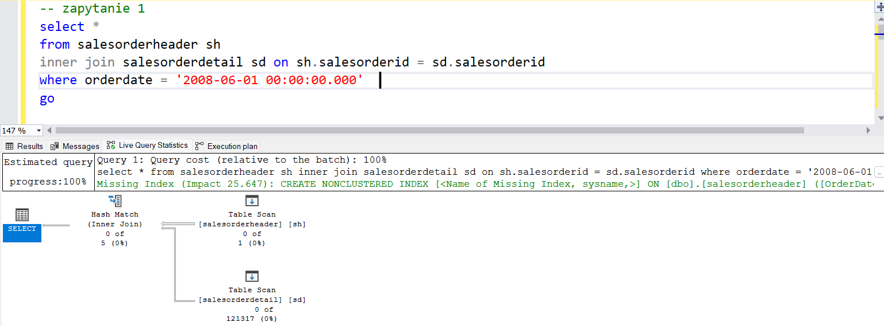
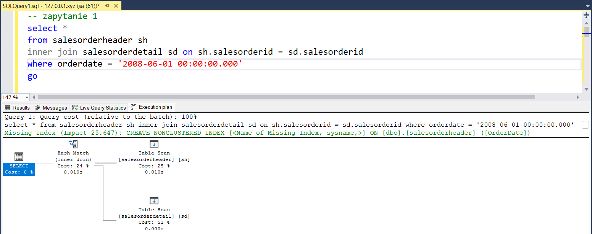

Zapytanie 2
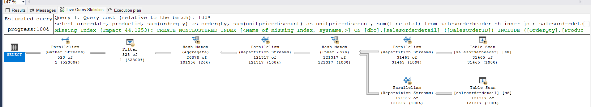
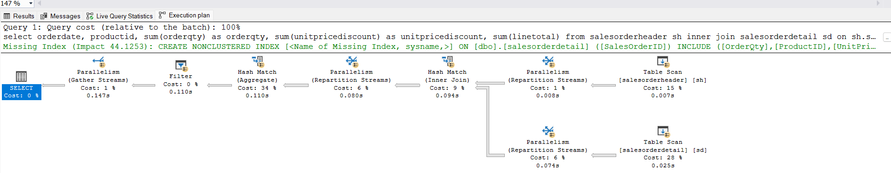

Zapytanie 3

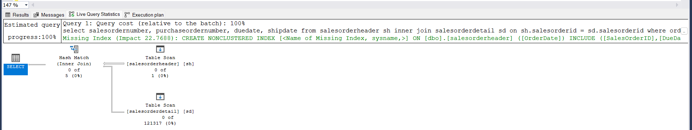
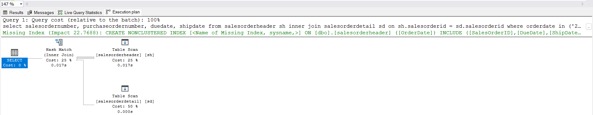

Zapytanie 4

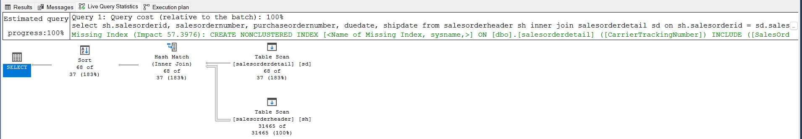
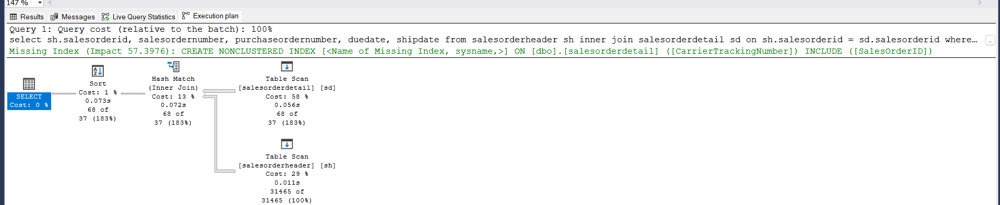
---

Ważne/wymagane są komentarze.

Zamieść kod rozwiązania oraz zrzuty ekranu pokazujące wyniki, (dołącz kod rozwiązania w formie tekstowej/źródłowej)

Zwróć uwagę na formatowanie kodu

## Oprogramowanie - co jest potrzebne?

Do wykonania ćwiczenia potrzebne jest następujące oprogramowanie
- MS SQL Server,
- SSMS - SQL Server Management Studio    
- przykładowa baza danych AdventureWorks2017.
    
Oprogramowanie dostępne jest na przygotowanej maszynie wirtualnej


## Przygotowanie  

Uruchom Microsoft SQL Managment Studio.
    
Stwórz swoją bazę danych o nazwie XYZ. 

```sql
create database xyz  
go  
  
use xyz  
go
```

Wykonaj poniższy skrypt, aby przygotować dane:

```sql
select * into [salesorderheader]  
from [adventureworks2017].sales.[salesorderheader]  
go  
  
select * into [salesorderdetail]  
from [adventureworks2017].sales.[salesorderdetail]  
go
```

## Dokumentacja/Literatura

Celem tej części ćwiczenia jest zapoznanie się z planami wykonania zapytań (execution plans) oraz narzędziem do automatycznego generowania indeksów.

Przydatne materiały/dokumentacja. Proszę zapoznać się z dokumentacją:
- [https://docs.microsoft.com/en-us/sql/tools/dta/tutorial-database-engine-tuning-advisor](https://docs.microsoft.com/en-us/sql/tools/dta/tutorial-database-engine-tuning-advisor)
- [https://docs.microsoft.com/en-us/sql/relational-databases/performance/start-and-use-the-database-engine-tuning-advisor](https://docs.microsoft.com/en-us/sql/relational-databases/performance/start-and-use-the-database-engine-tuning-advisor)
- [https://www.simple-talk.com/sql/performance/index-selection-and-the-query-optimizer](https://www.simple-talk.com/sql/performance/index-selection-and-the-query-optimizer)

Ikonki używane w graficznej prezentacji planu zapytania opisane są tutaj:
- [https://docs.microsoft.com/en-us/sql/relational-databases/showplan-logical-and-physical-operators-reference](https://docs.microsoft.com/en-us/sql/relational-databases/showplan-logical-and-physical-operators-reference)


<div style="page-break-after: always;"></div>

# Zadanie 1 - Obserwacja

Wpisz do MSSQL Managment Studio (na razie nie wykonuj tych zapytań):

```sql
-- zapytanie 1  
select *  
from salesorderheader sh  
inner join salesorderdetail sd on sh.salesorderid = sd.salesorderid  
where orderdate = '2008-06-01 00:00:00.000'  
go  
  
-- zapytanie 2  
select orderdate, productid, sum(orderqty) as orderqty, 
       sum(unitpricediscount) as unitpricediscount, sum(linetotal)  
from salesorderheader sh  
inner join salesorderdetail sd on sh.salesorderid = sd.salesorderid  
group by orderdate, productid  
having sum(orderqty) >= 100  
go  
  
-- zapytanie 3  
select salesordernumber, purchaseordernumber, duedate, shipdate  
from salesorderheader sh  
inner join salesorderdetail sd on sh.salesorderid = sd.salesorderid  
where orderdate in ('2008-06-01','2008-06-02', '2008-06-03', '2008-06-04', '2008-06-05')  
go  
  
-- zapytanie 4  
select sh.salesorderid, salesordernumber, purchaseordernumber, duedate, shipdate  
from salesorderheader sh  
inner join salesorderdetail sd on sh.salesorderid = sd.salesorderid  
where carriertrackingnumber in ('ef67-4713-bd', '6c08-4c4c-b8')  
order by sh.salesorderid  
go
```


Włącz dwie opcje: **Include Actual Execution Plan** oraz **Include Live Query Statistics**:


<!-- ![[_img/index1-1.png | 500]] -->


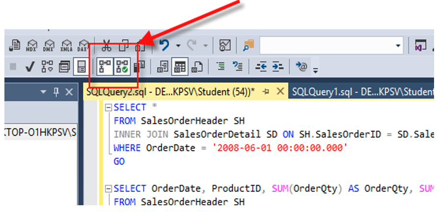


Teraz wykonaj poszczególne zapytania (najlepiej każde analizuj oddzielnie). Co można o nich powiedzieć? Co sprawdzają? Jak można je zoptymalizować?  
(Hint: aby wykonać tylko fragment kodu SQL znajdującego się w edytorze, zaznacz go i naciśnij F5)

---
> Wyniki: 

```sql
--  ...
```

---


<div style="page-break-after: always;"></div>

# Zadanie 2 - Optymalizacja

Zaznacz wszystkie zapytania, i uruchom je w **Database Engine Tuning Advisor**:

<!-- ![[_img/index1-12.png | 500]] -->


Sprawdź zakładkę **Tuning Options**, co tam można skonfigurować?

---
> Wyniki: 

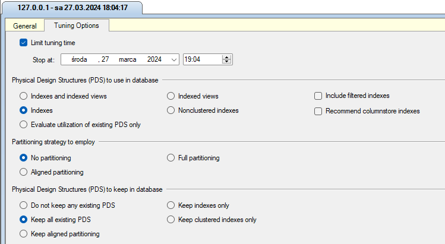

Można tutaj skonfigurować:

**Limit czasu tuningu**: Maksymalny czas, jaki narzędzie może poświęcić na analizę i proponowanie optymalizacji.

**Struktury projektowania fizycznego (PDS) do użycia w bazie danych**: Opcje dotyczące wykorzystania różnych struktur, takich jak indeksy, widoki indeksowane, partycjonowanie etc.

**Indeksy i widoki indeksowane**: Określa, które indeksy i widoki indeksowane należy uwzględnić w optymalizacji.

**Strategia partycjonowania do zastosowania**: Decyduje, czy baza danych powinna być partycjonowana, a jeśli tak, to w jaki sposób.

**Struktury projektowania fizycznego (PDS) do zachowania w bazie danych**: Decyduje, które istniejące struktury projektowania fizycznego (indeksy, partycje etc) należy zachować w wyniku optymalizacji.

**Indeksowane widoki**: Decyduje o sposobie obsługi indeksowanych widoków.

**Indeksy niemającece klastera**: Określa, czy uwzględniać w optymalizacji indeksy niemające klastra.

**Uwzględnij indeksy filtrowane**: Decyduje, czy narzędzie powinno uwzględnić indeksy filtrowane w procesie optymalizacji.

**Polecane indeksy kolumnowe**: Opcja sugerująca użycie indeksów kolumnowych.

**Pełne partycjonowanie**: Decyduje o partycjonowaniu bazy danych.

**Zachowaj tylko indeksy**: Określa, czy narzędzie powinno zachować tylko indeksy podczas optymalizacji.

**Zachowaj tylko indeksy klastra**: Decyduje, czy zachować tylko indeksy klastra.

---


Użyj **Start Analysis**:

<!-- ![[_img/index1-3.png | 500]] -->


Zaobserwuj wyniki w **Recommendations**.

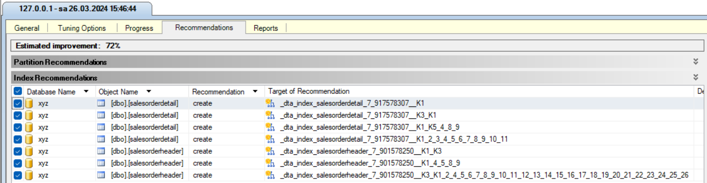

Przejdź do zakładki **Reports**. Sprawdź poszczególne raporty. Główną uwagę zwróć na koszty i ich poprawę:


<!-- ![[_img/index4-1.png | 500]] -->


Zapisz poszczególne rekomendacje:
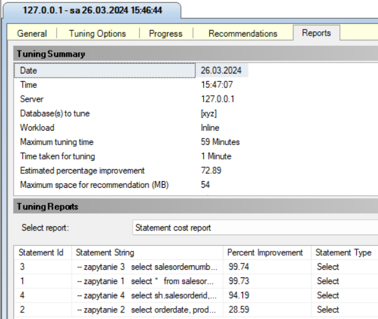

Uruchom zapisany skrypt w Management Studio.


Opisz, dlaczego dane indeksy zostały zaproponowane do zapytań:

---

> Wyniki: 


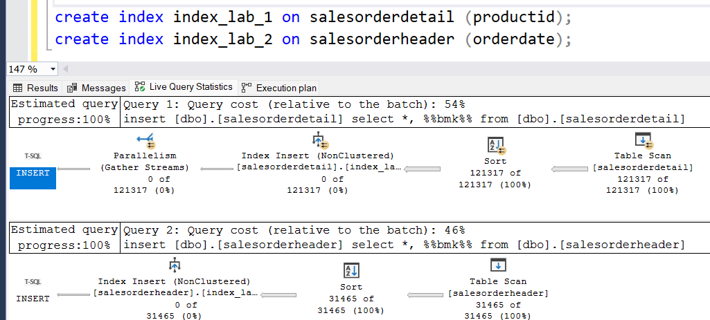


---


Sprawdź jak zmieniły się Execution Plany. Opisz zmiany:

---
> Wyniki: 


Zapytanie 1:
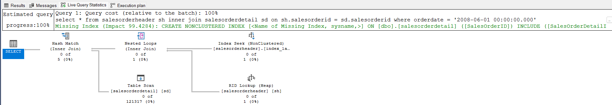
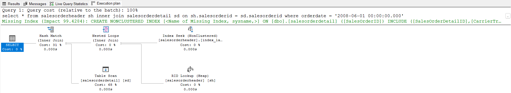

Zapytanie 2:
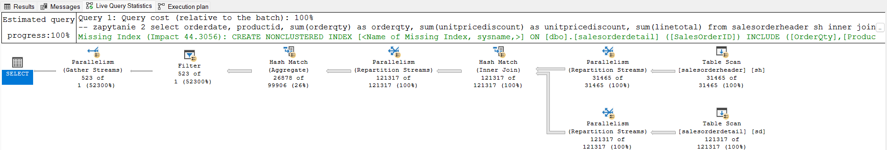
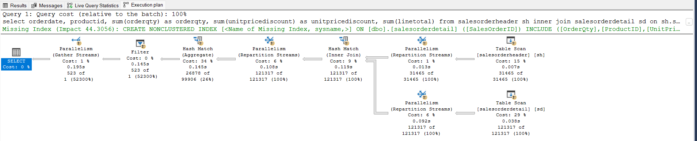

Zapytanie 3:
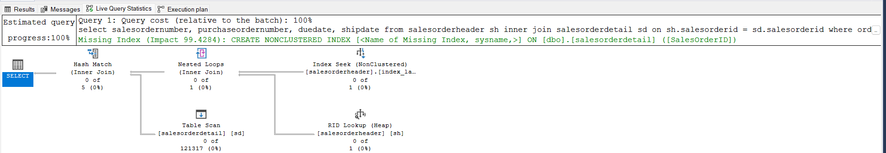
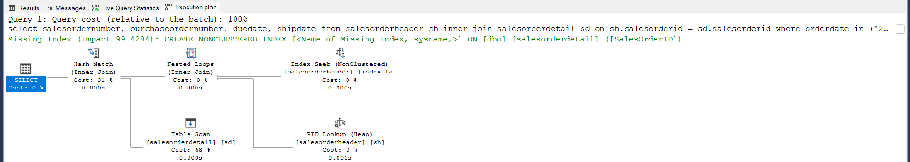

Zapytanie 4:
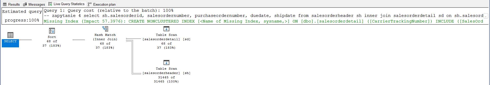
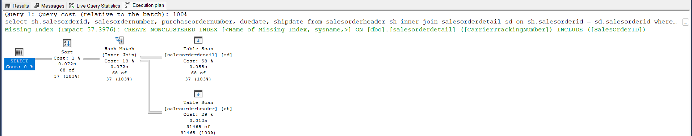


---


<div style="page-break-after: always;"></div>

# Zadanie 3 - Kontrola "zdrowia" indeksu

## Dokumentacja/Literatura

Celem kolejnego zadania jest zapoznanie się z możliwością administracji i kontroli indeksów.

Na temat wewnętrznej struktury indeksów można przeczytać tutaj:
- [https://technet.microsoft.com/en-us/library/2007.03.sqlindex.aspx](https://technet.microsoft.com/en-us/library/2007.03.sqlindex.aspx)
- [https://docs.microsoft.com/en-us/sql/relational-databases/system-dynamic-management-views/sys-dm-db-index-physical-stats-transact-sql](https://docs.microsoft.com/en-us/sql/relational-databases/system-dynamic-management-views/sys-dm-db-index-physical-stats-transact-sql)
- [https://docs.microsoft.com/en-us/sql/relational-databases/system-dynamic-management-views/sys-dm-db-index-physical-stats-transact-sql](https://docs.microsoft.com/en-us/sql/relational-databases/system-dynamic-management-views/sys-dm-db-index-physical-stats-transact-sql)
- [https://docs.microsoft.com/en-us/sql/relational-databases/system-catalog-views/sys-indexes-transact-sql](https://docs.microsoft.com/en-us/sql/relational-databases/system-catalog-views/sys-indexes-transact-sql)

Sprawdź jakie informacje można wyczytać ze statystyk indeksu:

```sql
select *  
from sys.dm_db_index_physical_stats (db_id('adventureworks2017')  
,object_id('humanresources.employee')  
,null -- null to view all indexes; otherwise, input index number  
,null -- null to view all partitions of an index  
,'detailed') -- we want all information
```

Jakie są według Ciebie najważniejsze pola?

---
> Wyniki: 
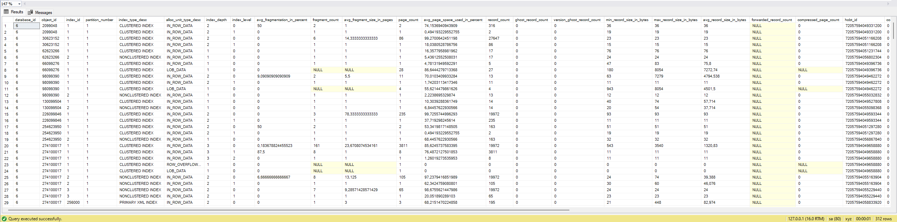
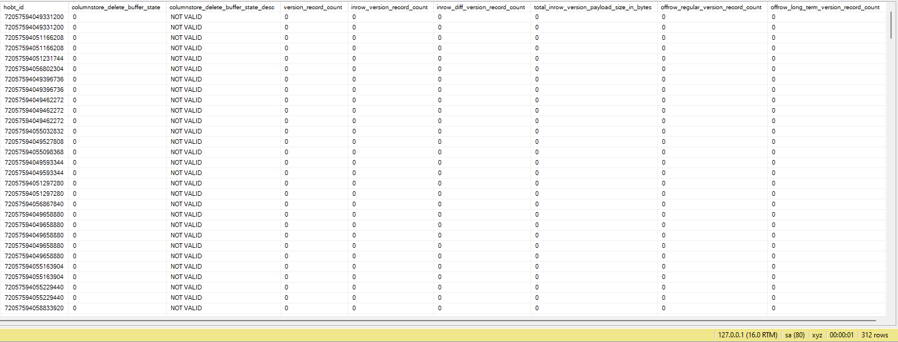

Według mnie najważniejsze pola to:

**avg_fragmentation_in_percent**: Wskaźnik fragmentacji indeksu, który informuje o stopniu fragmentacji danych w indeksie. Wyższa wartość oznacza większą fragmentację, co może prowadzić do wolniejszych operacji odczytu i zapisu.

**index_type**: Typ indeksu (np. clustered, non-clustered), co jest istotne dla zrozumienia struktury indeksu i jego wpływu na zapytania SQL.

**page_count**: Liczba stron zajmowanych przez indeks, co może być użyteczne do oceny rozmiaru indeksu i wykorzystania pamięci.

**record_count**: Liczba rekordów w indeksie, co pomaga zrozumieć, jak wiele danych jest zindeksowanych.

**avg_page_space_used_in_percent**: Średni używany procent miejsca na stronie, który może wskazywać na to, jak efektywnie strony są wykorzystywane przez indeks.

**avg_record_size_in_bytes**: Średni rozmiar rekordu w bajtach, co może mieć znaczenie dla oceny zużycia pamięci i wydajności zapytań.

**index_depth** i **index_level**: Informacje o głębokości i poziomach indeksu, które są istotne dla zrozumienia jego struktury i wpływu na wydajność zapytań.


---


Sprawdź, które indeksy w bazie danych wymagają reorganizacji:

```sql
use adventureworks2017  
  
select object_name([object_id]) as 'table name',  
index_id as 'index id'  
from sys.dm_db_index_physical_stats (db_id('adventureworks2017')  
,null -- null to view all tables  
,null -- null to view all indexes; otherwise, input index number  
,null -- null to view all partitions of an index  
,'detailed') --we want all information  
where ((avg_fragmentation_in_percent > 10  
and avg_fragmentation_in_percent < 15) -- logical fragmentation  
or (avg_page_space_used_in_percent < 75  
and avg_page_space_used_in_percent > 60)) --page density  
and page_count > 8 -- we do not want indexes less than 1 extent in size  
and index_id not in (0) --only clustered and nonclustered indexes
```


---
> Wyniki: 
> zrzut ekranu/komentarz:

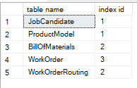


---


Sprawdź, które indeksy w bazie danych wymagają przebudowy:

```sql
use adventureworks2017  
  
select object_name([object_id]) as 'table name',  
index_id as 'index id'  
from sys.dm_db_index_physical_stats (db_id('adventureworks2017')  
,null -- null to view all tables  
,null -- null to view all indexes; otherwise, input index number  
,null -- null to view all partitions of an index  
,'detailed') --we want all information  
where ((avg_fragmentation_in_percent > 15) -- logical fragmentation  
or (avg_page_space_used_in_percent < 60)) --page density  
and page_count > 8 -- we do not want indexes less than 1 extent in size  
and index_id not in (0) --only clustered and nonclustered indexes
```

---
> Wyniki: 
> zrzut ekranu/komentarz:

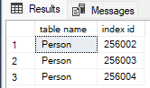

---

Czym się różni przebudowa indeksu od reorganizacji?

(Podpowiedź: [http://blog.plik.pl/2014/12/defragmentacja-indeksow-ms-sql.html](http://blog.plik.pl/2014/12/defragmentacja-indeksow-ms-sql.html))

---
> Wyniki: 

Przebudowa indeksu polega na całkowitym ponownym zbudowaniu struktury indeksu od podstaw.
Podczas przebudowy indeksu baza danych usuwa istniejący indeks i tworzy go ponownie na podstawie danych w tabeli.
Jest to bardziej czasochłonna operacja i może wymagać więcej zasobów niż reorganizacja.

Reorganizacja indeksu polega na fizycznym przestawieniu i ponownym uporządkowaniu danych w istniejącym indeksie, aby zmniejszyć fragmentację.
W odróżnieniu od przebudowy, reorganizacja nie tworzy indeksu od nowa, ale raczej dokonuje drobnych zmian w jego strukturze w celu poprawy wydajności.
Reorganizacja jest zazwyczaj szybsza i mniej inwazyjna dla systemu niż przebudowa.

---

Sprawdź co przechowuje tabela sys.dm_db_index_usage_stats:

---
> Wyniki: 


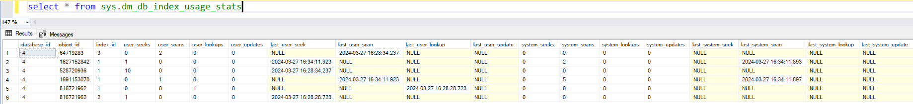

Tabela sys.dm_db_index_usage_stats przechowuje statystyki dotyczące używania indeksów w bazie danych, zawierając informacje takie jak liczba operacji wyszukiwania, skanowania, odwołań i aktualizacji wykonanych przez użytkowników na poszczególnych indeksach. Umożliwia to monitorowanie aktywności indeksów w celu optymalizacji wydajności zapytań poprzez analizę ich używania.

---


Napraw wykryte błędy z indeksami ze wcześniejszych zapytań. Możesz użyć do tego przykładowego skryptu:

```sql
use adventureworks2017  
  
--table to hold results  
declare @tablevar table(lngid int identity(1,1), objectid int,  
index_id int)  
  
insert into @tablevar (objectid, index_id)  
select [object_id],index_id  
from sys.dm_db_index_physical_stats (db_id('adventureworks2017')  
,null -- null to view all tables  
,null -- null to view all indexes; otherwise, input index number  
,null -- null to view all partitions of an index  
,'detailed') --we want all information  
where ((avg_fragmentation_in_percent > 15) -- logical fragmentation  
or (avg_page_space_used_in_percent < 60)) --page density  
and page_count > 8 -- we do not want indexes less than 1 extent in size  
and index_id not in (0) --only clustered and nonclustered indexes  
  
select 'alter index ' + ind.[name] + ' on ' + sc.[name] + '.'  
+ object_name(objectid) + ' rebuild'  
from @tablevar tv  
inner join sys.indexes ind  
on tv.objectid = ind.[object_id]  
and tv.index_id = ind.index_id  
inner join sys.objects ob  
on tv.objectid = ob.[object_id]  
inner join sys.schemas sc  
on sc.schema_id = ob.schema_id
```


Napisz przygotowane komendy SQL do naprawy indeksów:

---
> Wyniki: 

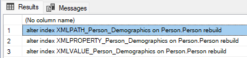

```sql
alter index XMLPATH_Person_Demographics on Person.Person rebuild
alter index XMLPROPERTY_Person_Demographics on Person.Person rebuild
alter index XMLVALUE_Person_Demographics on Person.Person rebuild
```
---

<div style="page-break-after: always;"></div>

# Zadanie 4 - Budowa strony indeksu

## Dokumentacja

Celem kolejnego zadania jest zapoznanie się z fizyczną budową strony indeksu 
- [https://www.mssqltips.com/sqlservertip/1578/using-dbcc-page-to-examine-sql-server-table-and-index-data/](https://www.mssqltips.com/sqlservertip/1578/using-dbcc-page-to-examine-sql-server-table-and-index-data/)
- [https://www.mssqltips.com/sqlservertip/2082/understanding-and-examining-the-uniquifier-in-sql-server/](https://www.mssqltips.com/sqlservertip/2082/understanding-and-examining-the-uniquifier-in-sql-server/)
- [http://www.sqlskills.com/blogs/paul/inside-the-storage-engine-using-dbcc-page-and-dbcc-ind-to-find-out-if-page-splits-ever-roll-back/](http://www.sqlskills.com/blogs/paul/inside-the-storage-engine-using-dbcc-page-and-dbcc-ind-to-find-out-if-page-splits-ever-roll-back/)

Wypisz wszystkie strony które są zaalokowane dla indeksu w tabeli. Użyj do tego komendy np.:

```sql
dbcc ind ('adventureworks2017', 'person.address', 1)  
-- '1' oznacza nr indeksu
```

Zapisz sobie kilka różnych typów stron, dla różnych indeksów:

---
> Wyniki: 

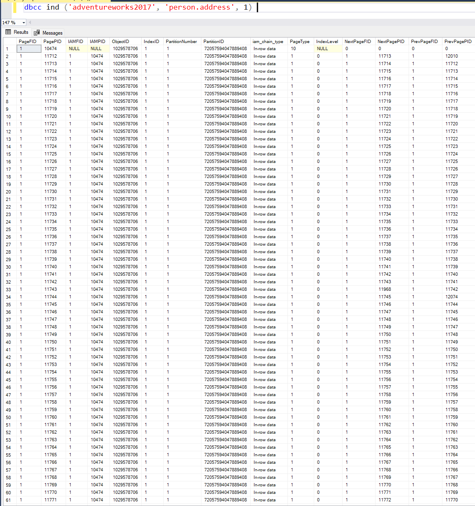
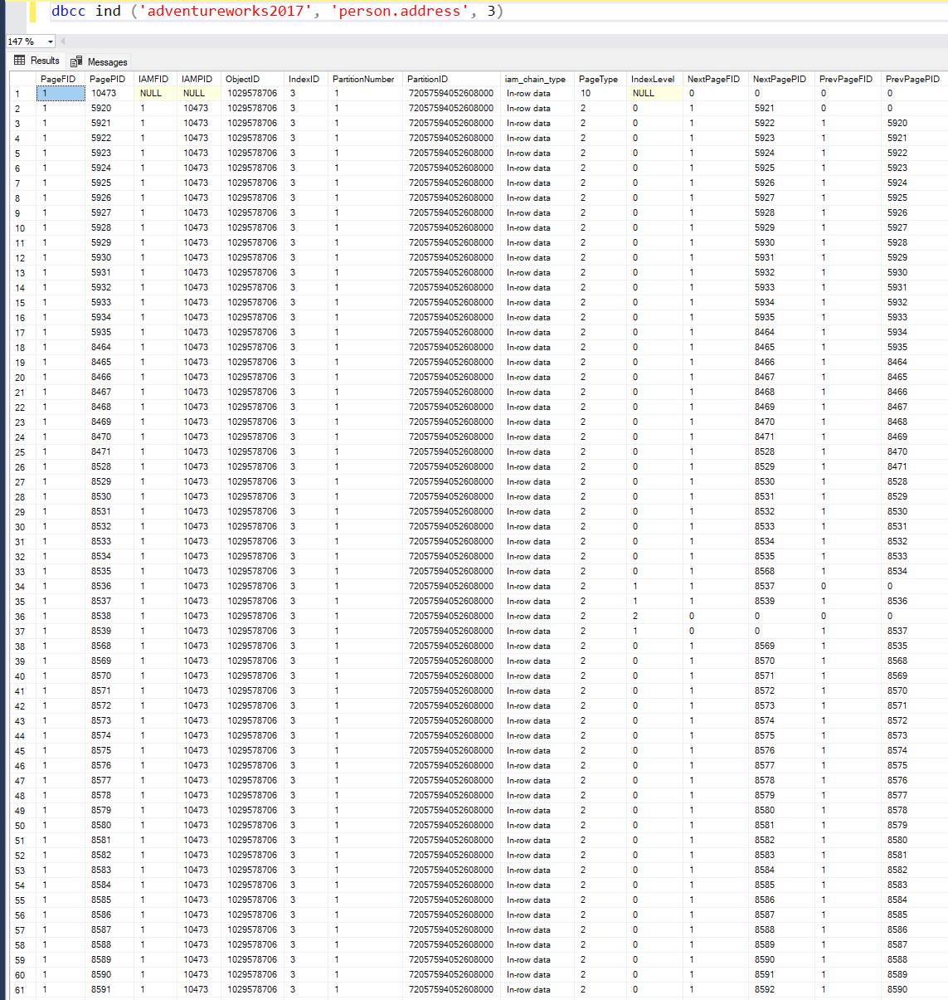
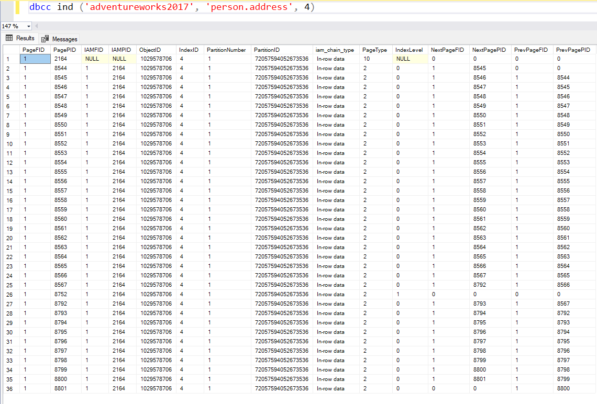
---

Włącz flagę 3604 zanim zaczniesz przeglądać strony:

```sql
dbcc traceon (3604);
```

Sprawdź poszczególne strony komendą DBCC PAGE. np.:

```sql
dbcc page('adventureworks2017', 1, 13720, 3);
```


Zapisz obserwacje ze stron. Co ciekawego udało się zaobserwować?

---
> Wyniki: 
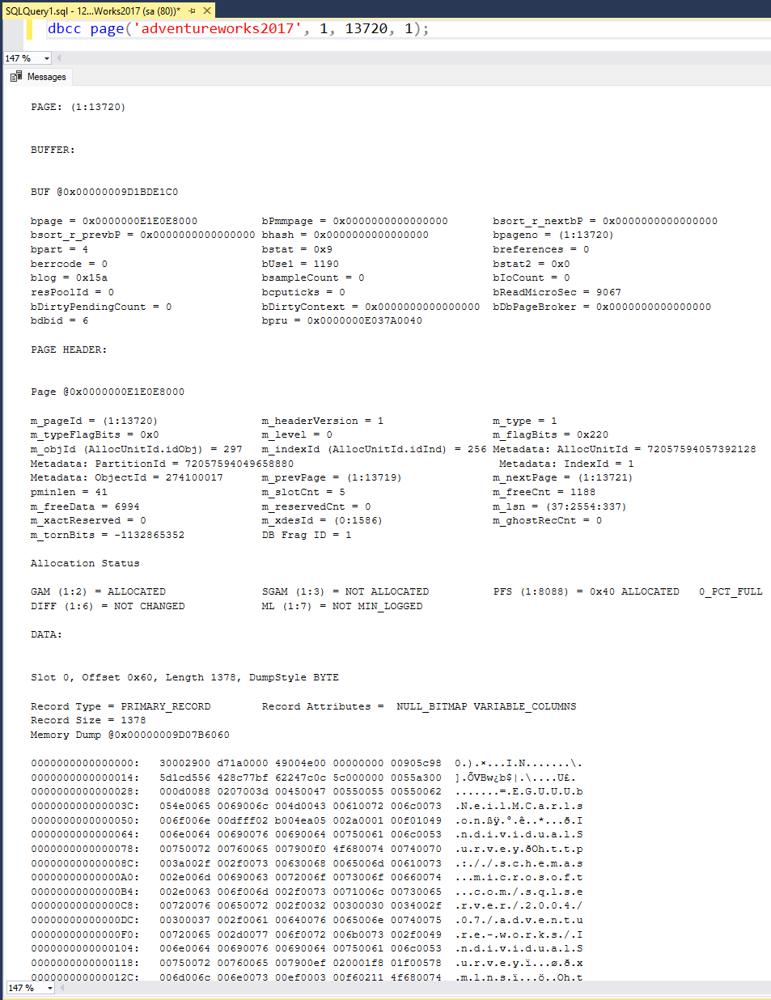

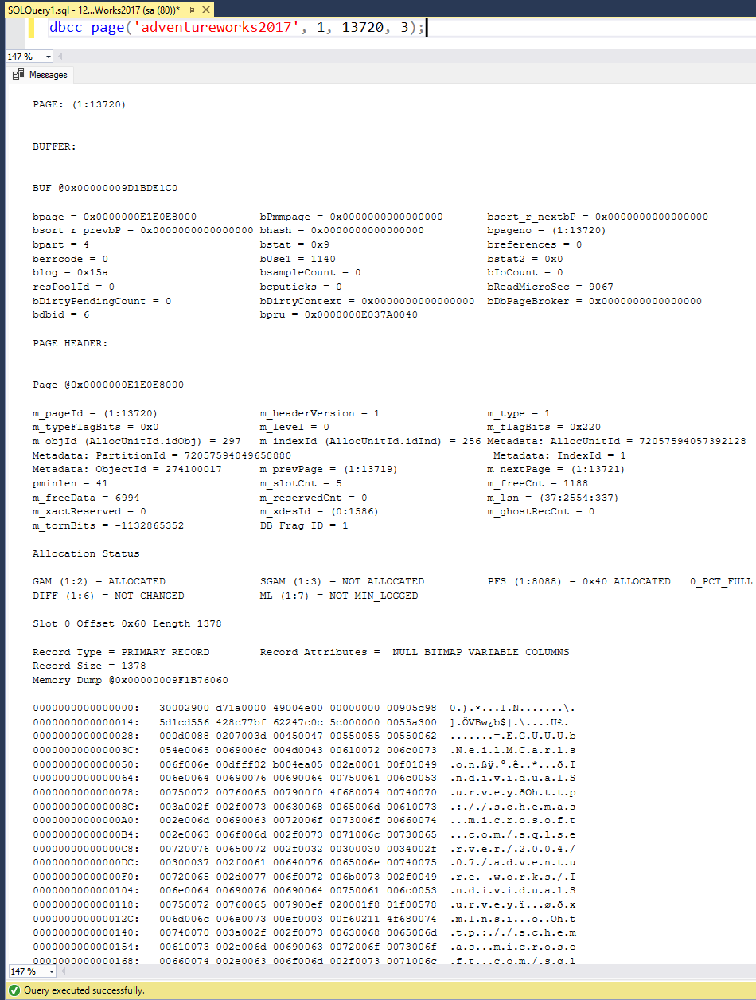

Zauważyliśmy cztery ciekawe obserwacje:

**Informacje o stronie**: Na początku raportu otrzymujemy ogólne informacje o stronie, takie jak jej identyfikator (PAGE: (1:13720)) oraz dane o buforze (BUFFER). Informacje o buforze zawierają szczegóły na temat sposobu, w jaki strona jest przechowywana w pamięci podręcznej, takie jak adresy, statystyki odczytu/zapisu, czy stan błędu.

**Nagłówek strony**: zawierający metadane dotyczące strony. Możemy zobaczyć identyfikator strony, wersję nagłówka, typ strony, poziom w hierarchii, flagi, informacje o obiekcie, indeksie, poprzedniej i następnej stronie, ilość slotów, ilość danych wolnych, zarezerwowane dane etc.

**Status alokacji**: W sekcji "Allocation Status" możemy zobaczyć informacje o alokacji miejsca w różnych strukturach w bazie danych, takich jak GAM (Global Allocation Map), SGAM (Shared Global Allocation Map), PFS (Page Free Space), DIFF (Differential Changed Map) i ML (Minimum Log Map). Inforamcje przydają się do zarządzania przestrzenią w plikach bazy danych.

**Dane**: Widać, że to rzeczywiste dane przechowywane na tej konkretnej stronie (coś jak zrzut pamięci). Dane te mają format szesnastkowy.

Punktacja:

|   |   |
|---|---|
|zadanie|pkt|
|1|3|
|2|3|
|3|3|
|4|1|
|razem|10|