# Indeksy,  optymalizator <br>Lab 5

<!-- <style scoped>
 p,li {
    font-size: 12pt;
  }
</style>  -->

<!-- <style scoped>
 pre {
    font-size: 8pt;
  }
</style>  -->


---

**Imię i nazwisko:**

Przemysław Spyra, Piotr Urbańczyk

--- 

Celem ćwiczenia jest zapoznanie się z planami wykonania zapytań (execution plans), oraz z budową i możliwością wykorzystaniem indeksów (cz. 2.)

Swoje odpowiedzi wpisuj w miejsca oznaczone jako:

---
> Wyniki: 

```sql
--  ...
```

---

Ważne/wymagane są komentarze.

Zamieść kod rozwiązania oraz zrzuty ekranu pokazujące wyniki, (dołącz kod rozwiązania w formie tekstowej/źródłowej)

Zwróć uwagę na formatowanie kodu

## Oprogramowanie - co jest potrzebne?

Do wykonania ćwiczenia potrzebne jest następujące oprogramowanie
- MS SQL Server,
- SSMS - SQL Server Management Studio    
- przykładowa baza danych AdventureWorks2017.
    
Oprogramowanie dostępne jest na przygotowanej maszynie wirtualnej


## Przygotowanie  

Uruchom Microsoft SQL Managment Studio.
    
Stwórz swoją bazę danych o nazwie XYZ. 

```sql
create database lab5  
go  
  
use lab5  
go
```


## Dokumentacja/Literatura

Obowiązkowo:

- [https://docs.microsoft.com/en-us/sql/relational-databases/indexes/indexes](https://docs.microsoft.com/en-us/sql/relational-databases/indexes/indexes)
- [https://docs.microsoft.com/en-us/sql/relational-databases/sql-server-index-design-guide](https://docs.microsoft.com/en-us/sql/relational-databases/sql-server-index-design-guide)
- [https://www.simple-talk.com/sql/performance/14-sql-server-indexing-questions-you-were-too-shy-to-ask/](https://www.simple-talk.com/sql/performance/14-sql-server-indexing-questions-you-were-too-shy-to-ask/)

Materiały rozszerzające:
- [https://www.sqlshack.com/sql-server-query-execution-plans-examples-select-statement/](https://www.sqlshack.com/sql-server-query-execution-plans-examples-select-statement/)

<div style="page-break-after: always;"></div>

# Zadanie 1 - Indeksy klastrowane I nieklastrowane

Skopiuj tabelę `Customer` do swojej bazy danych:

```sql
select * into customer from adventureworks2017.sales.customer
```

Wykonaj analizy zapytań:

```sql
select * from customer where storeid = 594  
  
select * from customer where storeid between 594 and 610
```

Zanotuj czas zapytania oraz jego koszt koszt:


---
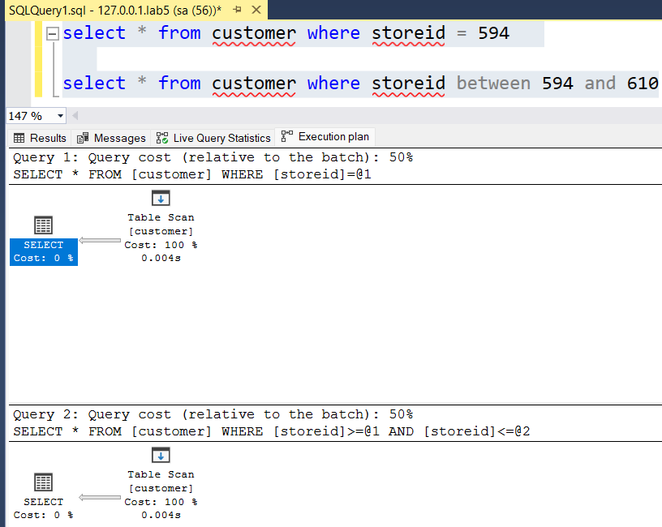

Czas wykonania zapytania 1 to 0.004s, a 100% jego kosztu to przeszukiwanie tabeli.
Czas wykonania zapytania 2 to 0.004s, a 100% jego kosztu to przeszukiwanie tabeli.

Dodaj indeks:

```sql
create  index customer_store_cls_idx on customer(storeid)
```

Jak zmienił się plan i czas? Czy jest możliwość optymalizacji?

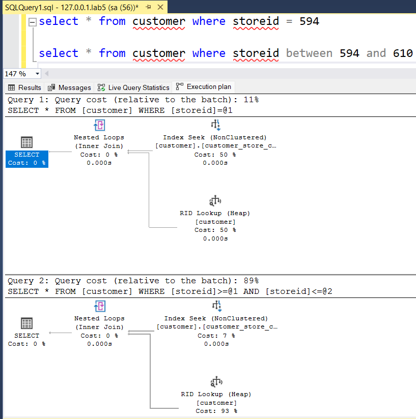

Plan wykonia zmienił się z prostego skanu tabeli (w obu przypadkach)
na (po użyciu indeksu) wykonanie Inner Joinów, a następnie wyszukanie wszystkich nieklastrowanych indeksów oraz 
RID Lookupa. Chodzi o to, że każdy nieklastrowany indeks zawiera ROW ID, aby móc potem szybko znaleźć pozostałą część tabeli 
w heap table. W taki właśnie sposób RID Lookup może przeglądać heap table używając Row ID.

Czas wykonania zapytania 1 to 0.000s, a 50% jego kosztu to szukanie indeksu, a drugie 50% kosztu idzie na RID Lookup. 
Czas wykonania zapytania 2 to 0.000s, a 7% jego kosztu to szukanie indeksu, a drugie 93% kosztu idzie na RID Lookup. 

Dodaj indeks klastrowany:

```sql
create clustered index customer_store_cls_idx on customer(storeid)
```

Czy zmienił się plan i czas? Skomentuj dwa podejścia w wyszukiwaniu krotek.

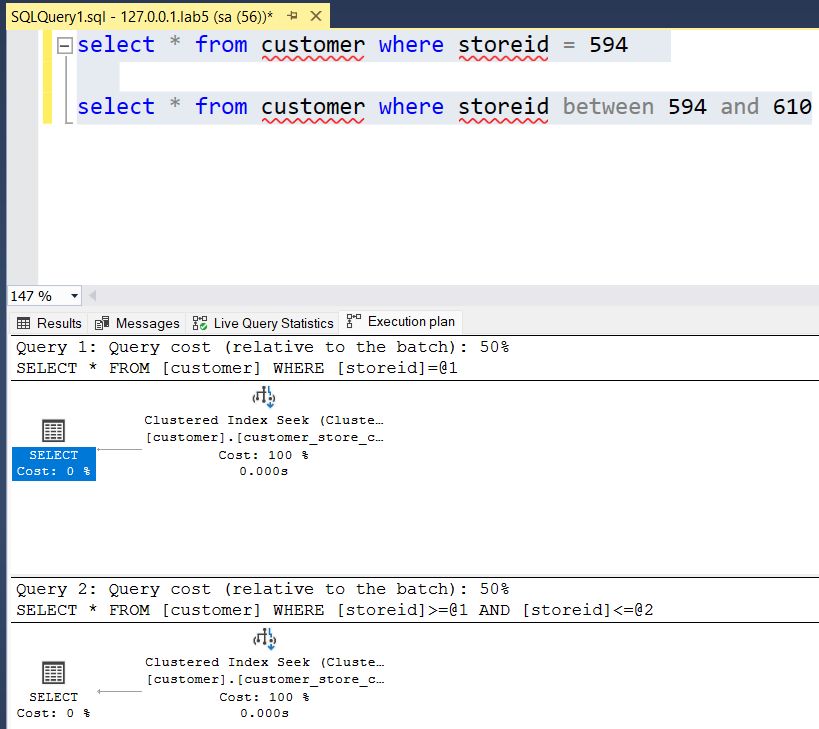

Po sklastrowaniu indeksu nasze plan składają się tylko z jego wyszukiwania, które stanowi 100% kosztu w obu zapytaniach. Zapytania wykonuję się natychmiast, czyli w 0.000s  


# Zadanie 2 – Indeksy zawierające dodatkowe atrybuty (dane z kolumn)

Celem zadania jest poznanie indeksów z przechowujących dodatkowe atrybuty (dane z kolumn)

Skopiuj tabelę `Person` do swojej bazy danych:

```sql
select businessentityid  
      ,persontype  
      ,namestyle  
      ,title  
      ,firstname  
      ,middlename  
      ,lastname  
      ,suffix  
      ,emailpromotion  
      ,rowguid  
      ,modifieddate  
into person  
from adventureworks2017.person.person
```
---

Wykonaj analizę planu dla trzech zapytań:

```sql
select * from [person] where lastname = 'Agbonile'  
  
select * from [person] where lastname = 'Agbonile' and firstname = 'Osarumwense'  
  
select * from [person] where firstname = 'Osarumwense'
```

Co można o nich powiedzieć?

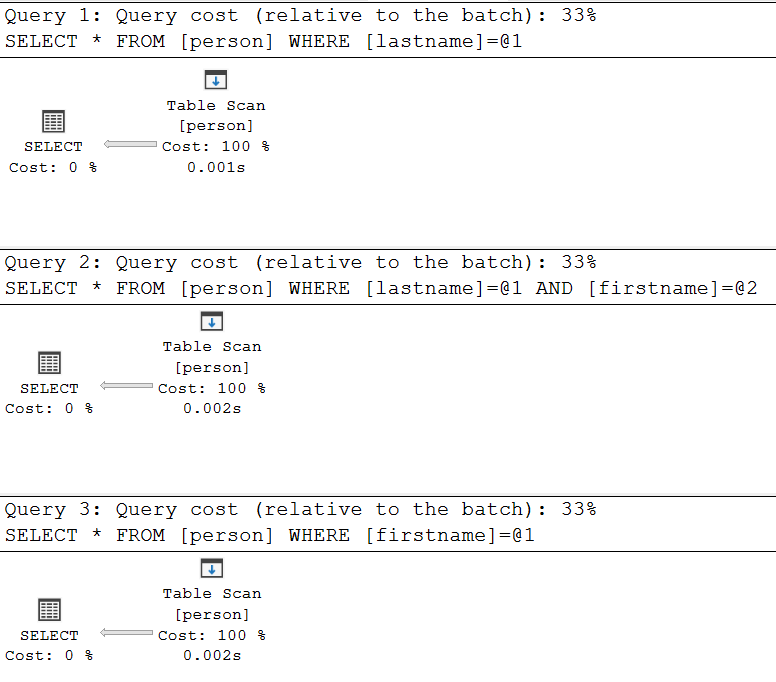

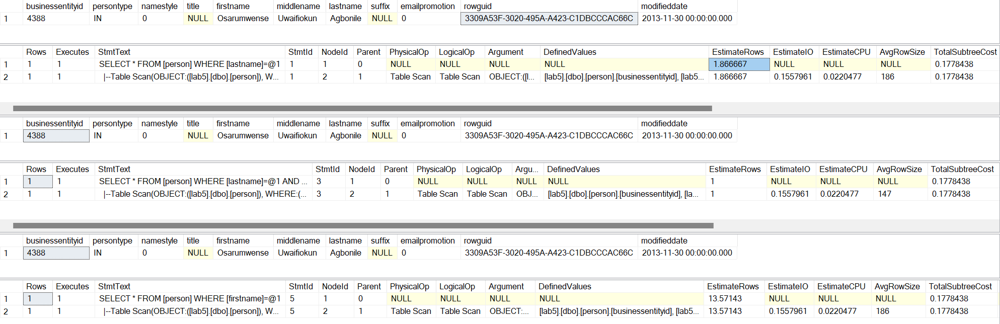

**Odpowiedź**:

Zapytania mają zwrócić wszystkie wiersze (`*`) tabeli `person` spełniające różną postać klauzli `WHERE` (zadeklarowanie pewnej tożsamości kolumny `lastname`, `firstname` oraz obu tych kolumn na raz).  Pierwsze zapytanie szuka wierszy z kolumną `lastname` równą `'Agbonile'`. Drugie zapytanie szuka wierszy z kolumnami `lastname` równą `'Agbonile'` i kolumną `firstname` równą `'Osarumwense'`. Trzecie zapytanie szuka wierszy z kolumną `firstname` równą `'Osarumwense'`.

Klauzule są tak dobrane, że w efekcie wszystkie zapytania dają ten sam rezultat (wyświetlają jeden i ten sam wiersz). Co ciekawe mają nawet taki sam koszt wykoanania (0.1778438), choć różnią się estymowaną liczbą wierszy do na wykonanie zapytania (odpowiednio, ok. 2, 1, oraz ok. 14). Te różnice w liczbie estymowanych wierszy dla zapytania drugiego łatwo wytłumaczyć obecnością operatora `and`. Różnice dla pierwszej i trzeciej tabeli mogą być wynikiem statystyk gromadzonych przez system zarządzania bazą danych dla poszczególnych kolumn (np. większa selektywność jednej z kolumn).
 
Wyygląda na to, że przeszukiwane w zapytaniach kolumny nie mają indeksu, ponieważ w planie wykonania znajduje się pełne przeszukiwanie tabeli (Table Scan), a nie przeszukiwanie indeksu (Index Seek/Scan). Zapytania są na tyle proste, że nawet bez indeksów ich koszt wykonania jest stosunkowo niski. Dodanie ich mogłoby jednak znacząco przyspieszyć podobne zapytania, zwłaszcza dla dużych zestawów danych.

---

Przygotuj indeks obejmujący te zapytania:

```sql
create index person_first_last_name_idx  
on person(lastname, firstname)
```

Sprawdź plan zapytania. Co się zmieniło?

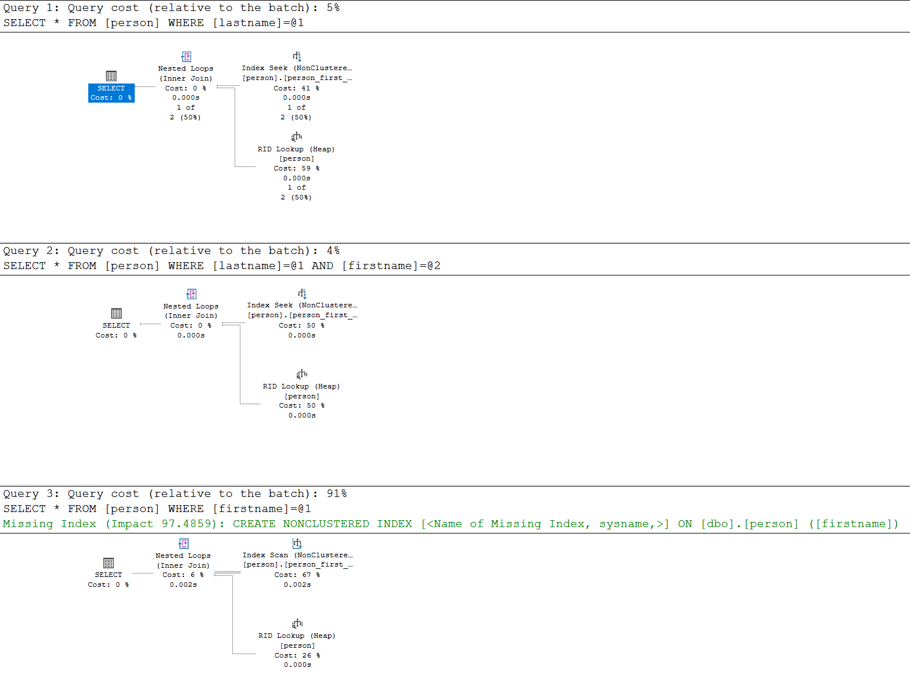

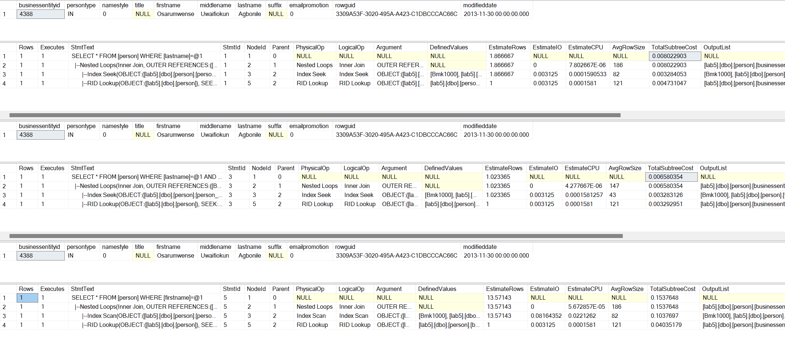

**Odpowiedź:**

Przeszukiwanie rekordów przy pomocy indeksu poprawiło plan wykonania zapytań a w przypadku pierwszych dwóch znacząco wpłynęło na koszty wykonania (odpowiednio 0.008022903 oraz 0.006580354). 

Oprócz przeszukiwania indeksów plany zawierają także operację RID Lookup, co oznacza, że SZBD po przeszukaniu indeksu musi także odwołać się do tabli by uzyskać dane z pozostałych kolumn. Dodatkowym sposobem optymaliacji, o którym mówiliśmy na zajęciach, byłoby zapytanie o kolumny, na których założony jest indeks, a nie `SELECT *`.

Trzecie zapytanie jest najbardziej kosztowne (0.1537648).
Pojawia się przy nim sugestia utworzenia nieklasterowanego indeksu na kolumnie `firstname`. Oznacza to, że SZBD zidentyfikował, że takie działanie mogłoby dodatkowo poprawić wydajność dla zapytań wyszukujących w oparciu o tę kolumnę.


---


Przeprowadź ponownie analizę zapytań tym razem dla parametrów: `FirstName = ‘Angela’` `LastName = ‘Price’`. (Trzy zapytania, różna kombinacja parametrów). 

Czym różni się ten plan od zapytania od `'Osarumwense Agbonile'` . Dlaczego tak jest?

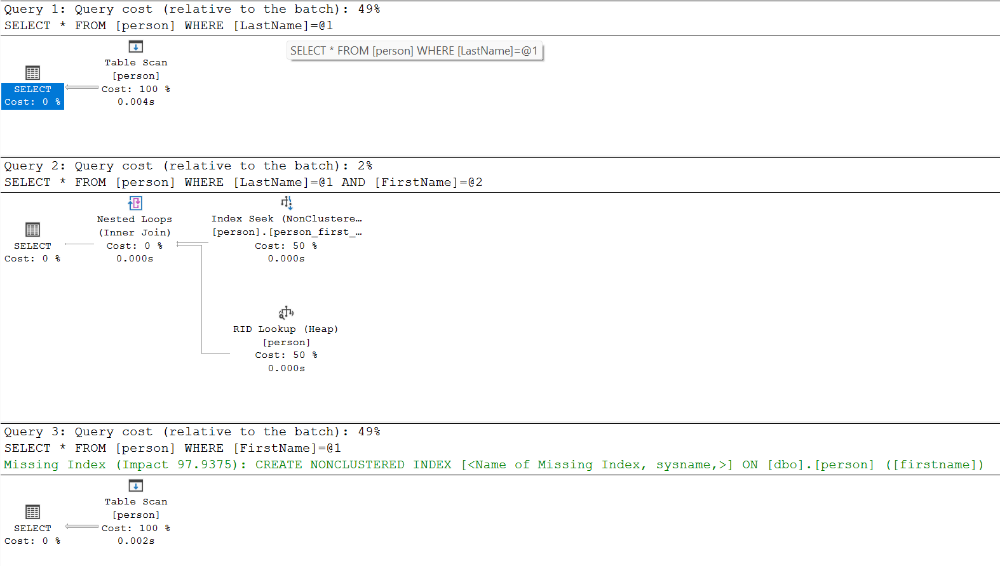

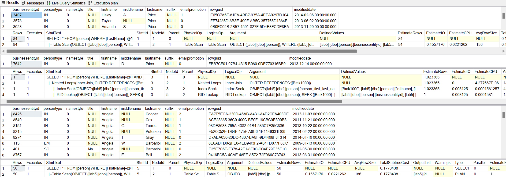

**Odpowiedź:**

Plany zapytania pierwszego i trzeciego ponownie zawierają operację Table Scan (zamiast Index Seek) - mimo założonego indeksu. Zapytania, które nie wykorzystały indeksowania mają, zgodnie z oczekiwaniem wysoki koszt (0.1778438), zapytanie drugie ma koszt znacząco niższy (0.006580354).

Najprawdopodobniej jest to sposowdowane selektywnością tych zapytań (czyli jak wiele wierszy spełnia warunki zapytania) i pozwala to sądzić, że SZBD przewiduje inny koszt wykonania zapytań w zależności od rozkładu danych w tabeli, co może wynikać z większej powszechności imienia ‘Angela’ i nazwiska ‘Price’ w bazie danych lub z różnic w rozkładzie danych.


# Zadanie 3

Skopiuj tabelę `PurchaseOrderDetail` do swojej bazy danych:

```sql
select * into purchaseorderdetail from  adventureworks2017.purchasing.purchaseorderdetail
```

Wykonaj analizę zapytania:

```sql
select rejectedqty, ((rejectedqty/orderqty)*100) as rejectionrate, productid, duedate  
from purchaseorderdetail  
order by rejectedqty desc, productid asc
```

Która część zapytania ma największy koszt?

---
> Wyniki: 

```sql
--  ...
```

Jaki indeks można zastosować aby zoptymalizować koszt zapytania? Przygotuj polecenie tworzące index.


---
> Wyniki: 

```sql
--  ...
```

 Ponownie wykonaj analizę zapytania:


---
> Wyniki: 

```sql
--  ...
```

# Zadanie 4

Celem zadania jest porównanie indeksów zawierających wszystkie kolumny oraz indeksów przechowujących dodatkowe dane (dane z kolumn).

Skopiuj tabelę `Address` do swojej bazy danych:

```sql
select * into address from  adventureworks2017.person.address
```

W tej części będziemy analizować następujące zapytanie:

```sql
select addressline1, addressline2, city, stateprovinceid, postalcode  
from address  
where postalcode between n'98000' and n'99999'
```

```sql
create index address_postalcode_1  
on address (postalcode)  
include (addressline1, addressline2, city, stateprovinceid);  
go  
  
create index address_postalcode_2  
on address (postalcode, addressline1, addressline2, city, stateprovinceid);  
go
```


Czy jest widoczna różnica w zapytaniach? Jeśli tak to jaka? Aby wymusić użycie indeksu użyj `WITH(INDEX(Address_PostalCode_1))` po `FROM`:

> Wyniki: 

> 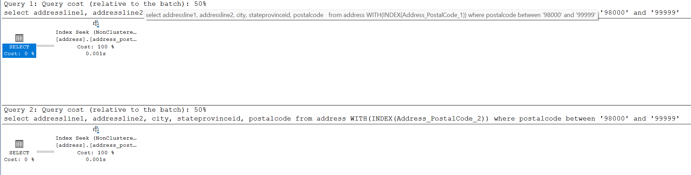

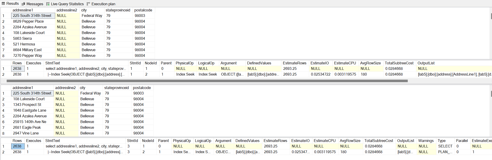

**Odpowiedź:**

Wygląda na to, że nie ma żadnej istotnej różnicy dla tego konkretnego zapytania przy wykorzystaniu `indeksu Address_PostalCode_1` i `Address_PostalCode_2`. Prawdopodobnie istnieją zapytania, w których różnice między tymi indeksami się będą pojawiać (np. zapytania nie tylko przeszukujące, ale i filtrujace po wszystkich kolumnach).

---

Sprawdź rozmiar Indeksów:

```sql
select i.name as indexname, sum(s.used_page_count) * 8 as indexsizekb  
from sys.dm_db_partition_stats as s  
inner join sys.indexes as i on s.object_id = i.object_id and s.index_id = i.index_id  
where i.name = 'address_postalcode_1' or i.name = 'address_postalcode_2'  
group by i.name  
go
```


Który jest większy? Jak można skomentować te dwa podejścia do indeksowania? Które kolumny na to wpływają?

> Wyniki: 

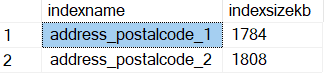

Indeks `address_postalcode_2` jest nieznacznie większy niż `address_postalcode_1` (1808 KB w porównaniu do 1784 KB). To różnica w rozmiarze może wynikać z faktu, że `address_postalcode_2` jest indeksem, który zawiera wszystkie kolumny w kluczu indeksu, podczas gdy `address_postalcode_1` jest indeksem na `postalcode` przechowujących dodatkowe dane (dane z kolumn `addressline1, addressline2, city, stateprovinceid`). W tym ostatnim przypadku w strukturze drzewa indeksu te dodatkowe dane mogę znajdować się wyłącznie na liściach. Wprzypadku `address_postalcode_2` dane z dodatkowych kolumn znajdują się na każdym poziomie drzewa.


```sql
--  ...
```


# Zadanie 5 – Indeksy z filtrami

Celem zadania jest poznanie indeksów z filtrami.

Skopiuj tabelę `BillOfMaterials` do swojej bazy danych:

```sql
select * into billofmaterials  
from adventureworks2017.production.billofmaterials
```


W tej części analizujemy zapytanie:

```sql
select productassemblyid, componentid, startdate  
from billofmaterials  
where enddate is not null  
    and componentid = 327  
    and startdate >= '2010-08-05'
```

Zastosuj indeks:

```sql
create nonclustered index billofmaterials_cond_idx  
    on billofmaterials (componentid, startdate)  
    where enddate is not null
```

Sprawdź czy działa. 

Przeanalizuj plan dla poniższego zapytania:

Czy indeks został użyty? Dlaczego?

> Wyniki: 

```sql
--  ...
```

Spróbuj wymusić indeks. Co się stało, dlaczego takie zachowanie?

> Wyniki: 

```sql
--  ...
```


---

Punktacja:

|         |     |
| ------- | --- |
| zadanie | pkt |
| 1       | 2   |
| 2       | 2   |
| 3       | 2   |
| 4       | 2   |
| 5       | 2   |
| razem   | 10  |
