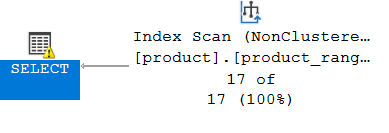
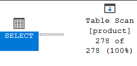
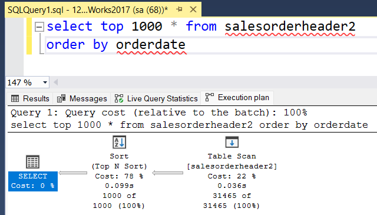
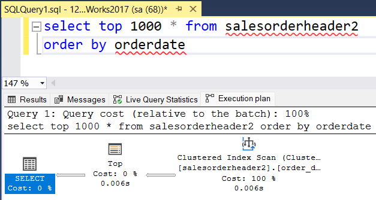
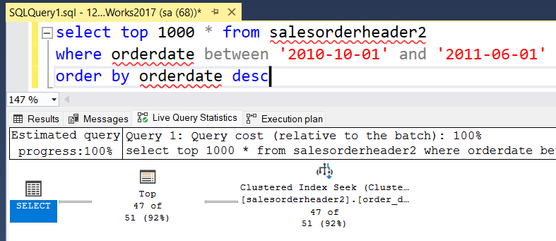
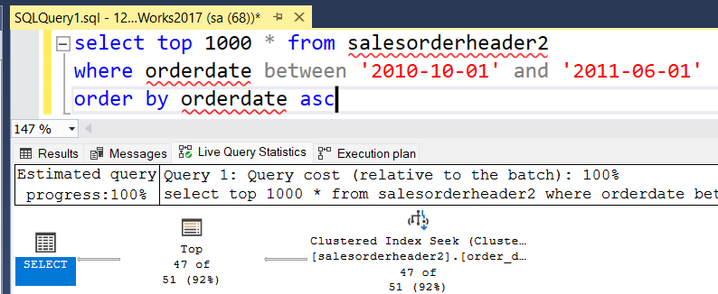
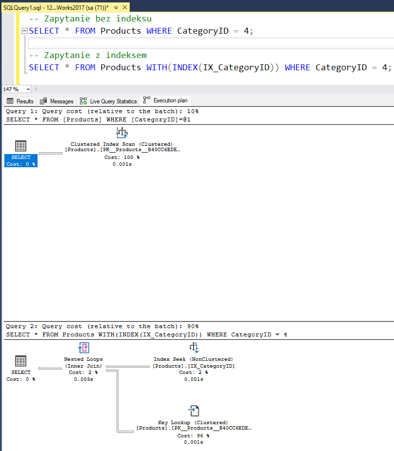
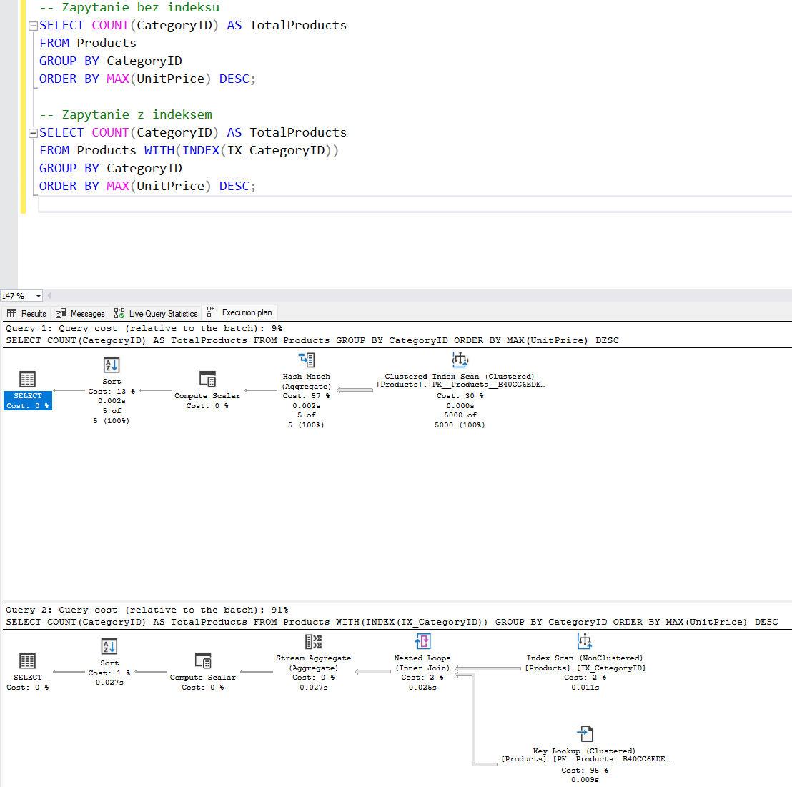
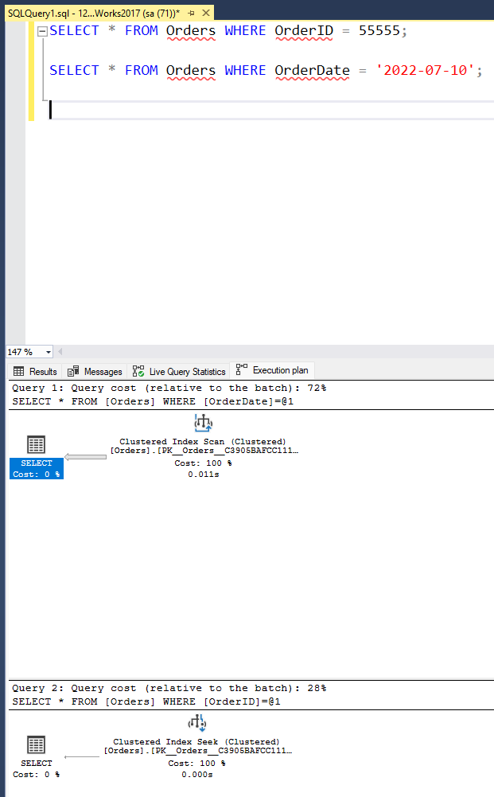

# Indeksy,  optymalizator <br>Lab 6-7

<!-- <style scoped>
 p,li {
    font-size: 12pt;
  }
</style>  -->

<!-- <style scoped>
 pre {
    font-size: 8pt;
  }
</style>  -->


---

**Imię i nazwisko:**

Przemysław Spyra, Piotr Urbańczyk

--- 

Celem ćwiczenia jest zapoznanie się z planami wykonania zapytań (execution plans), oraz z budową i możliwością wykorzystaniem indeksów (cz. 2.)

Swoje odpowiedzi wpisuj w miejsca oznaczone jako:

---
> Wyniki: 

```sql
--  ...
```

---

Ważne/wymagane są komentarze.

Zamieść kod rozwiązania oraz zrzuty ekranu pokazujące wyniki, (dołącz kod rozwiązania w formie tekstowej/źródłowej)

Zwróć uwagę na formatowanie kodu

## Oprogramowanie - co jest potrzebne?

Do wykonania ćwiczenia potrzebne jest następujące oprogramowanie
- MS SQL Server,
- SSMS - SQL Server Management Studio 
  - lub inne   
- przykładowa baza danych AdventureWorks2017.
    
Oprogramowanie dostępne jest na przygotowanej maszynie wirtualnej

## Przygotowanie  


    
Stwórz swoją bazę danych o nazwie lab6. 

```sql
create database lab6  
go  
  
use lab6  
go
```

## Dokumentacja

Obowiązkowo:
- [https://docs.microsoft.com/en-us/sql/relational-databases/indexes/indexes](https://docs.microsoft.com/en-us/sql/relational-databases/indexes/indexes)
- [https://docs.microsoft.com/en-us/sql/relational-databases/indexes/create-filtered-indexes](https://docs.microsoft.com/en-us/sql/relational-databases/indexes/create-filtered-indexes)

# Zadanie 1

Skopiuj tabelę Product do swojej bazy danych:

```sql
select * into product from adventureworks2017.production.product
```

Stwórz indeks z warunkiem przedziałowym:

```sql
create nonclustered index product_range_idx  
    on product (productsubcategoryid, listprice) include (name)  
where productsubcategoryid >= 27 and productsubcategoryid <= 36
```

Sprawdź, czy indeks jest użyty w zapytaniu:

```sql
select name, productsubcategoryid, listprice  
from product  
where productsubcategoryid >= 27 and productsubcategoryid <= 36
```

Sprawdź, czy indeks jest użyty w zapytaniu, który jest dopełnieniem zbioru:

```sql
select name, productsubcategoryid, listprice  
from product  
where productsubcategoryid < 27 or productsubcategoryid > 36
```


Skomentuj oba zapytania. Czy indeks został użyty w którymś zapytaniu, dlaczego? Czy indeks nie został użyty w którymś zapytaniu, dlaczego? Jak działają indeksy z warunkiem?


---
**Wyniki**: 

Indeks z warunkiem przedziałowym został użyty w zapytaniu z tym samym warunkiem:



Natomiast nie został użyty w zapytaniu o wiersze nie spełniające tego warunku. Zamiast tego SZBD wykonał pełne skanowanie tabeli (Table Scan).



Skoro indeks został ograniczony do tych wierszy z informacjami i produktach o productsubcategoryid >= 27 oraz <= 36, to nie będzie używany przy przeszukiwaniu innych (niespełniających warunku zadanego przy tworzeniu indeksu) wierszy w tej tabli.


# Zadanie 2 – indeksy klastrujące

Celem zadania jest poznanie indeksów klastrujących

Skopiuj ponownie tabelę SalesOrderHeader do swojej bazy danych:

```sql
select * into salesorderheader2 from adventureworks2017.sales.salesorderheader
```


Wypisz sto pierwszych zamówień:

```sql
select top 1000 * from salesorderheader2  
order by orderdate
```

Stwórz indeks klastrujący według OrderDate:

```sql
create clustered index order_date2_idx on salesorderheader2(orderdate)
```

Wypisz ponownie sto pierwszych zamówień. Co się zmieniło?


Przed:


Po:


Czas wykonywnia się zmniejszył z 0.135s na 0.012s (ponad 11-krotnie).
Sortowanie, które stanowiło największą część kosztu (78%) zostało zastąpione szybkim skanowaniem sklastrowanego indeksu.

Sprawdź zapytanie:

```sql
select top 1000 * from salesorderheader2  
where orderdate between '2010-10-01' and '2011-06-01'
```


Dodaj sortowanie według OrderDate ASC i DESC. Czy indeks działa w obu przypadkach. Czy wykonywane jest dodatkowo sortowanie?

### descending

### ascending


Indeks działa w obu przypadkach identycznie. W obu przypadkach nie jest wykonywane żadne dodatkowe sortowanie.

# Zadanie 3 – indeksy column store


Celem zadania jest poznanie indeksów typu column store

Utwórz tabelę testową:

```sql
create table dbo.saleshistory(  
 salesorderid int not null,  
 salesorderdetailid int not null,  
 carriertrackingnumber nvarchar(25) null,  
 orderqty smallint not null,  
 productid int not null,  
 specialofferid int not null,  
 unitprice money not null,  
 unitpricediscount money not null,  
 linetotal numeric(38, 6) not null,  
 rowguid uniqueidentifier not null,  
 modifieddate datetime not null  
 )
```

Załóż indeks:

```sql
create clustered index saleshistory_idx  
on saleshistory(salesorderdetailid)
```


Wypełnij tablicę danymi:

(UWAGA    `GO 100` oznacza 100 krotne wykonanie polecenia. Jeżeli podejrzewasz, że Twój serwer może to zbyt przeciążyć, zacznij od GO 10, GO 20, GO 50 (w sumie już będzie 80))

```sql
insert into saleshistory  
 select sh.*  
 from adventureworks2017.sales.salesorderdetail sh  
go 100
```

Sprawdź jak zachowa się zapytanie, które używa obecny indeks:

```sql
select productid, sum(unitprice), avg(unitprice), sum(orderqty), avg(orderqty)  
from saleshistory  
group by productid  
order by productid
```

Załóż indeks typu ColumnStore:

```sql
create nonclustered columnstore index saleshistory_columnstore  
 on saleshistory(unitprice, orderqty, productid)
```

Sprawdź różnicę pomiędzy przetwarzaniem w zależności od indeksów. Porównaj plany i opisz różnicę.


---
> Wyniki: 

```sql
--  ...
```

# Zadanie 4 – własne eksperymenty

Należy zaprojektować tabelę w bazie danych, lub wybrać dowolny schemat danych (poza używanymi na zajęciach), a następnie wypełnić ją danymi w taki sposób, aby zrealizować poszczególne punkty w analizie indeksów. Warto wygenerować sobie tabele o większym rozmiarze.

Do analizy, proszę uwzględnić następujące rodzaje indeksów:
- Klastrowane (np.  dla atrybutu nie będącego kluczem głównym)
- Nieklastrowane
- Indeksy wykorzystujące kilka atrybutów, indeksy include
- Filtered Index (Indeks warunkowy)
- Kolumnowe

## Analiza

Proszę przygotować zestaw zapytań do danych, które:
- wykorzystują poszczególne indeksy
- które przy wymuszeniu indeksu działają gorzej, niż bez niego (lub pomimo założonego indeksu, tabela jest w pełni skanowana)
Odpowiedź powinna zawierać:
- Schemat tabeli
- Opis danych (ich rozmiar, zawartość, statystyki)
- Opis indeksu
- Przygotowane zapytania, wraz z wynikami z planów (zrzuty ekranow)
- Komentarze do zapytań, ich wyników
- Sprawdzenie, co proponuje Database Engine Tuning Advisor (porównanie czy udało się Państwu znaleźć odpowiednie indeksy do zapytania)

### Eksperyment 1
**Nieklastrowane indeksowanie**

- Schemat tabeli: Tworzymy tabelę “Products” z kolumnami: “ProductID” (klucz główny), “ProductName”, “CategoryID” i “UnitPrice”.

- Opis danych: Wypełniamy tabelę danymi dotyczącymi produktów.

- Opis indeksu: Dodajemy nieklastrowany indeks na kolumnie “CategoryID”.

- Przygotowane zapytania: Tworzymy zapytania, które wyszukują produkty w określonej kategorii. Porównujemy wydajność z indeksem i bez indeksu.
```sql
CREATE TABLE Products (
    ProductID INT PRIMARY KEY,
    ProductName VARCHAR(255),
    CategoryID INT,
    UnitPrice DECIMAL(10, 2)
);
```
Wypełnieniamy tabelę Products danymi w następujący sposób: 

```sql
DECLARE @i INT = 1;
WHILE @i <= 5000
BEGIN
    INSERT INTO Products (ProductID, ProductName, CategoryID, UnitPrice) 
    VALUES 
    (@i, 'Product ' + CAST(@i AS VARCHAR), @i % 5 + 1, @i * 10.00);
    
    SET @i = @i + 1;
END;
```
Mamy zatem 5000 wierszy z powtarzającymi się kategorami 1-5 oraz stale rosnącą ceną.

Zakładamy nieklastrowany indeks na CategoryID

```sql
CREATE NONCLUSTERED INDEX IX_CategoryID ON Products (CategoryID);
```

Tworzymy zapytanie, które wyszukuje produkty z kategori nr. 4.

```sql
-- Zapytanie bez indeksu
SELECT * FROM Products WHERE CategoryID = 4;

-- Zapytanie z indeksem
SELECT * FROM Products WITH(INDEX(IX_CategoryID)) WHERE CategoryID = 4;
```


Widać zatem, że zapytanie z wymuszonym indeksem działa 5 razy dłużej (0.001s vs 0.005s) przez co wypada zdecydowanie gorzej.


Zapytanie nr. 2:

```sql
-- Zapytanie bez indeksu
SELECT COUNT(CategoryID) AS TotalProducts 
FROM Products 
GROUP BY CategoryID 
ORDER BY MAX(UnitPrice) DESC;

-- Zapytanie z indeksem
SELECT COUNT(CategoryID) AS TotalProducts 
FROM Products WITH(INDEX(IX_CategoryID)) 
GROUP BY CategoryID 
ORDER BY MAX(UnitPrice) DESC;
```
W sortowaniu użyto ```ORDER BY MAX(UnitPrice) DESC```, co oznacza, że sortowanie odbywa się według maksymalnej ceny jednostkowej dla każdej kategorii w kolejności malejącej.



Zapytanie z wymuszonym indeksem działa prawie 25 razy wolniej (0.004s vs 0.0099s). Sortowanie, agregacja oraz następnie inner joiny zajmują stosunkowo najwięcej czasu
.
### Eksperyment 2
**Klastrowane indeksowanie atrybutu nie będącego kluczem głównym.**

- Schemat tabeli: Stworzymy tabelę o nazwie “Orders” z kolumnami: “OrderID” (klucz główny), “CustomerID”, “OrderDate” i “TotalAmount”.

- Opis danych: Wypełniamy tabelę fikcyjnymi zamówieniami, aby uzyskać odpowiednią liczbę rekordów.

- Opis indeksu: Dodajemy klastrowany indeks na kolumnie “OrderDate”.

- Przygotowane zapytania: Przygotowujemy zapytania, które wyszukują zamówienia na określony dzień lub w określonym przedziale dat. Porównamy wydajność z indeksem i bez indeksu

Tworzymy tabelę Orders

```sql
CREATE TABLE Orders (
    OrderID INT PRIMARY KEY,
    CustomerID INT,
    OrderDate DATE,
    TotalAmount DECIMAL(10, 2)
);
```

Wypełniamy tabelę Orders danymi:

```sql
DECLARE @j INT = 1;
WHILE @j <= 100000
BEGIN
    INSERT INTO Orders (OrderID, CustomerID, OrderDate, TotalAmount) 
    VALUES 
    (@j, @j % 100 + 1, DATEADD(DAY, @j % 365, '2022-01-01'), @j * 100.00);
    
    SET @j = @j + 1;
END;
```

Teraz, dodajemy klastrowany indeks na kolumnie OrderDate:

```sql
CREATE CLUSTERED INDEX IX_OrderDate ON Orders (OrderDate);
```

Przygotowujemy zapytanie do porównania wydajności z indeksem i bez indeksu:

```sql
SELECT * FROM Orders WHERE OrderID = 55555;
```
```sql
SELECT * FROM Orders WHERE OrderDate = '2022-07-10';
```


Pierwsze zapytanie korzysta z indeksu na kolumnie OrderDate, więc jest szybkie, ponieważ wyszukuje zamówienia dla konkretnej daty. Plan wykonania pokazuję operację wyszukiwania z wykorzystaniem indeksu.

Drugie zapytanie wymusza korzystanie z indeksu, ale jest nieskuteczne, ponieważ szuka po kolumnie OrderID, która jest kluczem głównym. W tym przypadku, baza danych może zignorować indeks i wykonać pełne skanowanie tabeli. Plan wykonania powinien potwierdzić, że indeks nie został użyty, co oznacza mniej wydajną operację wyszukiwania.

### Eksperyment 3
**Indeksy wykorzystujące kilka atrybutów (indeksy include)**

- Schemat tabeli: Tworzymy tabelę “Employees" Tworzymy  z kolumnami: “EmployeeID” (klucz główny), “FirstName”, “LastName”, “DepartmentID” i “Salary”.

- Opis danych: Wypełniamy tabelę danymi dotyczącamymi pracowników.

- Opis indeksu: Dodajemy indeks wykorzystujący kolumny “DeparetmentID” i “Salary” jako indeks include.

- Przygotowane zapytania: Przygotujemy zapytania, które wyszukują pracowników w określonym dziale z określonym wynagrodzeniem. Porównamy wydajność z indeksem i bez indeksu.- 


### Eksperyment 4
**Filtered Index (Indeks warunkowy)**

- Schemat tabeli: Tworzymy tabelę “Customers” z kolumnami: “CustomerID” (klucz główny), “CompanyName”, “Country” i “ContactName”.

- Opis danych: Wypełniamy tabelę danymi dotyczącymi klientów z różnych krajów.

- Opis indeksu: Dodajemy filtered index na kolumnie “Country” dla określonego kraju (np. “USA”).

- Przygotowane zapytania: Przygotujemy zapytania, które wyszukują klientów z określonego kraju. Porównamy wydajność z indeksem i bez indeksu.


|         |     |     |     |
| ------- | --- | --- | --- |
| zadanie | pkt |     |     |
| 1       | 2   |     |     |
| 2       | 2   |     |     |
| 3       | 2   |     |     |
| 4       | 10  |     |     |
| razem   | 16  |     |     |
